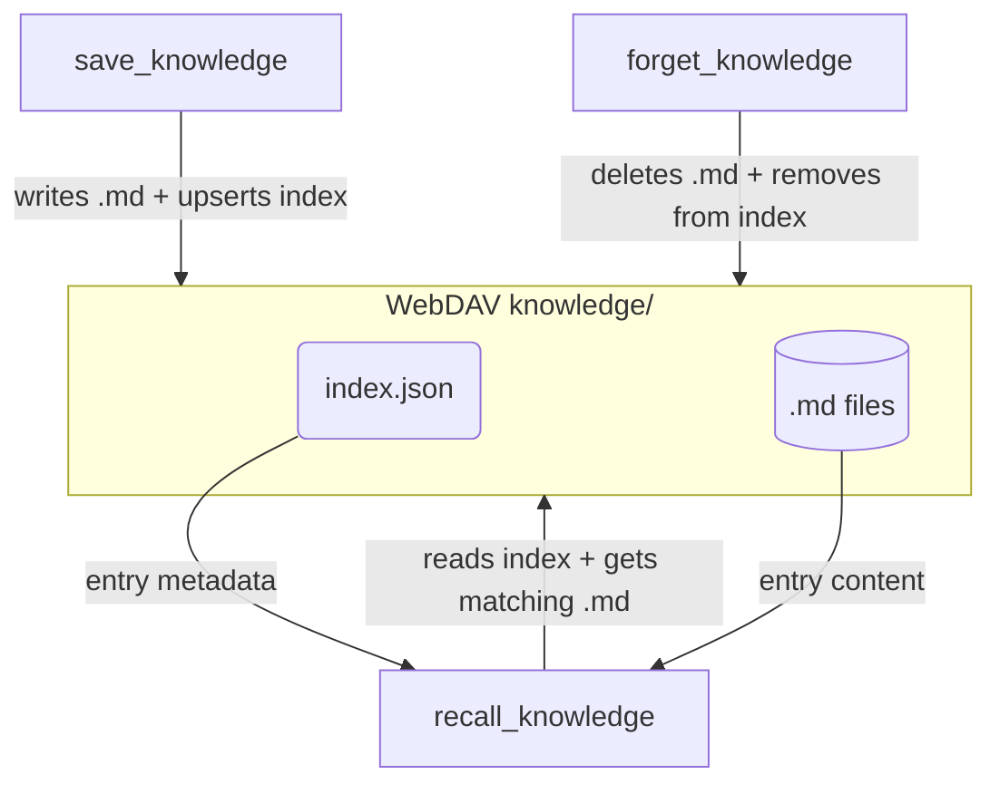

# Tool Interaction Overview

## 1. Purpose

Level 1 overview of how `save_knowledge`, `forget_knowledge`, and
`recall_knowledge` interact with the shared WebDAV `knowledge/` storage
(`index.json` + `.md` files).

**References:** [Shared Structures](structures.md) — params and file layout.

## 2. Diagram

## 3. Data Structures

Shared data structures for these flows are documented in
[`structures.md`](structures.md) — see its `## 1. Overview` for
the subsystem context.
