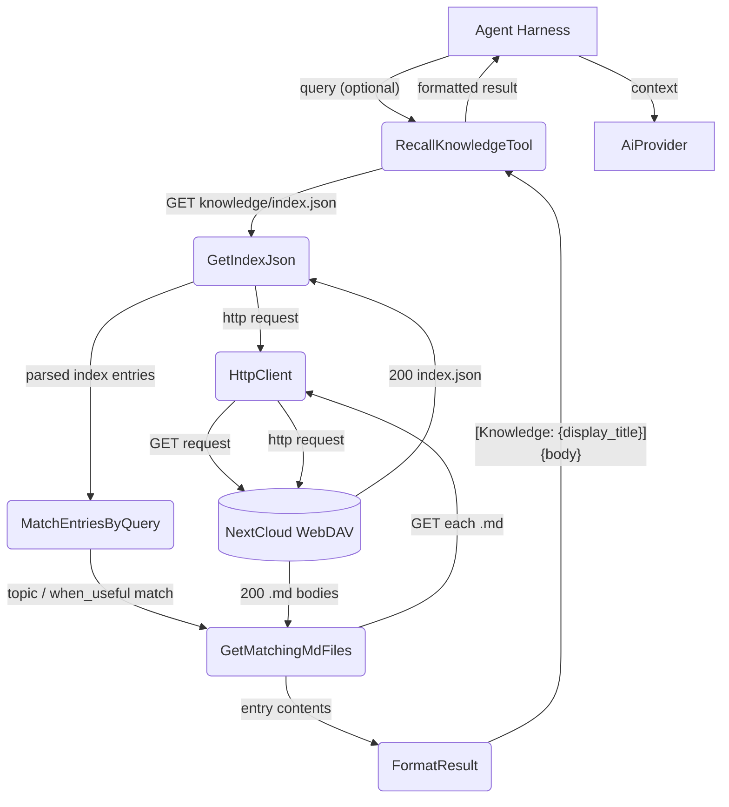

# Happy Flow — recall_knowledge

## 1. Purpose

When `query` is non-empty, entries are matched by keyword overlap against
`when_useful` and topic title. When `query` is empty, all entries in the
index are returned without filtering — the MATCH step is bypassed. Result
format: `[Knowledge: {display_title}]\n{body}`.

**References:** [Shared Structures](structures.md) — params and file layout.

## 2. Diagram

## 3. Data Structures

Shared data structures for these flows are documented in
[`structures.md`](structures.md) — see its `## 1. Overview` for
the subsystem context.
