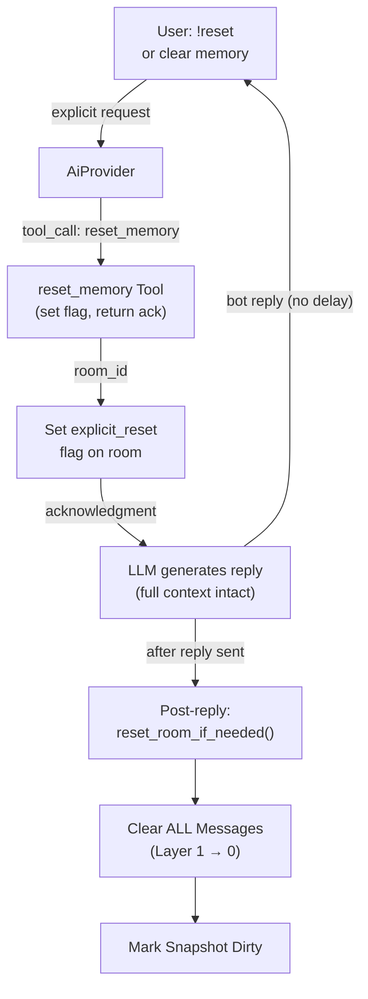
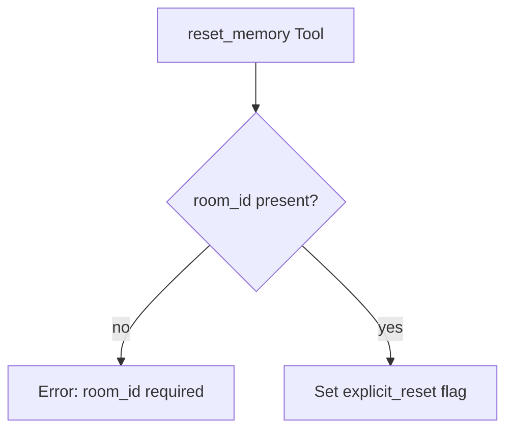

# Reset Memory

## 1. Purpose

User-explicit memory reset tool. When the user says `!reset` or explicitly
asks to clear/reset memory, the LLM invokes `reset_memory`. This tool
**instantly clears all Layer 1 messages** — no LLM call, no WebDAV write,
no summary generation. Zero overhead.

- Upstream: [Agent Harness](../agent/agent-harness.md) dispatches the tool
  call with room context (`room_id`) auto-injected
- Upstream: [Memory Management](../memory/memory.md) provides Layer 1
  messages for clearing
- Downstream: [Memory Reset](../memory/memory-reset.md) — shares the same
  `reset_room_if_needed` pipeline

## 2. Diagram

### 2a. Happy Flow — Flag-Driven (Post-Reply)

Reset is **post-reply, flag-driven**. The tool call sets the `explicit_reset`
flag; the LLM generates a natural reply; then `reset_room_if_needed()` clears
Layer 1 after the reply is sent. This avoids clearing history mid-conversation
(which would make the LLM see an empty context for its reply).

Reset is **silent** — no follow-up message is sent to the user.



The user receives the bot's reply immediately (no delay for reset).
Reset runs after the reply is delivered (silent — no follow-up message).

### 2b. Tool Parameters

| Parameter | Type | Required | Description |
|-----------|------|----------|-------------|
| `room_id` | `string` | No (auto-injected) | Room UUID |

No user-supplied parameters needed — the tool operates on the current room's
memory. Room context is injected by the harness before tool execution.

### 2c. Error Handling



Reset cannot fail — it is a pure in-memory operation. The only error case is
a missing `room_id` (programming error, not user-facing).

## 3. Data Structures

### Tool Arguments (JSON)

```json
{
    "room_id": "abc123-room-uuid"
}
```

### Tool Result (to LLM)

The tool returns a **lightweight acknowledgment** — reset is deferred until
after the reply is sent (silent — no user-facing notification).

```
Memory reset scheduled. Reply to the user first — memory will be cleared
after your reply is sent.
```

## 4. Integration

### Flag-driven execution

The tool call sets the `explicit_reset` flag on the room. Actual reset is
handled by `reset_room_if_needed()` which is called **after** the reply is
sent (in `main.rs`).

| Phase | Subsystem | Method | Purpose |
|-------|-----------|--------|---------|
| Tool call | `process_message` | `memory.set_explicit_reset(room_id)` | Set flag, return ack |
| Post-reply | `main.rs` | `reset_room_if_needed(room_id)` | Checks flag, clears L1 |
| Post-reply | `MemoryManager` | `needs_reset(room_id)` | Includes `explicit_reset` |
| Post-reply | `MemoryManager` | `clear_all_messages(room_id)` | Clear Layer 1 |
| Post-reply | `MemoryManager` | `clear_pressure_flags(room_id)` | Clears all flags |

## 5. Registration

```rust
// main.rs — stub tool, no harness ref needed (intercepted in process_message)
let mut h = harness.lock().await;
h.register_tool(Box::new(ResetMemoryTool::new()));
```

Room context (`room_id`) is auto-injected by the harness before tool execution
via `inject_room_context()`. The tool name is added to the stateful-tools list
alongside `webdav`, `edit_soul`, `save_knowledge`, etc.

### Execution path

When the LLM returns a `reset_memory` tool call, `process_message()` does
**not** call `execute_by_name()` for this tool. Instead it sets the
`explicit_reset` flag on the room and returns a lightweight acknowledgment as
the tool result. The LLM then generates a natural reply using the full
context. After the reply is delivered (in `main.rs`), `reset_room_if_needed()`
detects the flag and clears all Layer 1 messages.

The tool's own `execute()` is never reached in production — it exists solely
for LLM registration. Calling it directly returns an error.
