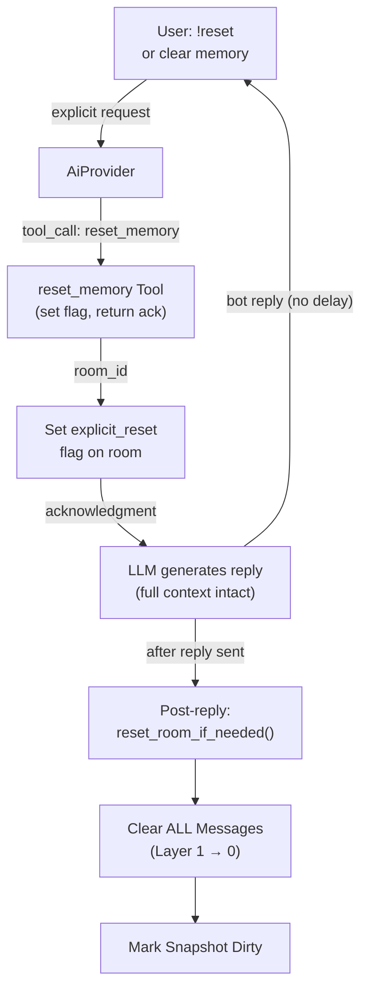

# Happy Flow — Flag-Driven (Post-Reply)

## 1. Purpose

Reset is **post-reply, flag-driven**. The tool call sets the `explicit_reset`
flag; the LLM generates a natural reply; then `reset_room_if_needed()` clears
Layer 1 after the reply is sent. This avoids clearing history mid-conversation
(which would make the LLM see an empty context for its reply).

Reset is **silent** — no follow-up message is sent to the user.

- References: [Post-Reply Decision](../../memory/memory-reset/post-reply-decision.md)

## 2. Diagram

The user receives the bot's reply immediately (no delay for reset).
Reset runs after the reply is delivered (silent — no follow-up message).

## 3. Data Structures

Shared data structures for these flows are documented in
[`structures.md`](structures.md) — see its `## 1. Overview` for
the subsystem context.
