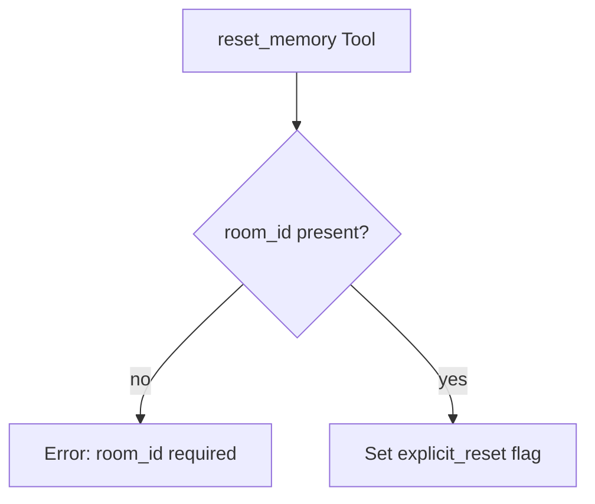

# Error Handling

## 1. Purpose

Reset cannot fail — it is a pure in-memory operation. The only error case is
a missing `room_id` (programming error, not user-facing).

- References: [Flag-Driven Reset](../flag-driven.md), [Shortcut Fast Path](../shortcut-fast-path.md)

## 2. Diagram

