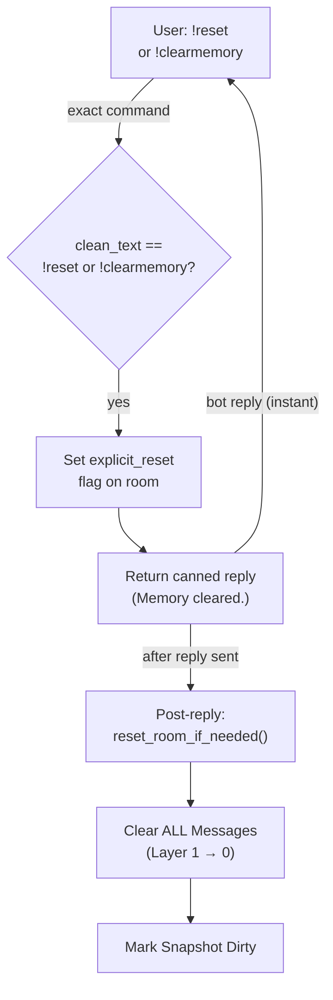

# Shortcut Fast Path — Pre-LLM Detection

## 1. Purpose

When the user sends a literal `!reset` or `!clearmemory` command, the harness
detects it before any LLM call and returns a canned reply. No token cost.

- References: [Pre-LLM Shortcut](../../memory/memory-reset/pre-llm-shortcut.md)

## 2. Diagram

No LLM call, no tool dispatch. The `reset_memory` tool registration is still
needed for natural-language reset requests handled by the LLM (§2a).

## 3. Data Structures

Shared data structures for these flows are documented in
[`structures.md`](structures.md) — see its `## 1. Overview` for
the subsystem context.
