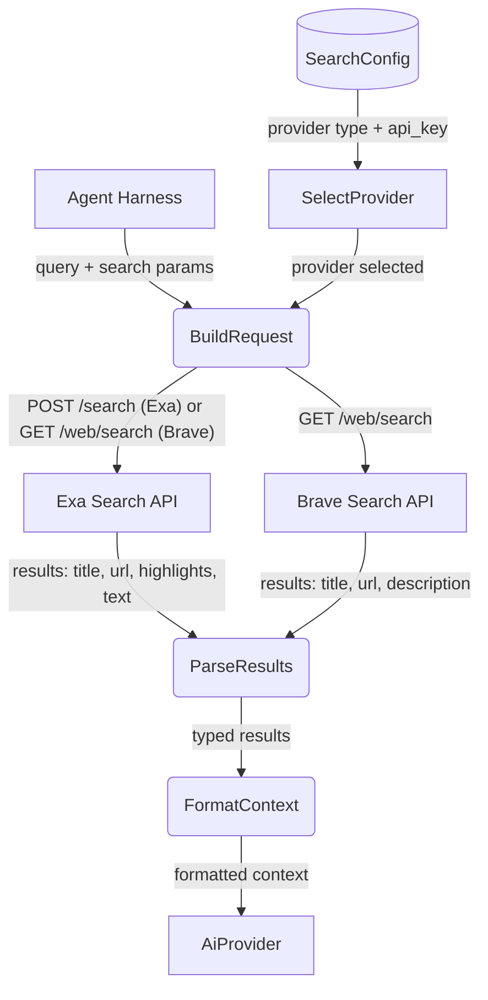
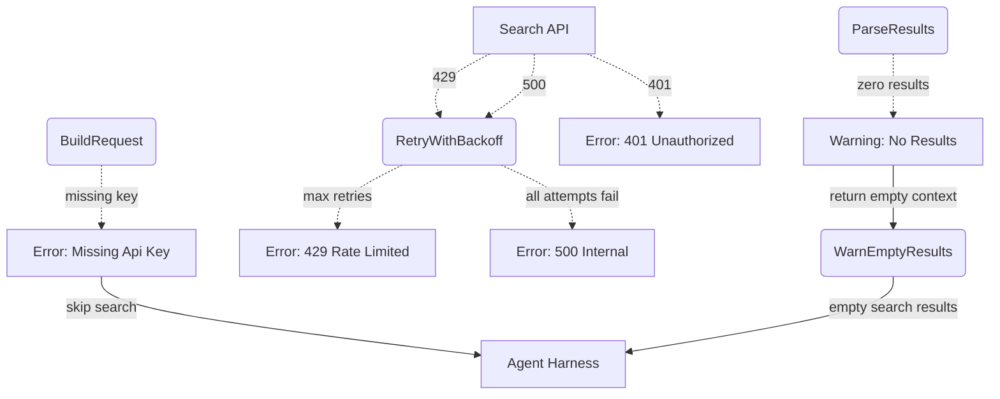
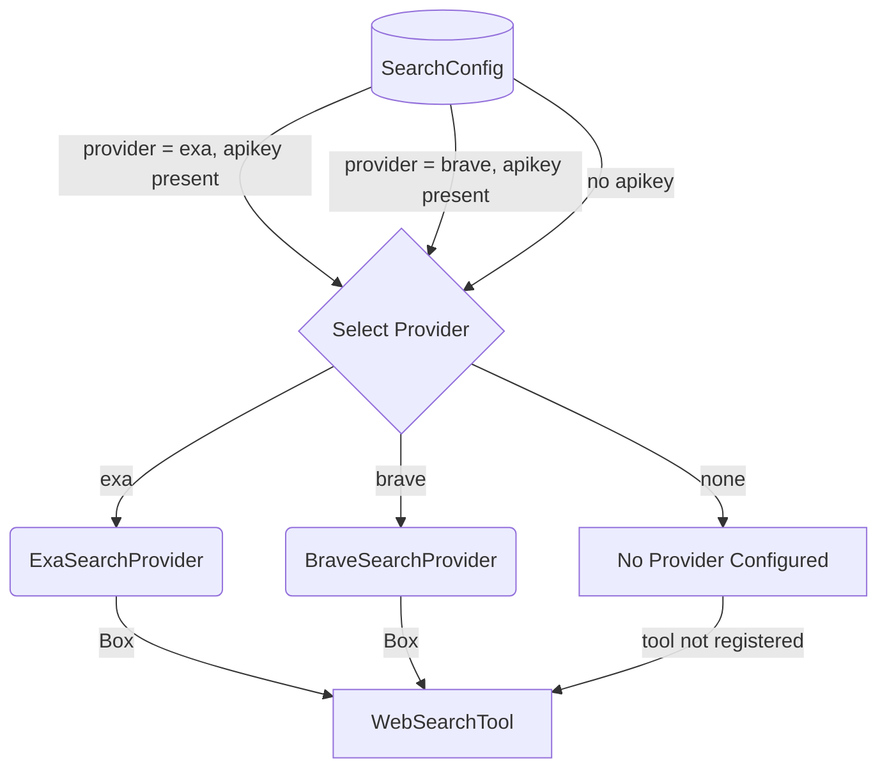
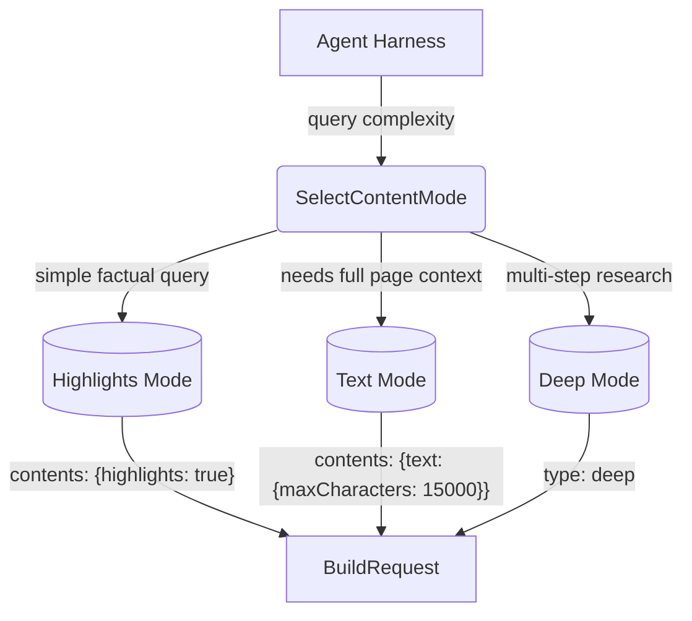

# Search Web

## 1. Purpose

Performs internet searches via a configurable search provider. Currently
supports **Exa** (`POST https://api.exa.ai/search`) and **Brave Search**
(`GET https://api.search.brave.com/res/v1/web/search`), returning
token-efficient highlights or page descriptions from search results.

- Upstream: [Configuration Management](../infra/config.md) provides `SearchConfig`
  with `provider` selection ("exa" | "brave") and per-provider API keys
- Upstream: [Agent Harness](../agent/agent-harness.md) invokes search as a tool during
  the agent loop, passing a natural-language query
- Downstream: [AI Provider](../ai/ai-provider.md) consumes returned context for chat
  completions

## 2. Diagram

### 2a. Happy Flow (Main Success Path)



### 2b. Error Handling & Fallbacks



Note: Exa HTTP errors (429, 5xx) are retried with up to 3 attempts using exponential backoff before returning a failure.

Note: 401 errors for Exa return a specific message: `"Exa search failed: invalid API key (401). Check your [search.exa] config."`

Note: 401 errors for Brave return a specific message: `"Brave Search failed: invalid API key (401). Check your [search.brave] config."`

### 2c. Provider Selection Deep Dive



### 2d. Content Mode Selection (Exa-specific)



`highlights` mode is the default — it returns excerpts relevant to the query.
`text` mode returns full page content up to 15K characters. `deep` mode
enables comprehensive search with up to 15K character content.
Brave returns `description` for all results regardless of content mode.

## 3. Data Structures

### `SearchProvider` (Trait)

| Method | Signature | Description |
|--------|-----------|-------------|
| `search` | `async fn(&self, client, query, search_type, num_results, contents_mode) -> Result<String>` | Execute a search and return formatted results |
| `provider_name` | `fn(&self) -> &str` | Returns `"exa"` or `"brave"` |

### `WebSearchParams`

| Field | Type | Notes |
|-------|------|-------|
| `query` | `NonEmptyString` | Natural-language search query |
| `search_type` | `String` | `auto` (default), `fast`, `deep` — Exa-specific, ignored by Brave |
| `num_results` | `u32` | Results to return (1-20, default 5) |
| `contents_mode` | `String` | `highlights` (default), `text`, `deep` — Exa-specific, ignored by Brave |

### Exa `SearchRequest`

| Field | Type | Notes |
|-------|------|-------|
| `query` | `String` | Natural-language search query |
| `type` | `String` | `auto` (default), `fast`, `deep` |
| `numResults` | `u32` | Results to return |
| `contents` | `ContentsOptions` | Content extraction configuration |

### Exa `ContentsOptions`

| Field | Type | Notes |
|-------|------|-------|
| `highlights` | `Option<{enabled, query}>` | Key excerpts relevant to query |
| `text` | `Option<{maxCharacters}>` | Full page text |

### Exa `SearchResult`

| Field | Type | Notes |
|-------|------|-------|
| `title` | `String` | Page title |
| `url` | `String` | Page URL |
| `id` | `String` | Document ID |
| `published_date` | `Option<String>` | Estimated publication date |
| `highlights` | `Vec<String>` | Key excerpts (if requested) |
| `text` | `Option<String>` | Full page text (if requested) |

### Brave `SearchResult`

| Field | Type | Notes |
|-------|------|-------|
| `title` | `String` | Page title |
| `url` | `String` | Page URL |
| `description` | `String` | Page snippet/description |
| `page_age` | `Option<String>` | Estimated page age |
| `language` | `Option<String>` | Page language code |

> **Implementation note:** No dedicated Rust structs exist for the search request
> and response types — all request/response processing uses ad-hoc
> `serde_json::Value`. The tool currently exposes `query`, `type`,
> `contents_mode`, and `num_results` to the LLM.

## 4. Search Provider API Reference

### Endpoints

| Provider | HTTP Method | Endpoint | Notes |
|----------|------------|----------|-------|
| Exa | `POST` | `https://api.exa.ai/search` | Natural-language web search with content extraction |
| Brave | `GET` | `https://api.search.brave.com/res/v1/web/search` | Standard web search with snippets |

### Authentication

| Provider | Auth Method | Config Location |
|----------|------------|----------------|
| Exa | `x-api-key` header | `[search.exa]` or legacy `[tools.exa]` |
| Brave | `X-Subscription-Token` header | `[search.brave]` |

### Configuration

```toml
[search]
provider = "exa"  # "exa" or "brave"

[search.exa]
api_key = "..."

[search.brave]
api_key = "..."
```

### Exa Search Types

| Type | Latency | Use Case |
|------|---------|----------|
| `auto` | ~1 second | Default; balances speed and quality |
| `fast` | ~450 ms | Reduced latency with minimal quality sacrifice |
| `deep` | 4-15 seconds | Comprehensive search |

### Error Status Codes

| HTTP Status | Meaning |
|-------------|---------|
| 400 | Bad request — invalid parameters |
| 401 | Invalid or missing API key |
| 429 | Rate limit exceeded |
| 500 | Internal server error |

### Deprecated / Invalid Parameters (Exa)

The following parameters are commonly misgenerated by LLMs and must not be used:

| Do NOT use | Use instead |
|------------|-------------|
| `useAutoprompt: true` | Remove entirely (deprecated) |
| `includeUrls` / `excludeUrls` | N/A for current implementation |
| `text: true` (top-level) | Nest under `contents` |
| `livecrawl: "always"` | N/A for current implementation |
| `numSentences`, `highlightsPerUrl`, `tokensNum` | Remove entirely |
