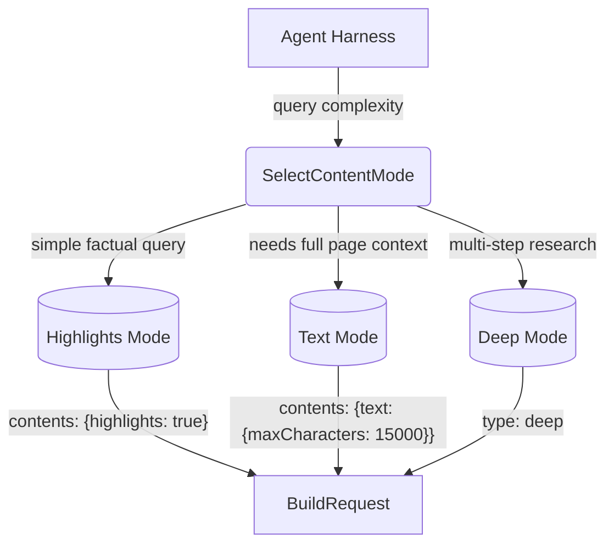

# Content Mode Selection (Exa-specific)

## 1. Purpose

Level 2 detail for the happy-path diagram in [main-path](../main-path.md): how query complexity selects the Exa content mode (`highlights`, `text`, `deep`) and maps it onto `BuildRequest`.

## 2. Diagram

`highlights` mode is the default — it returns excerpts relevant to the query.
`text` mode returns full page content up to 15K characters. `deep` mode
enables comprehensive search with up to 15K character content.
Brave returns `description` for all results regardless of content mode.
