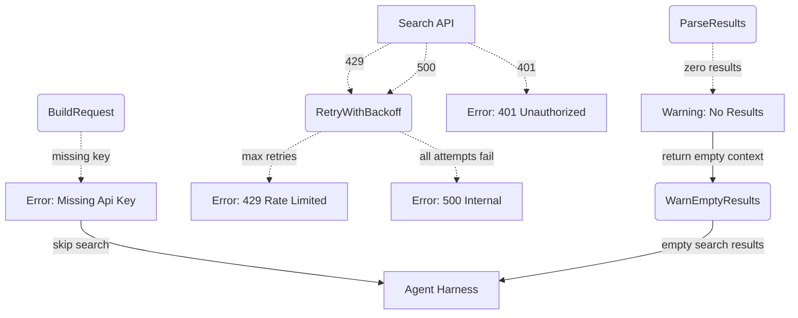

# Error Handling & Fallbacks

## 1. Purpose

Level 2 detail for the happy-path diagram in [main-path](../main-path.md): how search failures are handled — missing API key, 401 auth errors, 429/5xx retries with exponential backoff, and empty results fallback.

## 2. Diagram

Note: Exa HTTP errors (429, 5xx) are retried with up to 3 attempts using exponential backoff before returning a failure.

Note: 401 errors for Exa return a specific message: `"Exa search failed: invalid API key (401). Check your [search.exa] config."`

Note: 401 errors for Brave return a specific message: `"Brave Search failed: invalid API key (401). Check your [search.brave] config."`
