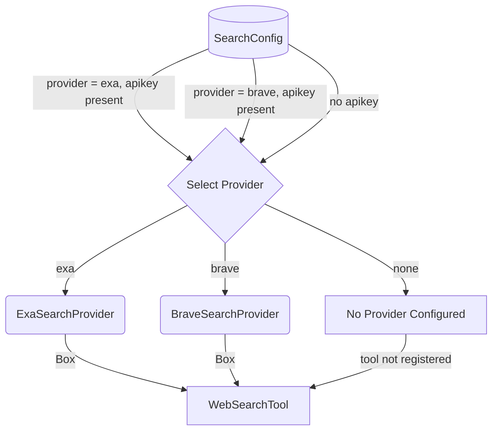

# Provider Selection Deep Dive

## 1. Purpose

Level 2 detail for the happy-path diagram in [main-path](../main-path.md): how `SearchConfig` selects the concrete `SearchProvider` (Exa or Brave) and registers the tool, or leaves it unregistered when no provider is configured.

## 2. Diagram

