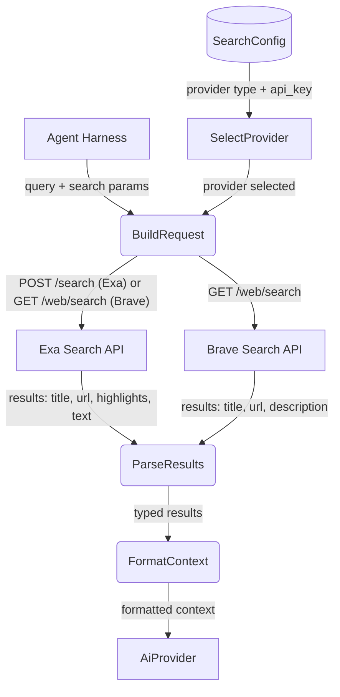

# Search Web

## 1. Purpose

Performs internet searches via a configurable search provider. Currently
supports **Exa** (`POST https://api.exa.ai/search`) and **Brave Search**
(`GET https://api.search.brave.com/res/v1/web/search`), returning
token-efficient highlights or page descriptions from search results.

- Upstream: [Configuration Management](../../infra/config/main-path.md) provides `SearchConfig`
  with `provider` selection ("exa" | "brave") and per-provider API keys
- Upstream: [Agent Harness](../../agent/agent-harness/tool-dispatch.md) invokes search as a tool during
  the agent loop, passing a natural-language query
- Downstream: [AI Provider](../../ai/ai-provider/main-path.md) consumes returned context for chat
  completions

## 2. Diagram

## 3. Data Structures

Shared with [structures.md](structures.md).
