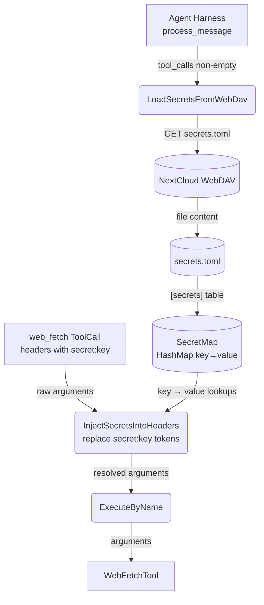
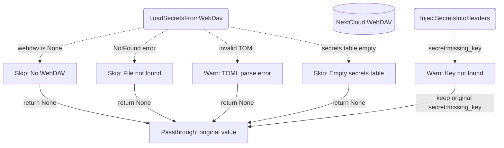
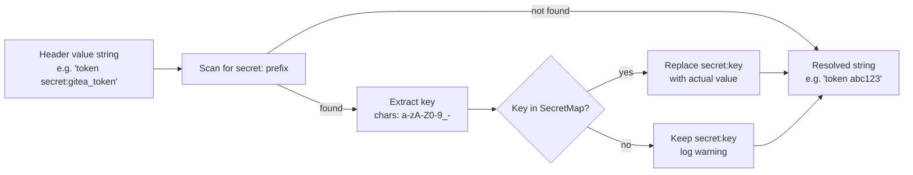

# Secret Interception

## 1. Purpose

The harness transparently replaces `secret:<key>` references in `web_fetch`
header values with actual secret values loaded from a global `secrets.toml`
file on WebDAV. The LLM never observes real secret values — it references
them by key name only.

This enables the LLM to authenticate against external APIs (Gitea, GitHub,
etc.) without exposing API tokens in the conversation history or LLM context.

- Upstream: [Agent Harness](../agent-harness.md) runs the interception inside
  `process_message()` — secrets are loaded once per tool-call batch and
  injected before `execute_by_name()` dispatch
- Upstream: [WebDAV Tool](webdav.md) provides the `read_file_to_string`
  transport for loading `secrets.toml`
- Downstream: [Web Fetch](web-fetch.md) receives the modified arguments with
  resolved header values — the tool is unaware of the interception
- Downstream: [AI Provider](../base/ai-provider.md) never observes real secret
  values — only the `secret:<key>` references appear in the conversation
  history

### Non-Functional Requirements

- **Graceful degradation**: When WebDAV is not configured, `secrets.toml` does
  not exist, or the file fails to parse, the tool arguments pass through
  unchanged. Secret interception is never a hard dependency.
- **No caching across batches**: Secrets are loaded once per tool-call batch
  within `process_message()`, not cached across agent turns. This ensures
  updated secrets take effect on the next message without restart.
- **Single-pass replacement**: Resolved secret values are not re-scanned for
  `secret:` references — no recursive expansion.

## 2. Diagram

### 2a. Happy Flow (Main Success Path)



### 2b. Error Handling & Graceful Degradation



### 2c. Secret Reference Replacement



## 3. Data Structures

### `SecretsToml` (parsed TOML root)

| Field     | Type                    | Notes                                    |
|-----------|-------------------------|------------------------------------------|
| `secrets` | `HashMap<String, String>` | Flat key-value table. `#[serde(default)]` handles absent table as empty map. |

### Secrets TOML File Format

```toml
[secrets]
gitea_token = "abc123"
github_api_key = "sk-xyz789"
```

Stored at WebDAV root path `secrets.toml` (not inside any room directory).
Global scope — shared across all rooms and conversations.

### Secret Reference Format

Header values containing the substring `secret:<key>` where `<key>` is a
contiguous sequence of `[a-zA-Z0-9_-]` characters. The `secret:<key>` token
is replaced in-place, preserving surrounding text.

| Input                                    | Secrets Map                         | Output                   |
| ---------------------------------------- | ----------------------------------- | ------------------------ |
| `"token secret:gitea_token"`             | `{"gitea_token": "abc123"}`        | `"token abc123"`         |
| `"secret:api_key"`                       | `{"api_key": "sk-xyz"}`            | `"sk-xyz"`               |
| `"Bearer secret:tok extra"`             | `{"tok": "real"}`                   | `"Bearer real extra"`    |
| `"secret:missing"`                       | `{"other": "val"}`                  | `"secret:missing"` (warn)|

## 4. Key Functions

| Function | Location | Role |
|----------|----------|------|
| `load_secrets_from_webdav` | `harness.rs` | Async: reads `secrets.toml` from WebDAV root, parses TOML, returns `Option<HashMap<String, String>>` |
| `inject_secrets_into_headers` | `harness.rs` | Sync: parses arguments JSON, iterates headers object, replaces `secret:<key>` in string values |
| `replace_secret_refs` | `harness.rs` | Sync: single-pass string replacement of `secret:<key>` tokens against the secrets map |
