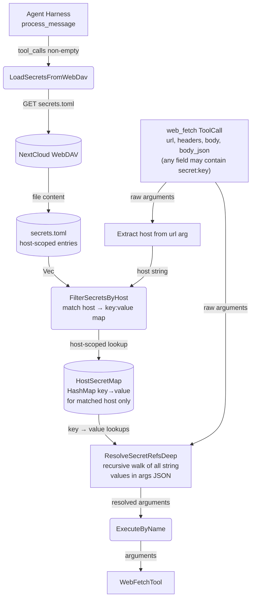
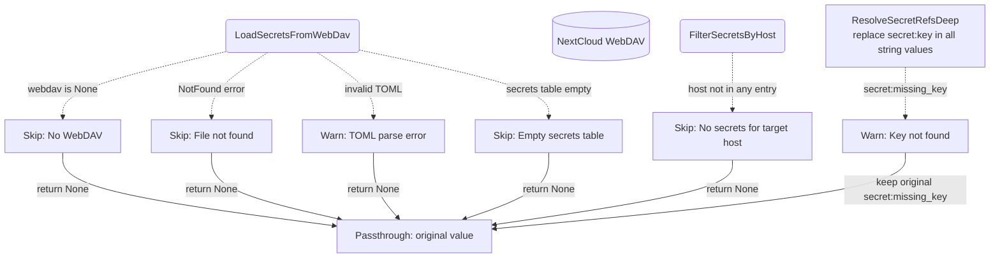
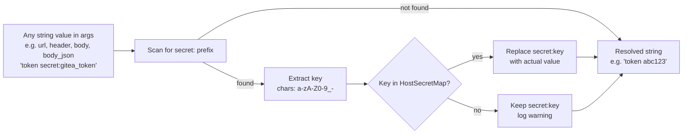
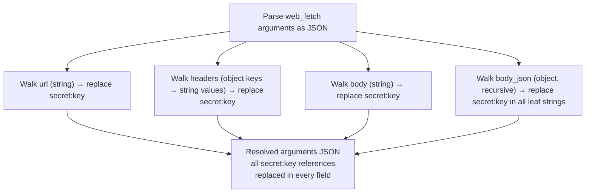
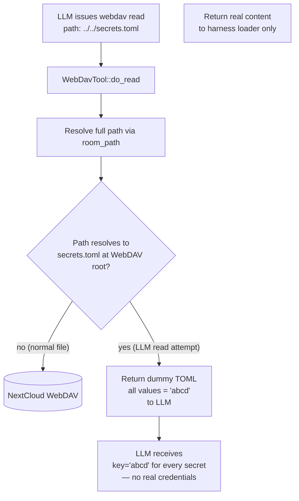

# Secret Interception

## 1. Purpose

The harness transparently replaces all `secret:<key>` references anywhere
in a `web_fetch` tool call — URL, query parameters, headers, raw `body`,
and `body_json` values — with actual secrets loaded from a host-scoped
`secrets.toml` file on WebDAV. The LLM never observes real secret values;
it references them by key name only. Each secret is scoped to a specific
host so a token for `https://site-a.com` cannot be leaked into a request
to `https://site-b.com`.

This enables the LLM to authenticate against external APIs (Gitea, GitHub,
etc.) without exposing API tokens in the conversation history or LLM context.

- Upstream: [Agent Harness](../agent-harness.md) runs the interception inside
  `process_message()` — secrets are loaded once per tool-call batch and
  injected before `execute_by_name()` dispatch
- Upstream: [WebDAV Tool](webdav.md) provides the `read_file_to_string`
  transport for loading `secrets.toml`
- Downstream: [Web Fetch](web-fetch.md) receives the modified arguments with
  all `secret:<key>` references resolved — the tool is unaware of the interception
- Downstream: [AI Provider](../base/ai-provider.md) never observes real secret
  values — only the `secret:<key>` references appear in the conversation
  history

### Non-Functional Requirements

- **Host-scoped secrets**: Each secret is bound to a host. When `web_fetch`
  targets `https://site-a.com`, only secrets scoped to that host are injected.
  A secret for `https://site-b.com` is never available to a request to
  `https://site-a.com`.
- **Dummy data defense**: If the LLM manages to read `secrets.toml` through
  the WebDAV tool (e.g. via path traversal), the file content returned contains
  only dummy placeholder values (`abcd`), never real credentials. This is
  enforced at the WebDAV-tool boundary.
- **Graceful degradation**: When WebDAV is not configured, `secrets.toml` does
  not exist, or the file fails to parse, the tool arguments pass through
  unchanged. Secret interception is never a hard dependency.
- **No caching across batches**: Secrets are loaded once per tool-call batch
  within `process_message()`, not cached across agent turns. This ensures
  updated secrets take effect on the next message without restart.
- **Single-pass replacement**: Resolved secret values are not re-scanned for
  `secret:` references — no recursive expansion.

## 2. Diagram

### 2a. Happy Flow — Host-Scoped Secret Injection



### 2b. Error Handling & Graceful Degradation



### 2c. Secret Reference Replacement (Per-String)



### 2d. Deep Argument Traversal — All Injection Points



### 2e. Dummy Data Gate — WebDAV Tool LLM Read Interception



## 3. Data Structures

### `SecretsToml` (parsed TOML root)

| Field     | Type               | Notes                                    |
|-----------|--------------------|------------------------------------------|
| `secrets` | `Vec<SecretEntry>` | Array of host-scoped entries. `#[serde(default)]` handles absent or empty table. |

### `SecretEntry` (one host-key-value triplet)

| Field   | Type     | Notes                                          |
|---------|----------|------------------------------------------------|
| `host`  | `String` | Target host the secret is bound to (e.g. `https://gitea.example.com`) |
| `key`   | `String` | Reference name used by the LLM (`secret:<key>`) |
| `value` | `String` | The actual secret value (token, API key, etc.)  |

### `HostSecretMap`

| Type | Notes |
|------|-------|
| `HashMap<String, String>` (key → value) | Produced by `filter_secrets_by_host`. Contains only entries whose `host` field matches the target URL's host. |

### Secrets TOML File Format (Host-Scoped)

```toml
[[secrets]]
host = "https://gitea.example.com"
key = "gitea_token"
value = "abc123"

[[secrets]]
host = "https://api.github.com"
key = "github_api_key"
value = "sk-xyz789"

[[secrets]]
host = "https://gitea.example.com"
key = "gitea_webhook_secret"
value = "wh-secret-456"
```

Stored at WebDAV root path `secrets.toml` (not inside any room directory).
Global scope — shared across all rooms and conversations.

### Dummy Data Format (LLM-Observable)

When the WebDAV tool reads `secrets.toml` (intended for the LLM to see), the
tool returns a sanitized version. All `value` fields are replaced with `"abcd"`.
The `host` and `key` names remain intact so the LLM can reason about which
secrets exist without seeing the actual tokens:

```toml
[[secrets]]
host = "https://gitea.example.com"
key = "gitea_token"
value = "abcd"

[[secrets]]
host = "https://api.github.com"
key = "github_api_key"
value = "abcd"

[[secrets]]
host = "https://gitea.example.com"
key = "gitea_webhook_secret"
value = "abcd"
```

This defense-in-depth ensures that even if the LLM successfully path-traverses
to read the root `secrets.toml`, it only obtains dummy placeholders. The real
file on WebDAV stores actual credentials, which only the harness's
`load_secrets_from_webdav` function (which reads directly via
`WebDavClient::read_file_to_string`, bypassing the tool layer) ever sees.

### Secret Reference Format

Any string value in the `web_fetch` arguments JSON — URL, query parameters,
headers, raw `body`, and nested `body_json` values — may contain
`secret:<key>` where `<key>` is a contiguous sequence of `[a-zA-Z0-9_-]`
characters. The `secret:<key>` token is replaced in-place, preserving
surrounding text.

### Injection Points (All Fields Subject to Replacement)

| Argument field   | JSON type          | Walk strategy                                |
|------------------|--------------------|----------------------------------------------|
| `url`            | string             | Direct string replacement                    |
| `headers`        | object (str→str)   | Each value string replaced                   |
| `body`           | string             | Direct string replacement                    |
| `body_json`      | object (recursive) | All leaf string values replaced recursively  |

### Replacement Examples (All Fields)

| Field     | Input                                       | HostSecretMap (host-matched)   | Output                                |
|-----------|---------------------------------------------|--------------------------------|---------------------------------------|
| url       | `"https://api.example.com/v1?token=secret:api_key"` | `{"api_key": "sk-xyz"}`   | `"https://api.example.com/v1?token=sk-xyz"` |
| headers   | `"Bearer secret:tok extra"`                 | `{"tok": "real"}`             | `"Bearer real extra"`                 |
| body      | `"{\"auth\":\"secret:token\"}"`             | `{"token": "abc123"}`         | `"{\"auth\":\"abc123\"}"`             |
| body_json | `{"pat": "secret:gh_pat"}`                  | `{"gh_pat": "ghp-xyz"}`       | `{"pat": "ghp-xyz"}`                  |
| (any)     | `"secret:missing"`                          | `{"other": "val"}`            | `"secret:missing"` (warn)             |
| (any)     | `"secret:gitea_token"`                      | (empty — wrong host)          | `"secret:gitea_token"` (passthrough)  |

### Host Matching Rules

The target host is extracted from the `url` field in the `web_fetch` arguments.
Only `SecretEntry` entries whose `host` field matches the URL host
(scheme + host + port) are included in the `HostSecretMap`.

| URL in web_fetch args           | Extracted host           | Matches entry with host=        |
| ------------------------------- | ------------------------ | ------------------------------- |
| `https://gitea.example.com/api` | `https://gitea.example.com` | `https://gitea.example.com`  |
| `https://gitea.example.com:443` | `https://gitea.example.com:443` | `https://gitea.example.com:443` |
| `http://localhost:3000`         | `http://localhost:3000`   | `http://localhost:3000`         |

If the URL cannot be parsed (malformed), no secrets are injected — the
arguments pass through unchanged.

## 4. Key Functions

| Function | Location | Role |
|----------|----------|------|
| `load_secrets_from_webdav` | `harness.rs` | Async: reads `secrets.toml` from WebDAV root, parses TOML, returns `Option<Vec<SecretEntry>>` |
| `filter_secrets_by_host` | `harness.rs` | Sync: extracts host from web_fetch URL arg, filters `Vec<SecretEntry>` by matching `host` field, returns `Option<HashMap<String, String>>` |
| `resolve_secret_refs_deep` | `harness.rs` | Sync: parses arguments JSON, walks all string values recursively (url, headers, body, body_json leaf strings), replaces `secret:<key>` in each using the host-filtered map. Replaces the old `inject_secrets_into_headers` which only walked `headers`. |
| `replace_secret_refs` | `harness.rs` | Sync: single-pass string replacement of `secret:<key>` tokens against the secrets map. Called by `resolve_secret_refs_deep` for each string value. |
| `sanitize_secrets_for_llm` | `tools/webdav.rs` or `harness.rs` | Sync: if a webdav tool `read` resolves to the root `secrets.toml`, returns a TOML string with all values replaced by `"abcd"`; real file content is never returned to the LLM |
