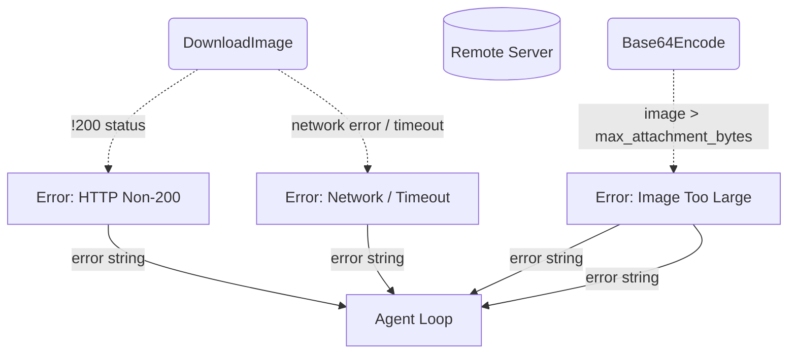

# Error Handling & Fallbacks

## 1. Purpose

Level 2 detail for the happy-path diagram in [main-path](../main-path.md): all
non-success HTTP responses produce a single generic error:
`"Failed to download image: HTTP {status}"`. Network errors
(connection refused, DNS failure, timeout) bubble up as `reqwest::Error`.
The 30-second timeout is set on the HTTP client but not distinguished
from other network failures in the error message.

## 2. Diagram

Errors during auto-attachment download/encode are logged and the attachment is
skipped; the message still enters chat history with text-only content. Errors
from the vision tool are returned as tool result errors.
The size limit is configurable via `rocketchat.model.max_attachment_bytes`
(default 25 MB).
