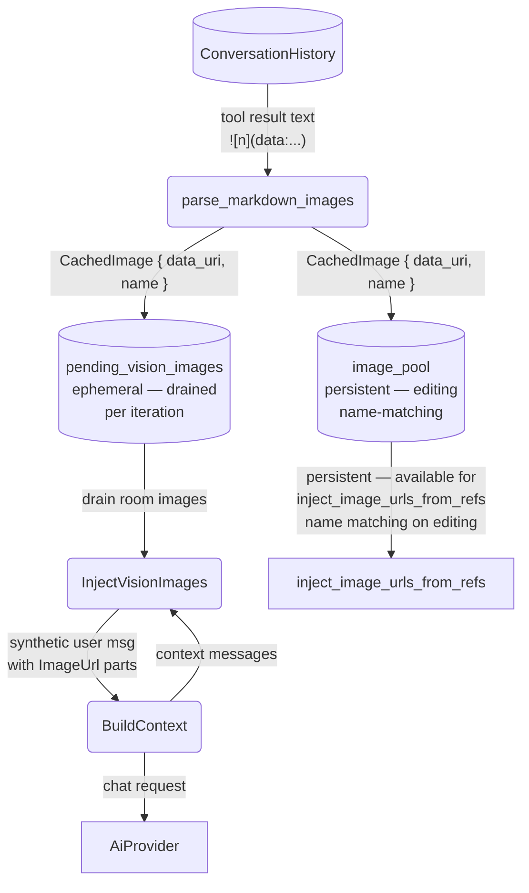

# Harness Vision Injection

## 1. Purpose

Level 2 detail for the happy-path diagram in [main-path](../main-path.md): after
the vision (or webdav) tool returns, the harness intercepts the result
text, parses the base64 data URIs from the markdown tags, and stores the
`CachedImage` entries in **two** pools:

1. **`image_pool`** (`HashMap<room_id, Vec<CachedImage>>`): **persistent** pool
   (entries live for the room's lifetime). Used by `inject_image_urls_from_refs`
   for name-based matching when the LLM calls `image_gen` for editing (one of the
   4 editing sources — see [Image Interception](../../../interception/image-interception/vision-webdav-consumption.md)).
2. **`pending_vision_images`** (`HashMap<room_id, Vec<CachedImage>>`):
   **ephemeral** pool — drained once per LLM iteration. Before each context
   rebuild, the harness drains this pool and injects a synthetic user message
   with `ContentPart::ImageUrl` parts so vision-capable LLMs can actually see
   the fetched image pixels (raw markdown `` text is invisible
   to vision models).

Both vision and webdav tool results are intercepted — `webdav`'s `read` action
detects image files by extension and returns the same `` format,
passing through the same `parse_markdown_images()` → dual-cache pipeline.

## 2. Diagram

**Persistence**: `pending_vision_images` is cleared at the start of each
`process_message` call (stale drain). During a multi-turn loop, it is consumed
(drained) before each context rebuild — one injection per LLM iteration.
`image_pool` entries persist indefinitely and can be matched by name in
subsequent `image_gen` calls (e.g. "make the cat darker" matches a vision-
fetched "cat.png").

**Labelling**: injected images use the filename from the markdown tag (e.g.
`photo.png`), or `photo1.png`, `photo2.png`, etc. if the name is empty.
