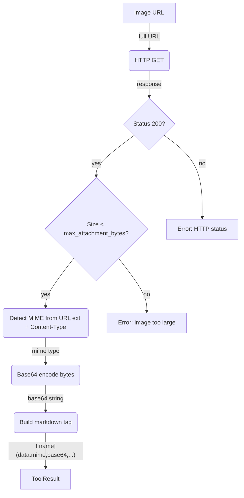

# Image Download & Encoding

## 1. Purpose

Level 2 detail for the happy-path diagram in [main-path](../main-path.md):
downloads the image bytes, verifies the MIME type and size limit (configurable
via `max_attachment_bytes`, fallback default 25MB), encodes as base64, and
builds a markdown image tag. The URL path fragment is used as the image alt
text.

## 2. Diagram

The markdown image tag format is ``.
The image name is extracted from the URL path (last segment, stripped of query
parameters). The result is appended to history as a standard
`ChatMessage::tool(call_id, content)`, then the harness intercepts it for
injection into the next LLM call (see [Harness Vision Injection](harness-injection.md)).

**Why base64 here but share links for image_gen**: the vision tool's base64 data
URIs flow only through the AI provider context and the harness's internal vision
image pool — they are never sent to RocketChat in the final reply. The LLM
receives them as `ContentPart::ImageUrl` parts (which AI providers handle
natively), and the harness collapses old vision data to `[image]` placeholders
in the conversation history. In contrast, `image_gen` results go into the
RocketChat reply text, where multi-megabyte base64 strings exceed
`Message_MaxAllowedSize` — hence the NextCloud share link approach.
