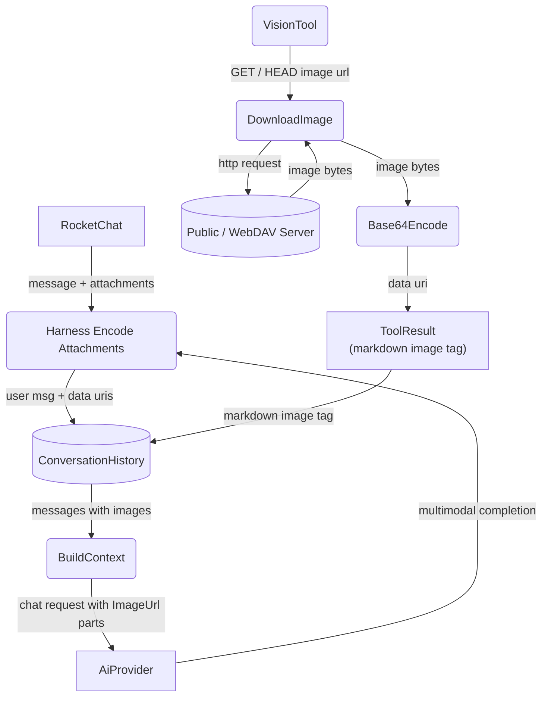

# Vision Tool

## 1. Purpose

The agent harness natively sees user attachments (left path). The vision tool is
only invoked by the LLM for remote images — public URLs or WebDAV files (right
path).

- Upstream: [Auto-Attachment Vision Pipeline](../../agent/agent-harness/auto-attachment-vision.md) — the harness's native attachment path
- Downstream: [Vision Payload Deep Dive](../../ai/ai-provider/level-2/vision-payload.md) — how the vision result reaches the multimodal model
- Interception: [Vision/WebDAV → LLM Direct Consumption](../../interception/image-interception/vision-webdav-consumption.md) — how vision tool results are consumed by the LLM

## 2. Diagram

## 3. Data Structures

Shared with [structures.md](structures.md).
