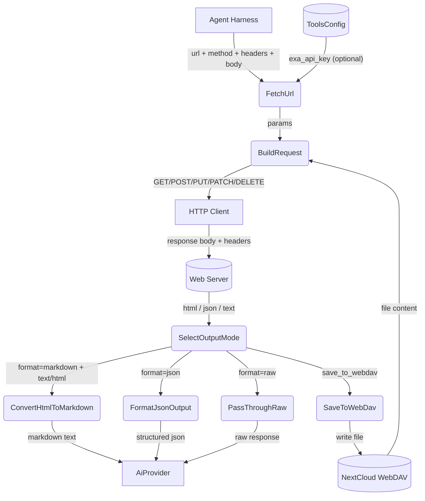
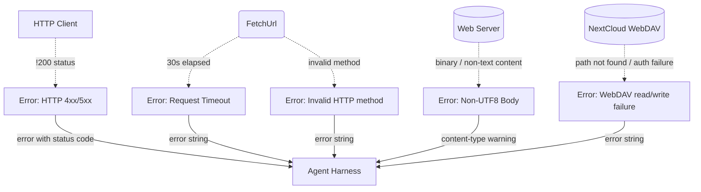
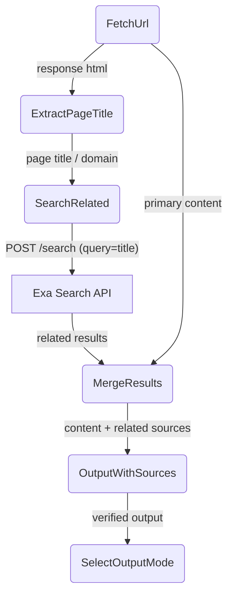

# Web Fetch

## 1. Purpose

Acts as a curl-like HTTP client: fetches content from arbitrary URLs with
customizable HTTP method, headers, and body. Supports JSON request bodies,
reading request bodies from WebDAV files, and saving response bodies to WebDAV.
Three output formats — `raw` (unmodified response body), `markdown` (HTML-to-markdown
conversion for AI consumption), and `json` (structured metadata with content).
Optionally cross-verifies fetched content via a parallel Exa web search.

This enables managing external APIs like Gitea, GitHub, or any REST API directly
from chat — create issues, query resources, or interact with webhooks.

- Upstream: [Exa Search](exa-search.md) provides the verification search when
  `verify` is enabled and an Exa API key is configured
- Upstream: [Configuration Management](../infra/config.md) supplies the
  `exa_api_key` for the optional verify flow
- Upstream: [Agent Harness](../agent/agent-harness.md) invokes web_fetch as a tool
  during the agent loop, passing a URL and format selector
- Upstream: [WebDAV Tool](webdav.md) provides file read/write for `file_from_webdav`
  and `save_to_webdav` body source/sink
- Upstream: [Secret Interception](secret-interception.md) transparently
  replaces `secret:<key>` references in header values with actual secrets
  from `secrets.toml` on WebDAV before the tool sees the arguments
- Downstream: [AI Provider](../ai/ai-provider.md) consumes the returned content
  (plain text, markdown, or structured JSON) as context for chat completions

### Non-Functional Requirements

- **No local file access**: The tool MUST NOT read from or write to the local
  filesystem. All file I/O is routed through WebDAV for remote storage only.
- All HTTP requests use `reqwest` with a 30-second timeout and `RockBot/1.0` user-agent.

## 2. Diagram

### 2a. Happy Flow (Main Success Path)



### 2b. Error Handling & Fallbacks



### 2c. Verify Deep Dive (Double-Check)



When `verify` is `true` and the tool holds a valid Exa API key, the fetched
page title is extracted and used as a query to the Exa search API. The resulting
related sources are bundled alongside the primary content, giving the AI provider
cross-referenced information for fact-checking.

### 2d. Secret Interception

Before `web_fetch` executes, the harness scans header values for `secret:<key>`
references and replaces them with actual values from `secrets.toml` on WebDAV.
The tool itself is unaware of this interception. See
[Secret Interception](secret-interception.md) for the full data flow.

## 3. Data Structures

### `FetchParams`

The table below documents the semantic interface of the `WebFetchParams` struct.

| Field              | Type     | Notes                                                      |
| ------------------ | -------- | ---------------------------------------------------------- |
| `url`              | `NonEmptyString` | The URL to fetch. Validated at LLM boundary (empty URL fails at parse boundary). |
| `method`           | `String` | HTTP method: `"GET"`, `"POST"`, `"PUT"`, `"PATCH"`, `"DELETE"`, `"HEAD"`, `"OPTIONS"` (default: `"GET"`) |
| `headers`          | `Object` | JSON object of `{ "Header-Name": "value" }` pairs. Values may contain `secret:<key>` references resolved by [Secret Interception](secret-interception.md) before the tool sees them. |
| `body`             | `String` | Raw string request body                                    |
| `body_json`        | `Object` | JSON value serialized as request body string. The caller must add `Content-Type: application/json` header manually; the tool does not inject headers automatically. |
| `file_from_webdav` | `String` | WebDAV file path to read and send as request body          |
| `save_to_webdav`   | `String` | WebDAV file path to save the response body                 |
| `format`           | `String` | Output format: `"json"`, `"markdown"`, or `"raw"` (default: `"raw"`) |
| `verify`           | `bool`   | Trigger a parallel Exa search for cross-referencing (default: `false`) |

### `FetchJsonOutput` (format=`"json"`)

> **Note:** No Rust struct exists — constructed ad-hoc. The table below documents the semantic output interface.

| Field             | Type              | Notes                                         |
| ----------------- | ----------------- | --------------------------------------------- |
| `url`             | `String`          | The requested URL                             |
| `status`          | `u16`             | HTTP status code                              |
| `content_type`    | `String`          | Content-Type header value                     |
| `content`         | `String`          | Response body (truncated to 10,000 chars)     |
| `verified`        | `bool`            | Whether cross-verification was performed      |
| `related_sources` | `Vec<SearchRef>`  | Results from the Exa verification search      |
| `response_headers`| `Option<HashMap<String, String>>` | Response headers. Omitted from output when empty (not `null`). |
| `saved_to`        | `String|null`     | WebDAV path where response was saved          |

### `SearchRef`

> **Note:** No Rust struct exists — constructed ad-hoc.

| Field    | Type     | Notes              |
| -------- | -------- | ------------------ |
| `title`  | `String` | Page title         |
| `url`    | `String` | Page URL           |
| `snippet`| `String` | Search snippet (populated from Exa's `text` field first, falling back to `snippet`) |

### Example: Creating a Gitea Issue via API (with secret reference)

```json
{
    "url": "https://gitea.example.com/api/v1/repos/owner/repo/issues",
    "method": "POST",
    "headers": {
        "Authorization": "token secret:gitea_token",
        "Content-Type": "application/json"
    },
    "body_json": {
        "title": "Bug: Login page broken",
        "body": "The login page returns 500 after recent deploy.",
        "labels": ["bug", "critical"]
    },
    "format": "json"
}
```

The harness replaces `secret:gitea_token` with the actual token from
`secrets.toml` before the HTTP request is made. The LLM never sees the real
token value.
