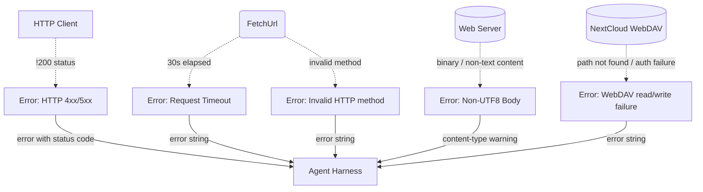

# Error Handling & Fallbacks

## 1. Purpose

Level 2 detail for the happy-path diagram in [main-path](../main-path.md): how web fetch failures are reported to the Agent Harness — request timeouts, invalid HTTP methods, HTTP 4xx/5xx responses, non-UTF8 bodies, and WebDAV read/write failures.

## 2. Diagram

