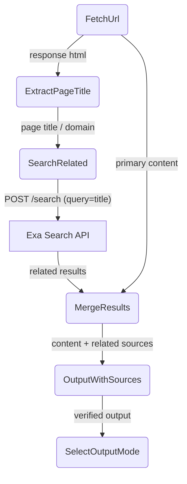

# Verify Deep Dive (Double-Check)

## 1. Purpose

Level 2 detail for the happy-path diagram in [main-path](../main-path.md): how the optional Exa cross-verification flow extracts the fetched page title, queries the Exa search API, and merges related sources into the output for fact-checking.

## 2. Diagram

When `verify` is `true` and the tool holds a valid Exa API key, the fetched
page title is extracted and used as a query to the Exa search API. The resulting
related sources are bundled alongside the primary content, giving the AI provider
cross-referenced information for fact-checking.
