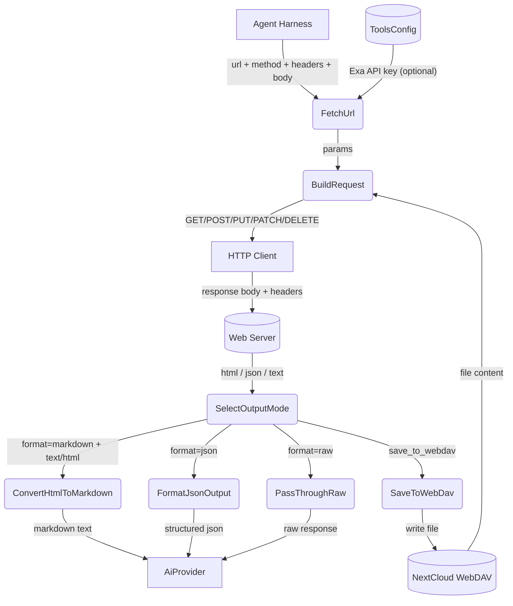

# Web Fetch

## 1. Purpose

Acts as a curl-like HTTP client: fetches content from arbitrary URLs with
customizable HTTP method, headers, and body. Supports JSON request bodies,
reading request bodies from WebDAV files, and saving response bodies to WebDAV.
Three output formats — `raw` (unmodified response body), `markdown` (HTML-to-markdown
conversion for AI consumption), and `json` (structured metadata with content).
Optionally cross-verifies fetched content via a parallel Exa web search.

This enables managing external APIs like Gitea, GitHub, or any REST API directly
from chat — create issues, query resources, or interact with webhooks.

- Upstream: [Search Web](../search-web/main-path.md) provides the verification search when
  `verify` is enabled and an Exa API key is configured
- Upstream: [Configuration Management](../../infra/config/main-path.md) supplies the
  Exa API key (from `[search.exa]` or legacy `[tools.exa]`) for the optional verify flow
- Upstream: [Agent Harness](../../agent/agent-harness/tool-dispatch.md) invokes web_fetch as a tool
  during the agent loop, passing a URL and format selector
- Upstream: [WebDAV Tool](../webdav/main-path.md) provides file read/write for `file_from_webdav`
  and `save_to_webdav` body source/sink
- Upstream: [Secret Interception](../../interception/secret-interception/uuidv5-scoped-injection.md) transparently
  replaces `secret:<key>` references in header values with actual secrets
  from `secrets.toml` on WebDAV before the tool sees the arguments
- Downstream: [AI Provider](../../ai/ai-provider/main-path.md) consumes the returned content
  (plain text, markdown, or structured JSON) as context for chat completions

## 2. Diagram

## 3. Data Structures

Shared with [structures.md](structures.md).
