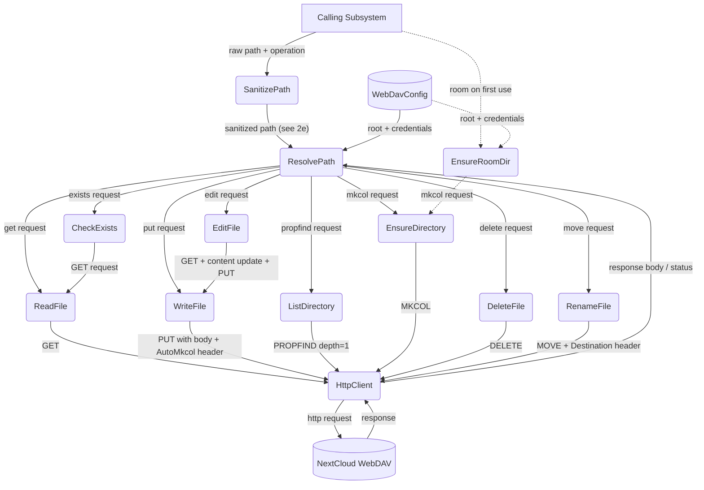
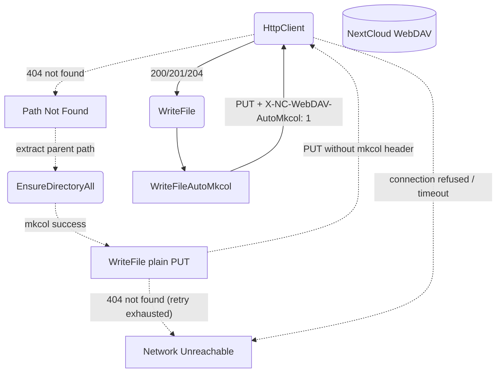
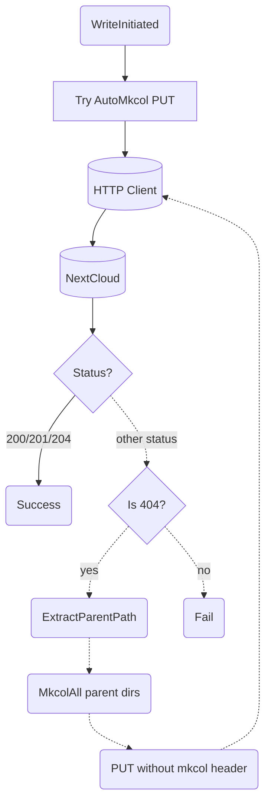
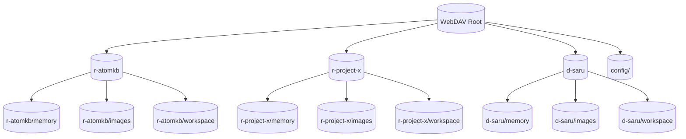
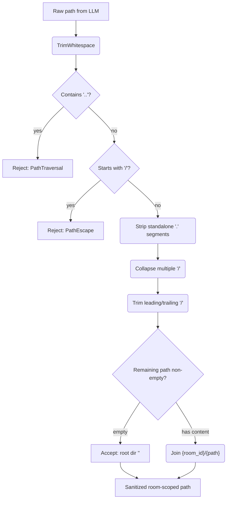

# WebDAV Directory

## 1. Purpose

Thin abstraction over HTTP-based WebDAV (NextCloud) providing typed file
read/write/list/mkdir/delete/rename with per-room directory isolation. Each room gets
its own subtree created proactively on first use. Room names use type prefixes
(`r-` for channels, `d-` for DMs) to prevent collisions.

### 1a. Room-Scoped Path Isolation with Sanitization

All WebDAV operations are **automatically scoped** to the room's dedicated
directory. Isolation is enforced at two layers:

1. **Structural**: The harness computes `webdav_dir` from `(room_name, room_fname, is_dm)` — prefixed `r-` for channels, `d-` for DMs, preferring friendly name over slug — e.g. `r-general`. `inject_room_context()` adds both `room_id` and `webdav_dir` to tool call arguments before execution — the LLM cannot override either.
2. **Sanitization (defense-in-depth)**: Every LLM-supplied `path` passes through
   a validation step before being joined with the room directory. The sanitizer
   rejects:
   - **Path traversal** — any segment equal to `..` (e.g. `foo/../bar`, `../../secrets.toml`)
   - **Absolute paths** — paths starting with `/` after trimming (would resolve relative to the WebDAV root, bypassing the room scope)
   - **Current-dir confusion** — standalone `.` segments are stripped during normalization (e.g. `./foo` → `foo`)
   - **Redundant separators** — consecutive `/` are collapsed (e.g. `foo//bar` → `foo/bar`)

   The sanitized path is then joined to the room-scoped prefix, producing a
   final path guaranteed to stay within the room's subtree.

3. The `WebDavClient`'s `base_url` (e.g.
   `https://nc.example.com/remote.php/dav/files/user/clawspaces/`) provides
   the server root; the room-scoped path is appended to form the full URL.

**This DFD serves as the canonical documentation for the webdav crate and tool.
Other tool DFDs that use WebDAV (edit_soul, save_knowledge, calendar,
image_gen, web_fetch) reference this layer instead of repeating it.**

- Upstream: [Configuration Management](../infra/config.md) provides `WebDavConfig`
- Downstream: [Agent Harness](../agent/agent-harness.md) exposes `WebDavTool` to
  the AI agent
- Downstream: [Knowledge Management](../knowledge/knowledge.md) persists `.md` files
- Downstream: [Memory Management](../memory/memory.md) uses PUT/GET/PROPFIND
- Related: [Vision Tool](vision.md) — webdav tool's `read` action detects
  image files by extension and returns base64 markdown tags (``),
  which the harness intercepts via the same vision image injection pipeline.

## 2. Diagram

### 2a. Happy Flow (Main Success Path)

Note: `ensure_room_directory()` (client.rs:264) exists but is not currently called — directories are created implicitly by `write_file_with_fallback()` via AutoMkcol.

### 2b. Error Handling & Fallbacks

### 2c. Write-With-Fallback Deep Dive

### 2d. Room Directory Structure

Each room (channel or DM) has three subdirectories: `memory/`, `images/`, and
`workspace/`. A shared `config/` directory holds backups.

> **Note:** Calendars do **not** live under the WebDAV file storage root.
> Calendar data resides in a separate CalDAV space at
> `/remote.php/dav/calendars/{user}/{cal-name}/` (see [Calendar](calendar.md)).

### 2e. Path Sanitization Checkpoint (Security)

Every LLM-supplied `path` passes through a validation checkpoint before
being joined with the room directory. This is a non-functional requirement
(security boundary) applied at the `WebDavPath::room_path()` and
`WebDavPath::image_path()` entry points. The harness-injected `webdav_dir`
is trusted (computed server-side from room metadata, not LLM-controlled).

**Implementation note**: The `url::Url::parse()` call in `full_url()` does
not normalize `../` segments — they pass through unchanged to the server
(unlike a browser which would resolve them client-side). The sanitization
must therefore happen at the `WebDavPath` layer, before the path reaches
`full_url()`.

## 3. Data Structures

#### `WebDavClient`

| Field        | Type              | Notes                                  |
| ------------ | ----------------- | -------------------------------------- |
| `base_url`   | `String`          | WebDAV endpoint including root         |
| `client`     | `reqwest::Client` | Shared HTTP client with connection pool|
| `auth_header`| `String`          | `Basic` base64-encoded credentials     |

#### `WebDavEntry`

| Field      | Type     | Notes                              |
| ---------- | -------- | ---------------------------------- |
| `name`     | `String` | File or directory name             |
| `href`     | `String` | Full WebDAV href                   |
| `is_dir`   | `bool`   | True if collection (directory)     |
| `size`     | `u64`    | File size in bytes (0 for dirs)    |
| `modified` | `String` | Last-modified timestamp            |

#### `WebDavPath`

All methods accept a `dir_key` — a flat type-prefixed directory name such
as `r-森林生態` or `d-saru`. The harness computes `webdav_dir` preferring
`room_fname` (the friendly display name) over `room_name` (the ASCII slug);
the raw RocketChat room UUID is never used as a path segment.

`room_path()` and `image_path()` validate the caller-supplied path
component, rejecting traversal attempts before joining with the room prefix.

| Method                     | Returns         | Notes                                       |
| -------------------------- | --------------- | ------------------------------------------- |
| `sanitize_subpath(raw)`    | `Result<String>` | Validates and normalizes a path component (see 2e). Rejects `..`, absolute paths. Strips `.`, collapses `//`. |
| `memory_dir(key)`          | `String`         | `/{root}/{key}/memory/`                     |
| `room_path(key, file)`     | `Result<String>` | Sanitizes `file`, then joins: `/{root}/{key}/{file}` |
| `image_dir(key)`           | `String`         | `/{root}/{key}/images/`                     |
| `workspace_dir(key)`       | `String`         | `/{root}/{key}/workspace/`                  |
| `image_path(key, name)`    | `Result<String>` | Sanitizes `name`, then joins: `/{root}/{key}/images/{name}` |
| `parent_path(path)`        | `String`         | Strips last path segment                    |
| `config_backup_path(filename)` | `String`     | `/{root}/config/{filename}`                 |

#### `WebDavError::PathTraversal`

| Field    | Type     | Notes                                      |
| -------- | -------- | ------------------------------------------ |
| `path`   | `String` | The raw path that was rejected             |
| `reason` | `String` | Human-readable reason (e.g. "contains '..' segment", "absolute path not allowed") |

#### `WebDavTool` Rename Parameters

The `rename` action takes two room-scoped paths: `path` (source) and
`destination` (target). Both pass through the same sanitization checkpoint
(2e) before being resolved to full WebDAV URLs. The tool computes the
`Destination` header from the resolved target URL. The `Overwrite: F`
header prevents accidental overwrites — if the destination already exists,
the server returns 412 Precondition Failed.

| Parameter     | Type     | Notes                                                       |
| ------------- | -------- | ----------------------------------------------------------- |
| `action`      | `String` | `"rename"`                                                  |
| `path`        | `String` | Source file/directory path, room-scoped and sanitized       |
| `destination` | `String` | Target file/directory path, room-scoped and sanitized       |

## 4. NextCloud API Reference

Per [NextCloud WebDAV basic operations](https://docs.nextcloud.com/server/latest/developer_manual/client_apis/WebDAV/basic.html).

| DFD Operation           | HTTP Method | NextCloud Endpoint                        | Notes                                |
| ----------------------- | ----------- | ----------------------------------------- | ------------------------------------ |
| ReadFile                | `GET`       | `{base}/files/{user}/{path}`              | Returns raw file bytes               |
| WriteFile               | `PUT`       | `{base}/files/{user}/{path}`              | Overwrites existing files            |
| WriteFileAutoMkcol      | `PUT`       | `{base}/files/{user}/{path}`              | Set `X-NC-WebDAV-AutoMkcol: 1` header |
| WriteFileWithFallback   | `PUT`       | `{base}/files/{user}/{path}`              | Tries AutoMkcol; 404 → mkcol parents → retry PUT |
| ListDirectory           | `PROPFIND`  | `{base}/files/{user}/{path}`              | `Depth: 1` for children              |
| EnsureDirectory         | `MKCOL`     | `{base}/files/{user}/{path}`              | Returns 405 if exists                |
| EnsureDirectoryAll      | `MKCOL`     | `{base}/files/{user}/{path}`              | Iterative MKCOL per segment          |
| EnsureRoomDirectory     | `MKCOL`     | `{base}/files/{user}/{root}/{room}/`      | Creates room dir on first use        |
| Delete                  | `DELETE`    | `{base}/files/{user}/{path}`              | Recursive for folders                |
| RenameFile              | `MOVE`      | `{base}/files/{user}/{path}`              | `Destination: {base}/files/{user}/{dest}` header; `Overwrite: F`. Works for both rename and move — they are the same WebDAV operation. |
| Exists                  | `PROPFIND`  | `{base}/files/{user}/{path}`              | `Depth: 0` — 207 = exists, 404 = no  |
