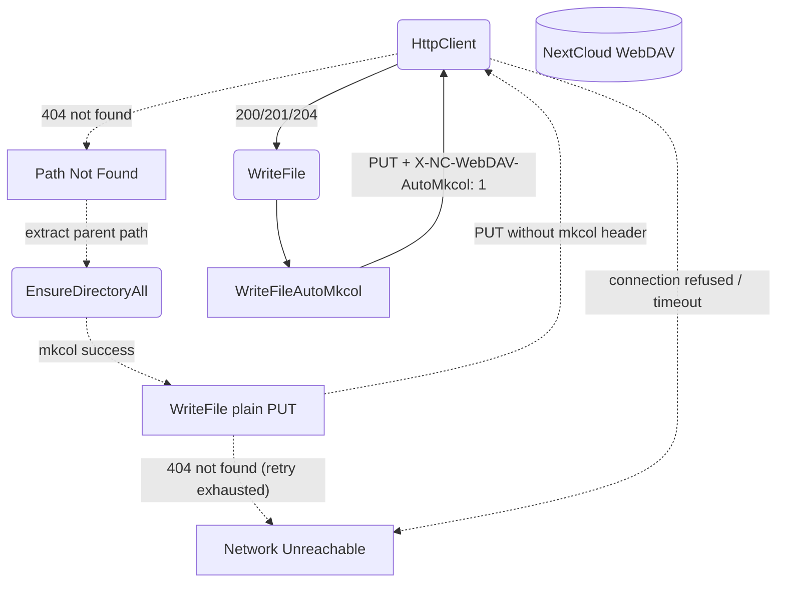

# WebDAV — Error Handling

## 1. Purpose

Error paths and fallbacks for WebDAV operations — failed AutoMkcol writes
degrade to parent-directory creation and a plain PUT retry; network failures
surface as errors. See [Main Path](../main-path.md) for the happy flow.

## 2. Diagram

