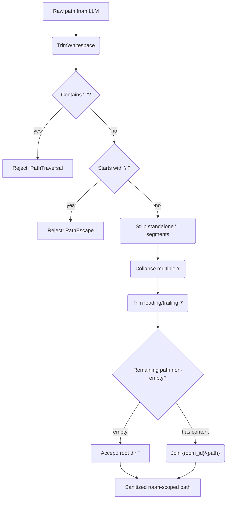

# WebDAV — Path Sanitization Checkpoint (Security)

## 1. Purpose

Every LLM-supplied `path` passes through a validation checkpoint before
being joined with the room directory. This is a non-functional requirement
(security boundary) applied at the `WebDavPath::room_path()` and
`WebDavPath::image_path()` entry points. The harness-injected `webdav_dir`
is trusted (computed server-side from room metadata, not LLM-controlled).
See [Main Path](../main-path.md) for the overall flow.

## 2. Diagram

**Implementation note**: The `url::Url::parse()` call in `full_url()` does
not normalize `../` segments — they pass through unchanged to the server
(unlike a browser which would resolve them client-side). The sanitization
must therefore happen at the `WebDavPath` layer, before the path reaches
`full_url()`.
