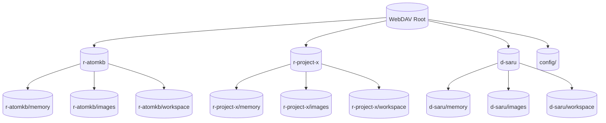

# WebDAV — Room Directory Structure

## 1. Purpose

Each room (channel or DM) has three subdirectories: `memory/`, `images/`, and
`workspace/`. A shared `config/` directory holds backups.

## 2. Diagram

> **Note:** Calendars do **not** live under the WebDAV file storage root.
> Calendar data resides in a separate CalDAV space at
> `/remote.php/dav/calendars/{user}/{cal-name}/` (see [Calendar](../../calendar/main-path.md)).
