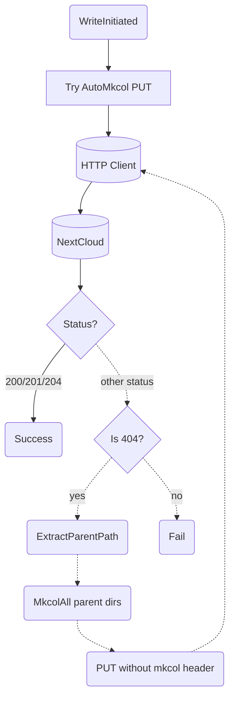

# WebDAV — Write-With-Fallback Deep Dive

## 1. Purpose

Deep dive into `write_file_with_fallback()`: try a PUT with the
`X-NC-WebDAV-AutoMkcol: 1` header; on 404, extract the parent path, create
all parent directories via MKCOL, then retry the PUT. See [Main Path](../main-path.md)
for the happy flow.

## 2. Diagram

