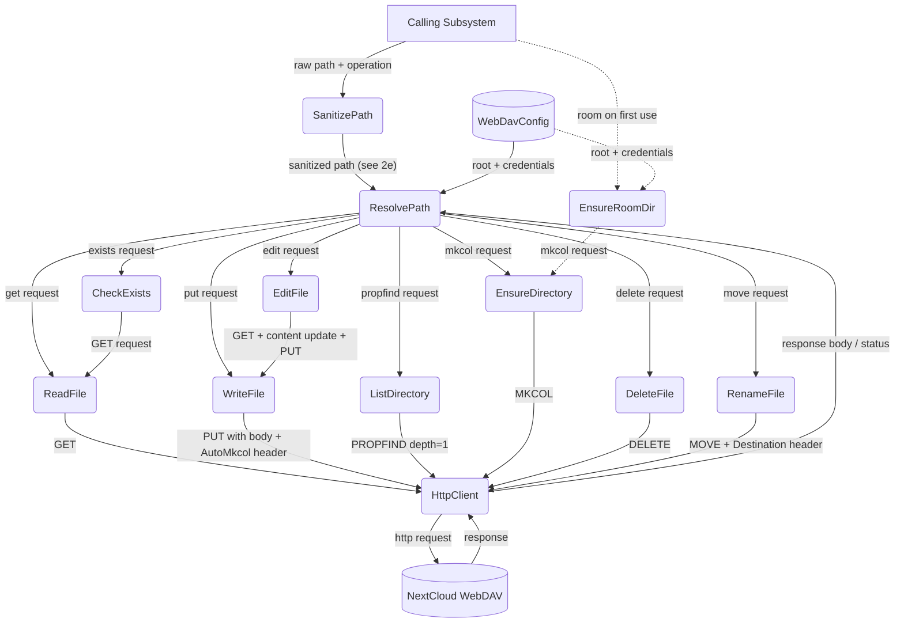

# WebDAV — Main Path

## 1. Purpose

Happy flow of the WebDAV tool layer: a caller supplies a raw path and an
operation; the path is sanitized, resolved against the room-scoped prefix,
and dispatched as the corresponding HTTP request to NextCloud. The whole
flow is a thin abstraction — data structures are shared, see
[structures.md](structures.md).

## 2. Diagram

Note: `ensure_room_directory()` (client.rs:264) exists but is not currently called — directories are created implicitly by `write_file_with_fallback()` via AutoMkcol.
