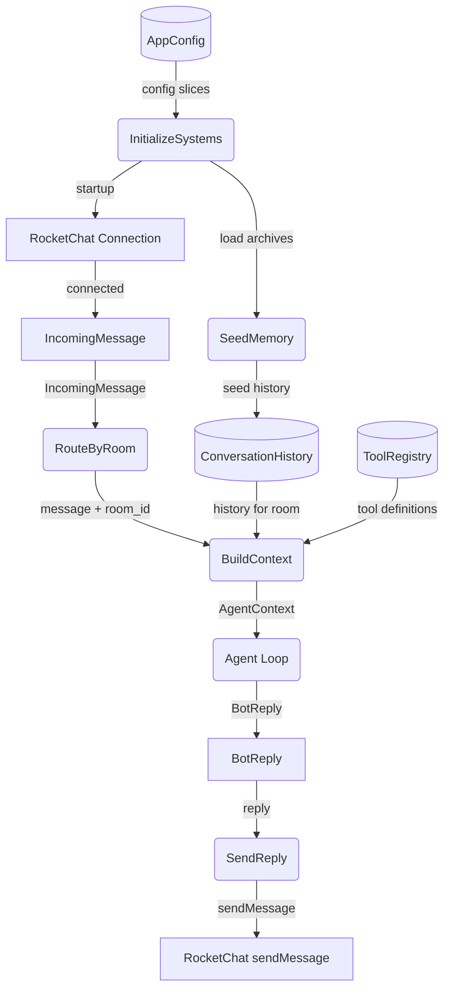
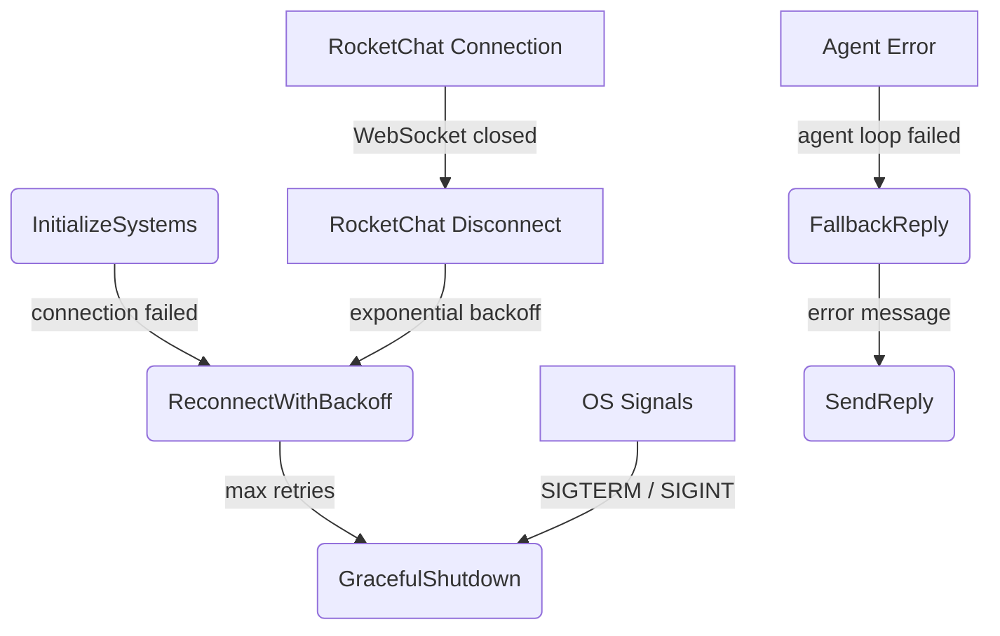

# Agent Harness

## 1. Purpose

Top-level application runtime that initializes all subsystems, runs the main
event loop, routes incoming messages through the agentic pipeline, and manages
the bot lifecycle — startup, per-room state coordination, shutdown, and
reconnection.

- Downstream: [RocketChat Connection](rocketchat.md) receives `AppConfig` and
  produces `IncomingMessage` events; consumes `BotReply` for delivery
- Downstream: [Agent Orchestration](agent.md) receives per-room `AgentContext`
  and returns `BotReply`
- Downstream: [Memory Management](memory.md) provides conversation history per
  room, triggered on startup (load archives) and after each message
- Downstream: [AI Provider](ai-provider.md), [Configuration Management](config.md),
  [WebDAV Storage](webdav.md) — consumed indirectly through the subsystems above

## 2. Diagram

### 2a. Happy Flow (Main Success Path)



### 2b. Error Handling & Fallbacks



### 2c. Per-Room State Routing

Each room maintains independent state — conversation history, agent context, and
WebDAV archive path. The harness routes incoming messages to the correct room's
pipeline.

```mermaid
flowchart TD
    RC[IncomingMessage]
    ROOM_MAP[(RoomStateMap)]
    GET_EXIST{GetOrCreate}
    NEW_ROOM(NewRoomState)
    EXIST_ROOM[RoomState]
    MEM[(InMemoryHistory)]
    AGENT(Agent Loop)
    AREPLY[BotReply]
    DAV[{room_id}/memory/]
    DAV_IMG[{room_id}/images/]

    RC -->|"room_id"| GET_EXIST
    ROOM_MAP -->|"lookup"| GET_EXIST
    GET_EXIST -->|"not found"| NEW_ROOM
    GET_EXIST -->|"found"| EXIST_ROOM
    NEW_ROOM -->|"load archives"| DAV
    DAV -->|"archive files"| NEW_ROOM
    NEW_ROOM -->|"seed"| MEM
    NEW_ROOM -->|"store"| ROOM_MAP
    EXIST_ROOM -->|"history"| MEM
    MEM -->|"history"| AGENT
    AGENT -->|"reply"| AREPLY
    AGENT -->|"generated image"| DAV_IMG
```

### 2d. Startup Sequence Deep Dive

```mermaid
flowchart TD
    START[main()]
    CFG(LoadConfig)
    MIGRATE{Legacy JSON?}
    TOML["config.toml"]
    JSON["config.json"]
    VALIDATE(ValidateConfig)
    LOGIN(LoginRocketChat)
    CONNECT(ConnectWebSocket)
    DAV[(WebDAV)]
    LIST_MEM(ListMemoryArchives)
    SEED(SeedAllRooms)
    LOOP[Event Loop]
    CFG_STORE[(AppConfig)]

    START -->|"config path"| CFG
    CFG -->|"load TOML"| TOML
    CFG -->|"check legacy"| MIGRATE
    MIGRATE -->|"found"| JSON
    JSON -->|"migrate"| TOML
    TOML -->|"raw config"| VALIDATE
    VALIDATE -->|"AppConfig"| CFG_STORE
    CFG_STORE -->|"server section"| LOGIN
    LOGIN -->|"auth token"| CONNECT
    CONNECT -->|"connected"| DAV
    CFG_STORE -->|"WebDAV credentials"| DAV
    DAV -->|"PROPFIND"| LIST_MEM
    LIST_MEM -->|"archive list"| SEED
    SEED -->|"ready"| LOOP
```

## 3. Data Structures

#### `HarnessState`

| Field       | Type                       | Notes                                       |
| ----------- | -------------------------- | ------------------------------------------- |
| `config`    | `Arc<AppConfig>`           | Immutable configuration shared across subsystems |
| `rooms`     | `HashMap<String, RoomState>` | Per-room state map (room_id → state)     |
| `client`    | `rocketchat::Client`       | RocketChat connection handle                |
| `agent`     | `Agent`                    | Single agent instance (state per room)      |
| `memory`    | `MemoryManager`            | Per-room conversation history               |
| `webdav`    | `WebDavClient`             | WebDAV handle for persistent storage        |

#### `RoomState`

| Field      | Type                | Notes                                      |
| ---------- | ------------------- | ------------------------------------------ |
| `room_id`  | `String`            | RocketChat room/channel identifier         |
| `is_dm`    | `bool`              | True if direct message room                |
| `history`  | `ConversationHistory`| In-memory message buffer for this room     |
| `webdav_root` | `String`         | `/{root}/{room_id}/` path prefix           |

#### `LifecycleSignal`

| Variant    | Fields             | Notes                                      |
| ---------- | ------------------ | ------------------------------------------ |
| `Startup`  | —                  | Bot is initializing                        |
| `Running`  | —                  | Main event loop active                     |
| `Shutdown` | `exit_code: i32`   | Graceful shutdown triggered                |
| `Reconnect`| `attempt: u32`     | WebSocket reconnection in progress         |
