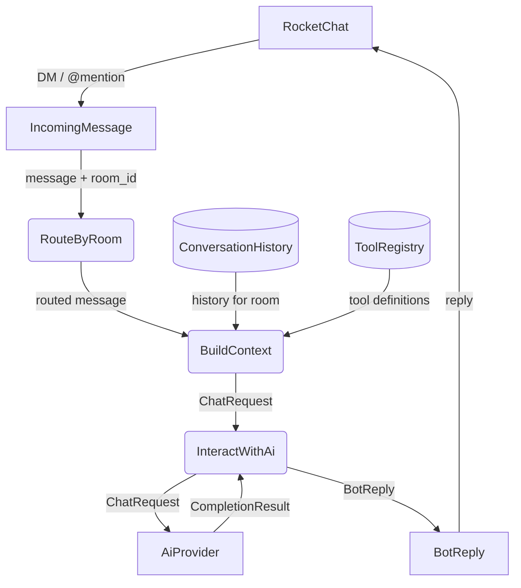
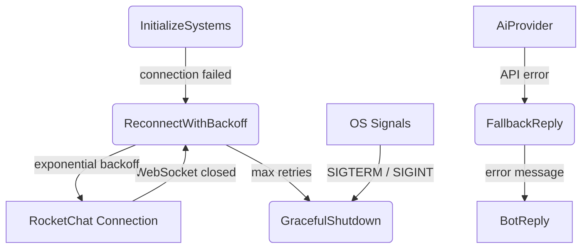
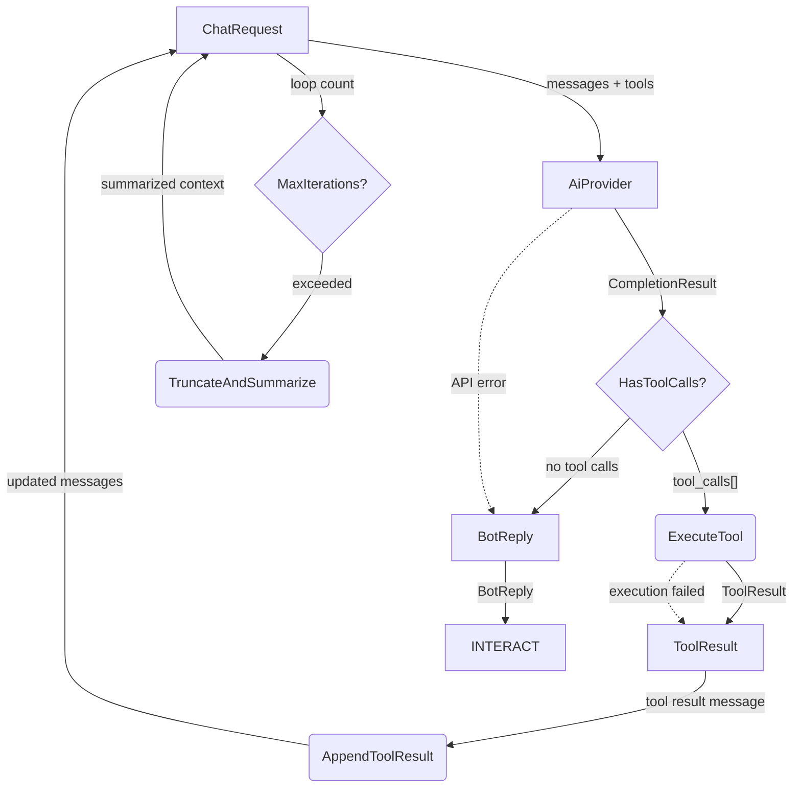
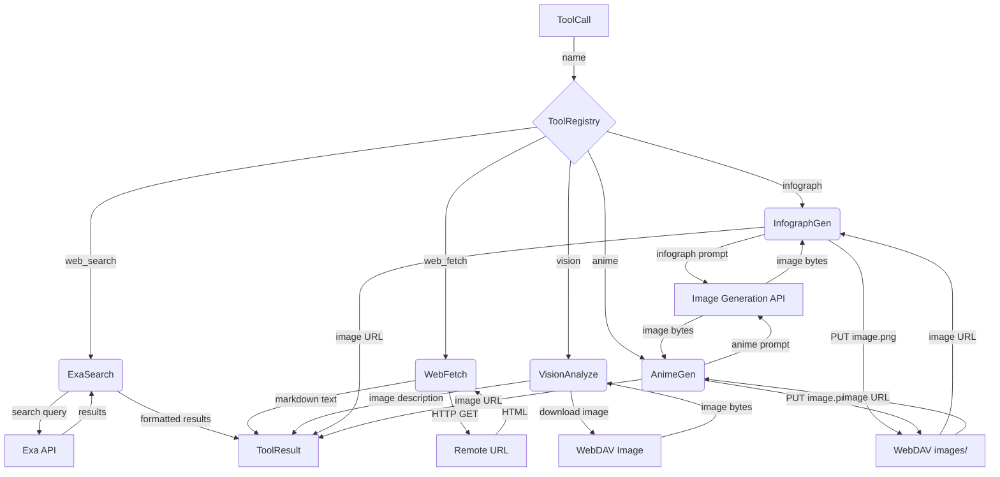
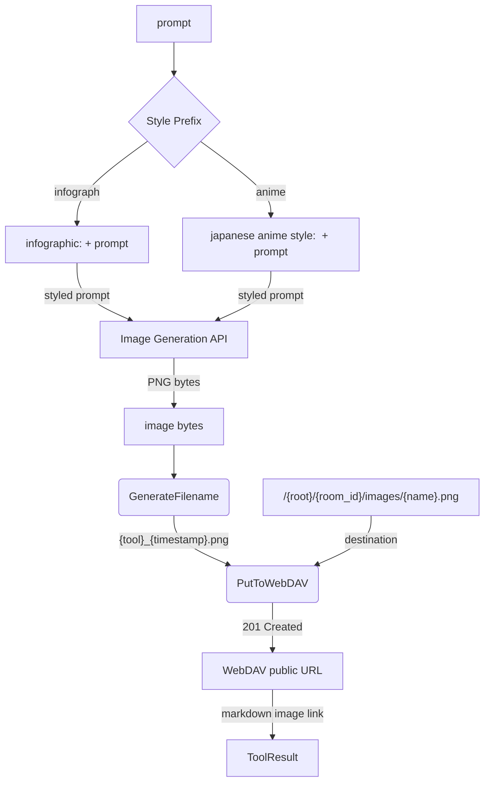
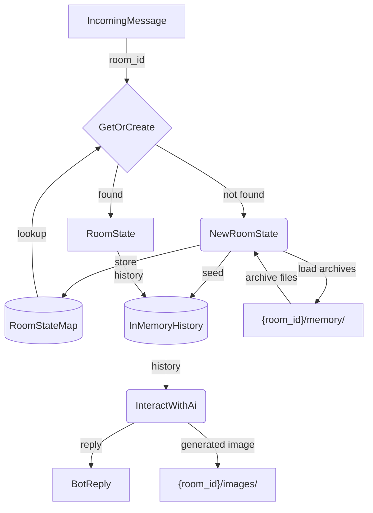
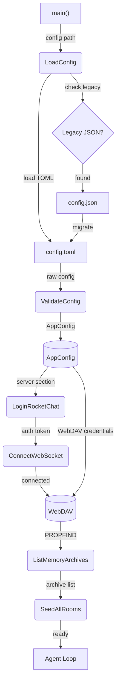

# Agent Loop

## 1. Purpose

The agent loop — the core event-driven pipeline that receives incoming messages
from RocketChat, builds per-room context (system prompt + conversation history +
tool definitions), interacts with the AI provider in a tool-calling loop, and
returns replies. This IS the agent: a single loop that routes messages, maintains
per-room state, and orchestrates LLM interaction.

- Downstream: [RocketChat Connection](rocketchat.md) produces `IncomingMessage`
  events and consumes `BotReply` for delivery
- Downstream: [Memory Management](memory.md) provides `ConversationHistory` per
  room and receives new messages for archival
- Downstream: [AI Provider](ai-provider.md) receives `ChatRequest` and returns
  `CompletionResult` with tool calls or final text
- Downstream: [WebDAV Storage](webdav.md) persists generated image assets

## 2. Diagram

### 2a. Agent Loop (Main Success Path)

### 2b. Error Handling & Fallbacks

### 2c. LLM Interaction Deep Dive

Level 2 decomposition of `InteractWithAi`: the tool-calling loop that queries the
AI provider, executes any tool calls, feeds results back, and loops until a final
text reply is produced.

### 2d. Tool Execution Deep Dive

### 2e. Image Generation Pipeline

Both `infograph` and `anime` share the same pipeline; only the system prompt
and style prefix differ.

### 2f. Per-Room State Routing

Each room maintains independent state — conversation history, agent context, and
WebDAV archive path. The agent routes incoming messages to the correct room's
pipeline.

### 2g. Startup Sequence

### 2h. Tool Definitions

| Tool Name     | Description                                      | Arguments                          |
| ------------- | ------------------------------------------------ | ---------------------------------- |
| `web_search`  | Search the web using Exa                         | `query: string`                    |
| `web_fetch`   | Fetch a URL, optionally as markdown              | `url: string, markdown: bool`      |
| `vision`      | Describe or analyze an image                     | `url: string, prompt: string`      |
| `infograph`   | _(planned)_ Generate an infographic image        | `prompt: string`                   |
| `anime`       | _(planned)_ Generate a Japanese anime-style image | `prompt: string`                  |

## 3. Data Structures

#### `HarnessState`

| Field       | Type                       | Notes                                       |
| ----------- | -------------------------- | ------------------------------------------- |
| `config`    | `Arc<AppConfig>`           | Immutable configuration shared across subsystems |
| `rooms`     | `HashMap<String, RoomState>` | Per-room state map (room_id → state)     |
| `client`    | `rocketchat::Client`       | RocketChat connection handle                |
| `memory`    | `MemoryManager`            | Per-room conversation history               |
| `webdav`    | `WebDavClient`             | WebDAV handle for persistent storage        |

#### `RoomState`

| Field      | Type                | Notes                                      |
| ---------- | ------------------- | ------------------------------------------ |
| `room_id`  | `String`            | RocketChat room/channel identifier         |
| `is_dm`    | `bool`              | True if direct message room                |
| `history`  | `ConversationHistory`| In-memory message buffer for this room     |
| `webdav_root` | `String`         | `/{root}/{room_id}/` path prefix           |

#### `LifecycleSignal`

| Variant    | Fields             | Notes                                      |
| ---------- | ------------------ | ------------------------------------------ |
| `Startup`  | —                  | Bot is initializing                        |
| `Running`  | —                  | Main event loop active                     |
| `Shutdown` | `exit_code: i32`   | Graceful shutdown triggered                |
| `Reconnect`| `attempt: u32`     | WebSocket reconnection in progress         |

#### `AgentContext`

| Field           | Type                  | Notes                              |
| --------------- | --------------------- | ---------------------------------- |
| `system_prompt` | `String`              | Bot personality and instructions   |
| `history`       | `Vec<ChatMessage>`    | Conversation history for room      |
| `tools`         | `Vec<ToolDef>`        | Registered tool definitions        |
| `room_id`       | `String`              | Source room/DM identifier          |

#### `ToolResult`

| Field      | Type     | Notes                                      |
| ---------- | -------- | ------------------------------------------ |
| `call_id`  | `String` | Matches `ToolCall.id`                      |
| `name`     | `String` | Tool name                                  |
| `content`  | `String` | Result text (returned to LLM as tool msg)  |
| `is_error` | `bool`   | True if tool execution failed              |

#### `ToolRegistry`

| Field      | Type                    | Notes                          |
| ---------- | ----------------------- | ------------------------------ |
| `tools`    | `HashMap<String, Box<dyn Tool>>` | Name → implementation |

#### `ToolDef`

| Field        | Type     | Notes                                   |
| ------------ | -------- | --------------------------------------- |
| `name`       | `String` | Function name                           |
| `description`| `String` | Human-readable description for the LLM  |
| `parameters` | `Value`  | JSON Schema for arguments               |
