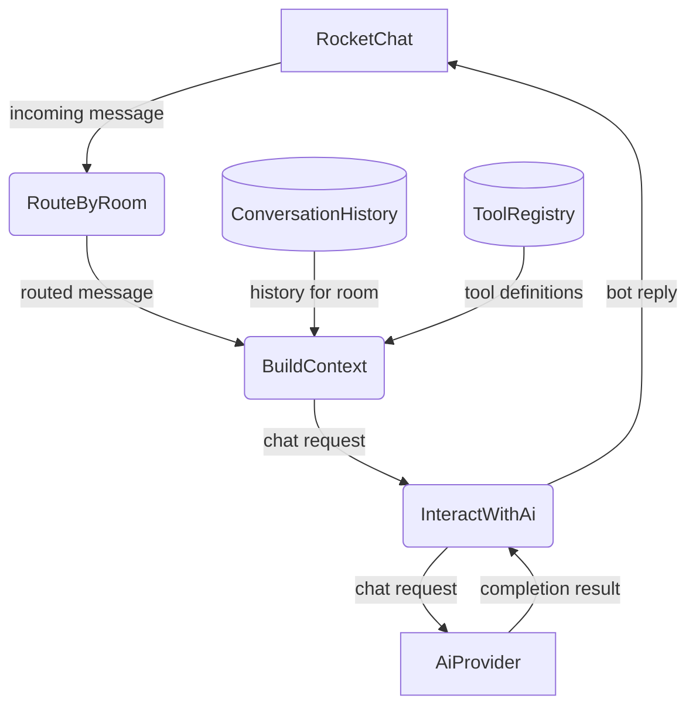
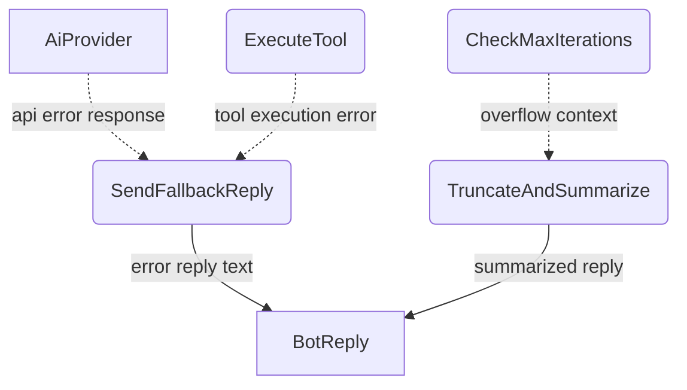
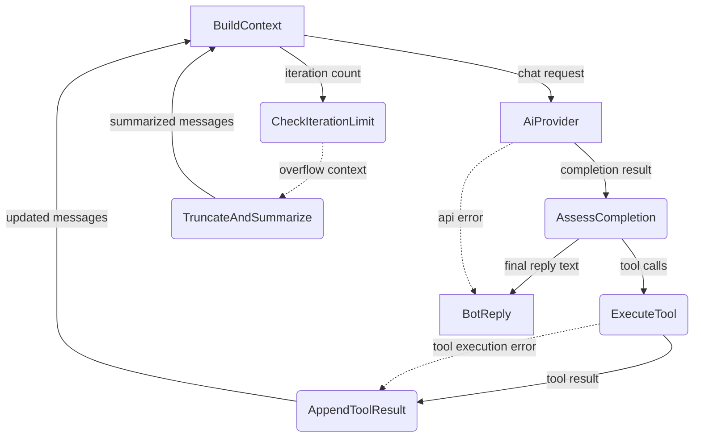
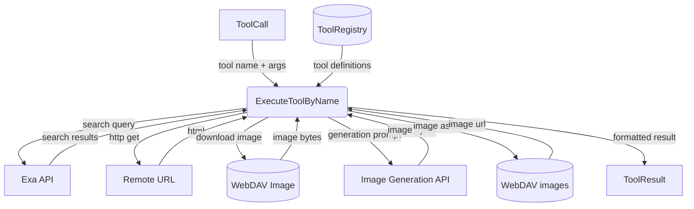
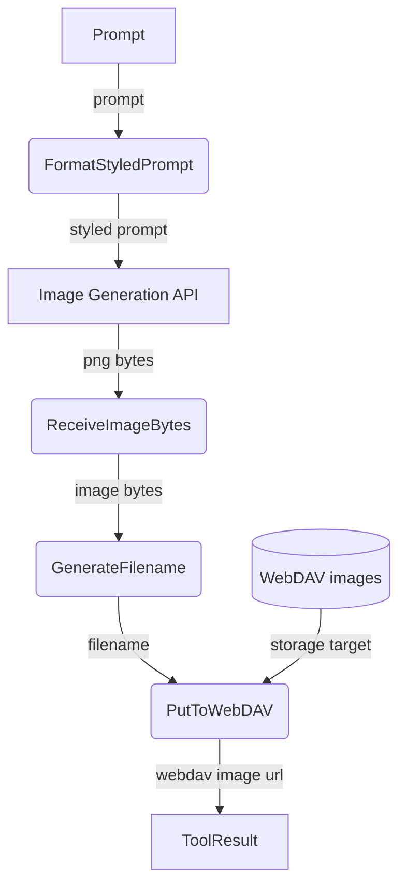
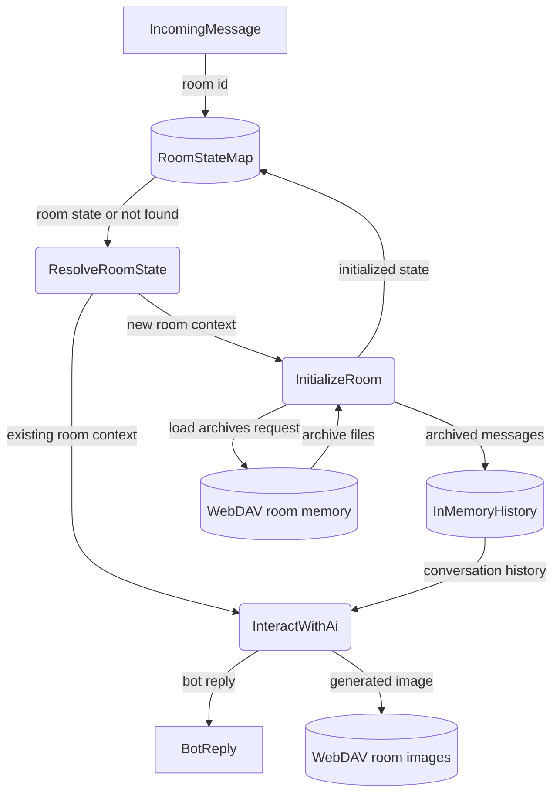

# Agent Harness

## 1. Purpose

The operational environment that wraps the agent loop — the invariant core
cycle of `LLM → tools → LLM → ...`. The harness layers Tools, Knowledge, and
Context around this loop without modifying it.

### 1a. Micro Harness Scope

rockbot implements a **micro harness**: a minimal harness with only the
mechanisms needed for a single-agent, single-channel chatbot. Three of the six
standard harness mechanisms are present:

| Mechanism   | Coverage | Details |
|-------------|----------|---------|
| **Tools**   | Full     | `web_search`, `web_fetch`, `vision`, `webdav`, image generation — each tool has its own DFD |
| **Knowledge** | Full  | On-demand context via [Memory Management](base/memory.md): archive loading, conversation history, system prompt assembly |
| **Context** | Full     | Per-room history, loop iteration limits, truncation/summarization, room state routing |

Intentionally absent — not needed for rockbot's scope:

| Mechanism       | Reason |
|-----------------|--------|
| **Permissions** | Single-user bot — no sandbox or approval flows |
| **Extensions**  | No plugin/hook system — tools are statically registered |
| **Coordination**| Single agent — no subagents, teams, or worktrees |

- Upstream: [Agent Loop](agent-loop.md) feeds `IncomingMessage`
  into the loop and consumes `BotReply`
- Downstream: [AI Provider](base/ai-provider.md) receives `ChatRequest` and returns
  `CompletionResult` with tool calls or final text
- Downstream: [Memory Management](base/memory.md) provides `ConversationHistory` per
  room and receives new messages for archival
- Downstream: [WebDAV Storage](base/webdav.md) persists generated image assets

## 2. Diagram

### 2a. Agent Loop (Main Success Path)

### 2b. Error Handling & Fallbacks

### 2c. Agent Loop Deep Dive

Level 2 decomposition of the invariant agent loop (`while True: LLM → tools →
LLM`): queries the AI provider, executes any tool calls, feeds results back, and
loops until a final text reply is produced.

### 2d. Tool Execution Deep Dive

### 2e. Image Generation Pipeline

Both `infograph` and `anime` share the same pipeline; only the system prompt
and style prefix differ.

### 2f. Per-Room State Routing

Each room maintains independent state — conversation history, agent context, and
WebDAV archive path. The agent routes incoming messages to the correct room's
pipeline.

## 3. Data Structures

#### `AgentContext`

| Field           | Type                  | Notes                              |
| --------------- | --------------------- | ---------------------------------- |
| `system_prompt` | `String`              | Bot personality and instructions   |
| `history`       | `Vec<ChatMessage>`    | Conversation history for room      |
| `tools`         | `Vec<ToolDef>`        | Registered tool definitions        |
| `room_id`       | `String`              | Source room/DM identifier          |

#### `ToolResult`

| Field      | Type     | Notes                                      |
| ---------- | -------- | ------------------------------------------ |
| `call_id`  | `String` | Matches `ToolCall.id`                      |
| `name`     | `String` | Tool name                                  |
| `content`  | `String` | Result text (returned to LLM as tool msg)  |
| `is_error` | `bool`   | True if tool execution failed              |

#### `ToolRegistry`

| Field      | Type                    | Notes                          |
| ---------- | ----------------------- | ------------------------------ |
| `tools`    | `HashMap<String, Box<dyn Tool>>` | Name → implementation |

#### `ToolDef`

| Field        | Type     | Notes                                   |
| ------------ | -------- | --------------------------------------- |
| `name`       | `String` | Function name                           |
| `description`| `String` | Human-readable description for the LLM  |
| `parameters` | `Value`  | JSON Schema for arguments               |

#### Registered Tools

| Tool Name     | Description                                      | Arguments                          |
| ------------- | ------------------------------------------------ | ---------------------------------- |
| `web_search`  | Search the web using Exa                         | `query: string`                    |
| `web_fetch`   | Fetch a URL, optionally as markdown              | `url: string, markdown: bool`      |
| `vision`      | Download an image and report metadata _(true vision — sending image data to AI provider — is planned)_ | `url: string, prompt: string`      |
| `infograph`   | _(planned)_ Generate an infographic image        | `prompt: string`                   |
| `anime`       | _(planned)_ Generate a Japanese anime-style image | `prompt: string`                  |
