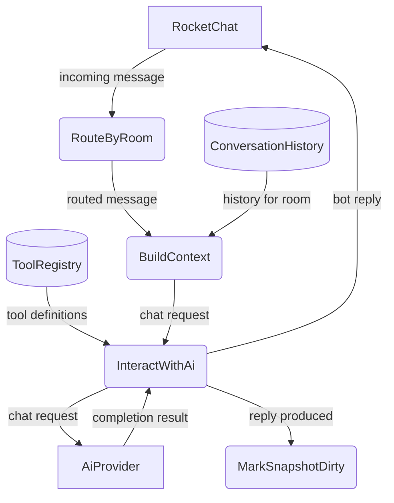
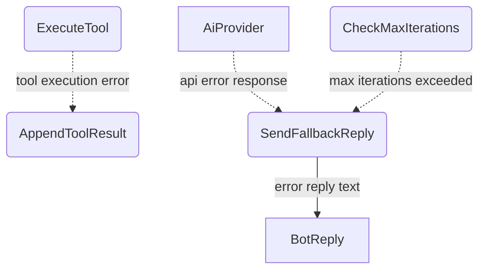
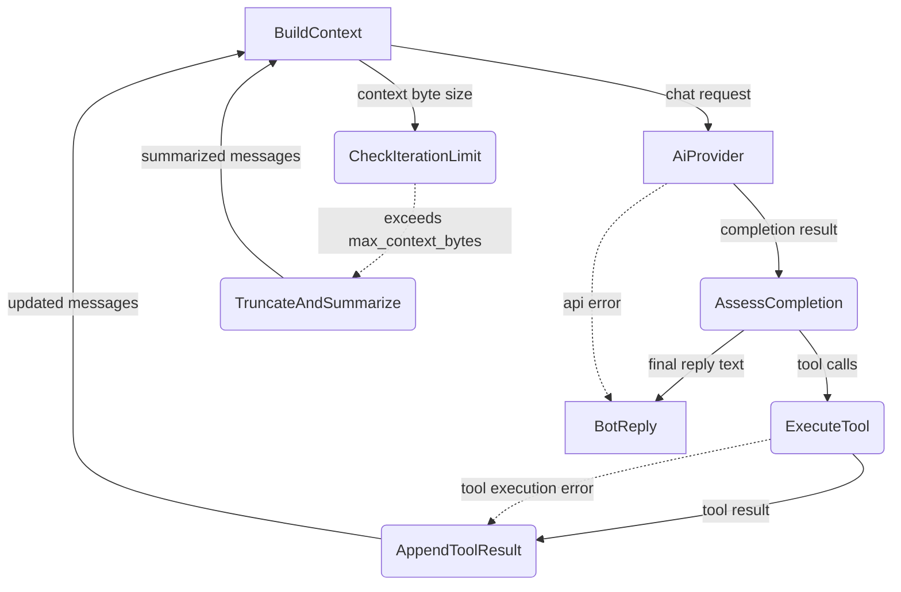
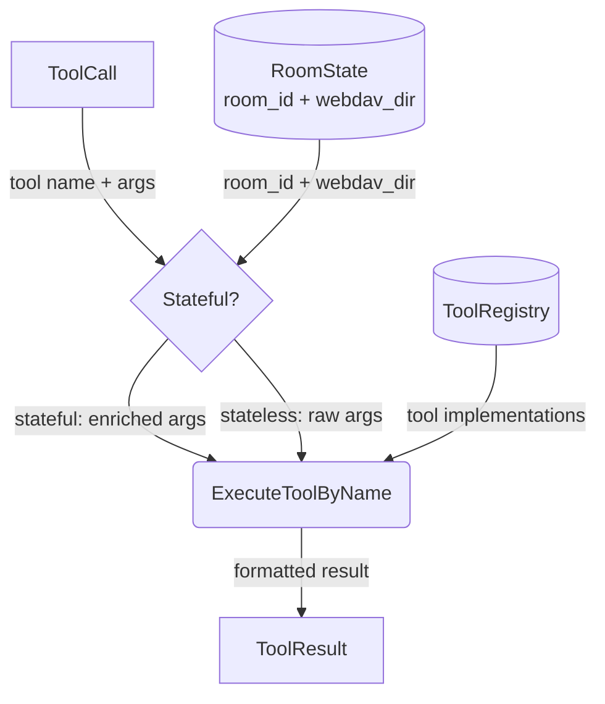
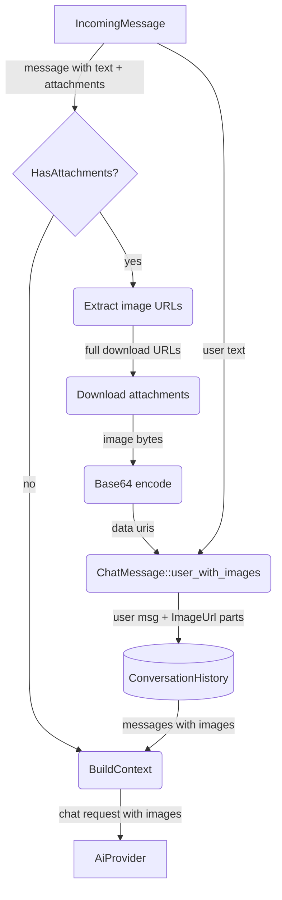
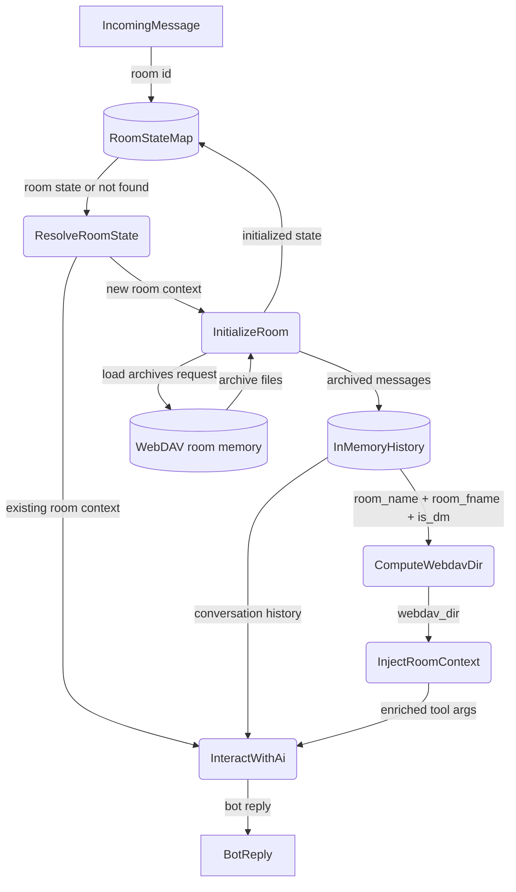
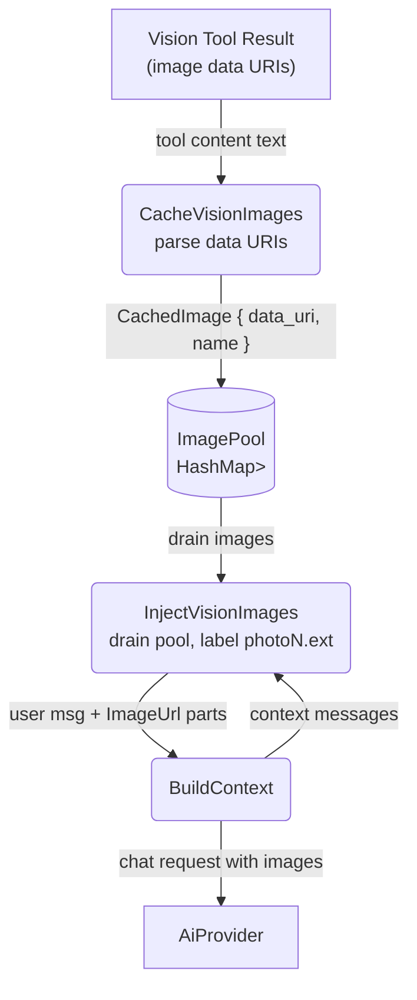
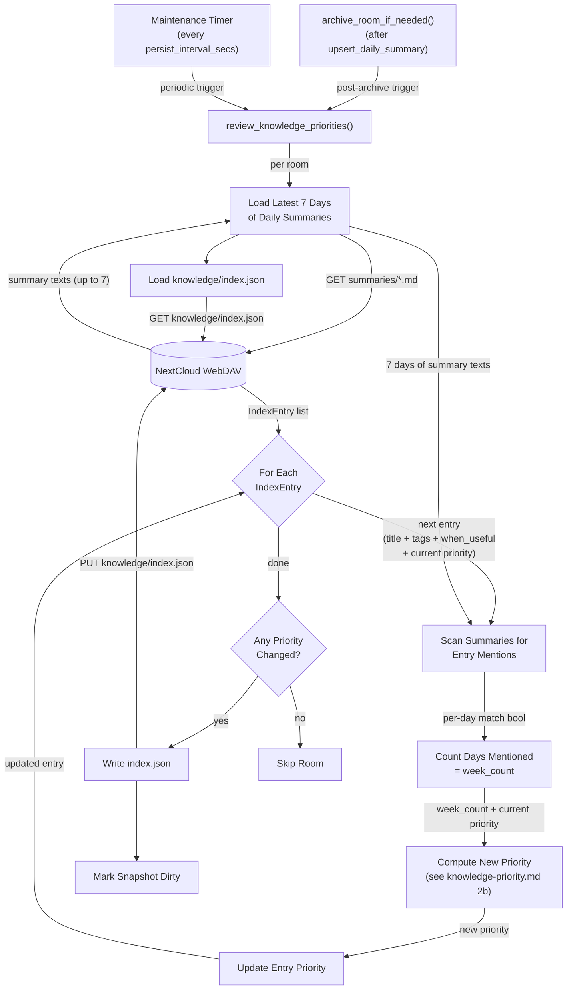
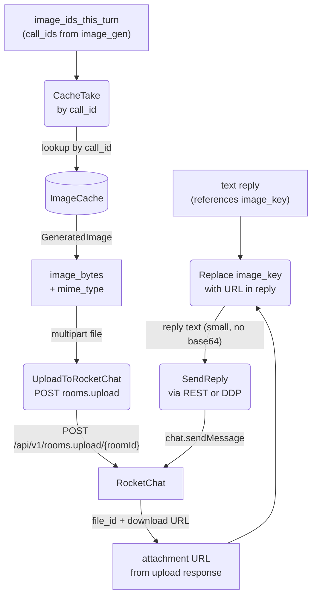

# Agent Harness

## 1. Purpose

The operational environment that wraps the agent loop — the invariant core
cycle of `LLM → tools → LLM → ...`. The harness layers Tools, Knowledge, and
Context around this loop without modifying it.

### 1a. Micro Harness Scope

rockbot implements a **micro harness**: a minimal harness with only the
mechanisms needed for a single-agent, single-channel chatbot. Three of the six
standard harness mechanisms are present:

| Mechanism   | Coverage | Details |
|-------------|----------|---------|
| **Tools**   | Full     | Abstract tool calling via `ToolRegistry` — individual tools each have their own DFD |
| **Context** | Full     | Per-room conversation history buffer, summarization, archive loading — see [Memory Management](base/memory.md); plus iteration limits, room state routing, system prompt assembly |
| **Knowledge** | Full     | `save_knowledge`, `forget_knowledge`, `recall_knowledge`; adaptive priority recalculation via daily summary review — see [Knowledge Management](base/knowledge.md) and [Knowledge Priority Algorithm](base/knowledge-priority.md) |

Intentionally absent — not needed for rockbot's scope:

| Mechanism       | Reason |
|-----------------|--------|
| **Permissions** | Single-user bot — no sandbox or approval flows |
| **Extensions**  | No plugin/hook system — tools are statically registered |
| **Coordination**| Single agent — no subagents, teams, or worktrees |

- Upstream: [Agent Loop](agent-loop.md) feeds `IncomingMessage`
  into the loop and consumes `BotReply`
- Downstream: [AI Provider](base/ai-provider.md) receives `ChatRequest` and returns
  `CompletionResult` with tool calls or final text
- Downstream: [Memory Management](base/memory.md) provides `ConversationHistory` per
  room and receives new messages for archival
- Downstream: [Knowledge Management](base/knowledge.md) extracts and persists
  domain facts, loads entries into agent context on room init
 - Downstream: Individual tools (see `tools/` directory) are registered in
   `ToolRegistry` and invoked by the agent loop via `execute_by_name()`
 - Shared: `ImageCache` (`image_cache.rs`) stores `GeneratedImage` entries keyed by call_id for the image upload pipeline (§2i)

## 2. Diagram

### 2a. Agent Loop (Main Success Path)

After every response (including errors and fallbacks), the room is marked dirty for
snapshot persistence. The room is also marked dirty immediately when a new user message
is appended to history. The periodic maintenance timer (every `persist_interval_secs`)
flushes all dirty snapshots to WebDAV.

### 2b. Error Handling & Fallbacks

### 2c. Agent Loop Deep Dive

Level 2 decomposition of the invariant agent loop (`while True: LLM → tools →
LLM`): queries the AI provider, executes any tool calls, feeds results back, and
loops until a final text reply is produced.

### 2d. Tool Execution Deep Dive

Room context (`room_id` UUID + `webdav_dir` path key) is injected into
stateful tools that need it (tools backed by WebDAV or room-scoped storage).
Stateless tools (web search, fetch, datetime, etc.) receive raw arguments
without room context. The `ToolRegistry` maps tool names to implementations;
calls are dispatched generically via `execute_by_name()`.

### 2e. Auto-Attachment Vision Pipeline

When an incoming message contains image attachments (`IncomingMessage.attachments`
is non-empty), the harness downloads each attachment, encodes it as a base64 data
URI, and embeds it directly in the user's `ChatMessage` as `ContentPart::ImageUrl`
parts. The agent harness natively "sees" these images — no tool call is involved.
The vision tool is only invoked by the LLM for images at public URLs or WebDAV
file URLs.

**Image selection**: uses `attachments[0].title_link` (original file) over
`image_url` (thumbnail). The server base URL is prepended to construct the full
download URL: `{server_config.host()}{title_link}`. Multiple attachments are
supported — all are encoded and embedded in the same message.

**Prompt construction**: if the user included text with the image (e.g. "B78"),
that text is prepended with the sender name (e.g. "User: B78"). If no text is
present, the prompt becomes `"SenderName: Describe this image in detail."`.

**Chat history preservation**: when `build_context()` builds messages for the AI
provider, `ContentPart::ImageUrl` parts are preserved only on the most recent
user message. Earlier user messages with images are collapsed to `[image]` text
placeholders (see [Vision](tools/vision.md) section 2e).

### 2f. Per-Room State Routing

Each room maintains independent state — conversation history, agent context, and
WebDAV archive path. The agent routes incoming messages to the correct room's
pipeline. Room context (`room_id` UUID + `webdav_dir` path key) is computed from
`room_name`, `room_fname`, and `is_dm` and injected into stateful tool calls
(tools backed by WebDAV or room-scoped storage).

### 2g. Vision Image Injection

After the vision tool returns, the harness intercepts the tool result, parses
base64 data URIs from markdown image tags, caches them in a per-room image pool,
and injects them as `ContentPart::ImageUrl` parts in a synthetic user message
before the next LLM call. The pool is drained on each injection — images are
ephemeral, used for a single LLM cycle.

This bridges the gap between the vision tool (which returns plain text) and
the AI provider's multimodal requirement (which needs structured
`ContentPart::ImageUrl` parts). Injection happens at two points in the agent loop:
(1) before the first LLM call for a message, and (2) after each tool-execution
iteration before the next LLM call.

### 2h. Daily Summary Review — Knowledge Priority Recalculation

After each daily summary write (archive) and during periodic maintenance, the
harness runs a review step that scans the latest 7 days of Layer 2 summaries
for mentions of each knowledge entry, then recalculates priorities using a
state machine that depends on both mention count and current priority.
Degradation is rate-limited to at most once per 24 hours per entry. The full
algorithm is defined in [Knowledge Priority Algorithm](base/knowledge-priority.md).

Mention matching uses keyword tokenization against summary texts — an entry is
considered "mentioned" on a given day if any of its title tokens, `when_useful`
tokens, or tags appear as substrings in that day's summary (case-insensitive,
tokens > 2 characters, split on non-alphanumeric boundaries). The resulting
`week_count` (0-7) and current priority drive a state machine (see
knowledge-priority.md section 2b).

### 2i. Generated Image Upload & Injection Pipeline

After the LLM produces a final text reply, the harness scans for image_gen
tool calls made during the agent loop. For each successful image_gen call,
it retrieves the `GeneratedImage` from `ImageCache`, uploads the raw image
bytes to RocketChat as a file attachment, and replaces the `image_key`
placeholder in the reply text with the attachment URL. This keeps the
message payload small — no base64 data URIs are embedded.

**Design rationale**: embedding multi-megabyte base64 data URIs in message text
exceeds RocketChat's `Message_MaxAllowedSize` (HTTP 400). Uploading the image
as a proper file attachment — which RocketChat can store and serve natively —
eliminates the size limit while preserving inline image display for the user.
The `ImageCache` stores `image_bytes: Vec<u8>` specifically to enable this
upload without re-downloading from WebDAV.

**Fallback**: if the RocketChat upload fails, the image URL is omitted from the
reply and the LLM's text is sent as-is. No retry or error injection — the
image remains on WebDAV for inspection.

## 3. Data Structures

- **AgentContext** — does not exist as a struct. The harness constructs these values on the fly: `system_prompt` is built by `build_system_prompt()`, `history` by `build_context()`, `tools` by `ToolRegistry::definitions()`, `room_id` is a method parameter, `webdav_dir` is computed by `compute_webdav_dir()`.

#### `ToolResult`

| Field      | Type     | Notes                                      |
| ---------- | -------- | ------------------------------------------ |
| `call_id`  | `String` | Matches `ToolCall.id`                      |
| `name`     | `String` | Tool name                                  |
| `content`  | `String` | Result text (returned to LLM as tool msg)  |
| `is_error` | `bool`   | True if tool execution failed              |

#### `ToolRegistry`

| Field      | Type                    | Notes                          |
| ---------- | ----------------------- | ------------------------------ |
| `tools`    | `HashMap<String, Box<dyn Tool>>` | Name → implementation |

#### `ToolDef`

| Field           | Type            | Notes                                   |
| --------------- | --------------- | --------------------------------------- |
| `tool_type`     | `String`        | Always `"function"`                     |
| `function`      | `FunctionDef`   | Nested function definition object       |

#### `FunctionDef`

| Field        | Type            | Notes                                   |
| ------------ | --------------- | --------------------------------------- |
| `name`       | `String`        | Function name                           |
| `description`| `Option<String>`| Human-readable description for the LLM  |
| `parameters` | `Option<Value>` | JSON Schema for arguments               |
| `strict`     | `Option<bool>`  | Whether to enforce strict schema        |

#### `GeneratedImage` (ImageCache Entry)

Stored in `Arc<Mutex<HashMap<String, GeneratedImage>>>` keyed by tool call_id.

| Field          | Type     | Description                                   |
| -------------- | -------- | --------------------------------------------- |
| `webdav_path`  | `string` | WebDAV path where the image was persisted     |
| `image_bytes`  | `Vec<u8>`| Raw image bytes for RocketChat file upload    |
| `mime_type`    | `string` | MIME type, e.g. `image/png`                  |

#### Registered Tools

Tools are registered at startup via `ToolRegistry::register()`. Each tool
implements the `Tool` trait (`name`, `description`, `parameters`, `execute`).
The registry exposes `definitions()` for the LLM and dispatches calls via
`execute_by_name()`. See individual tool DFDs under `tools/` for each tool's
implementation.
