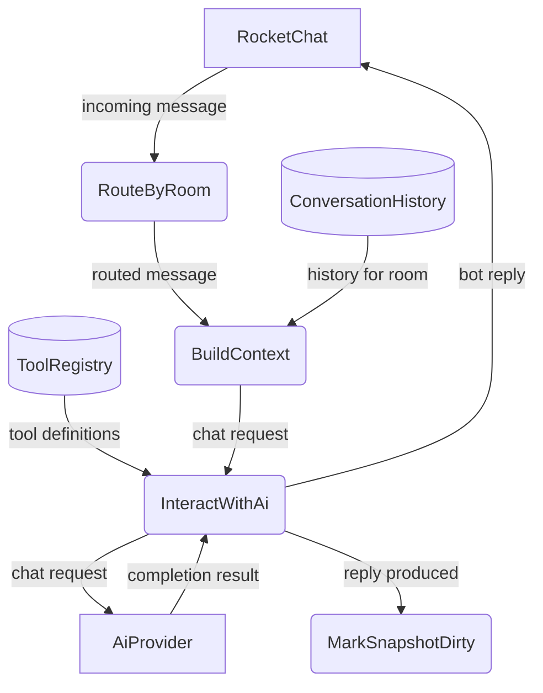
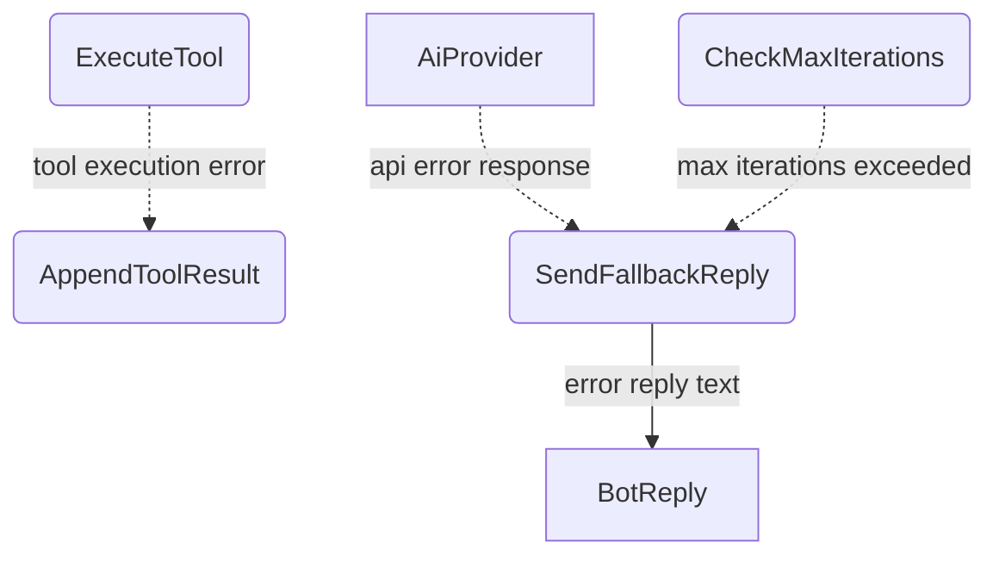
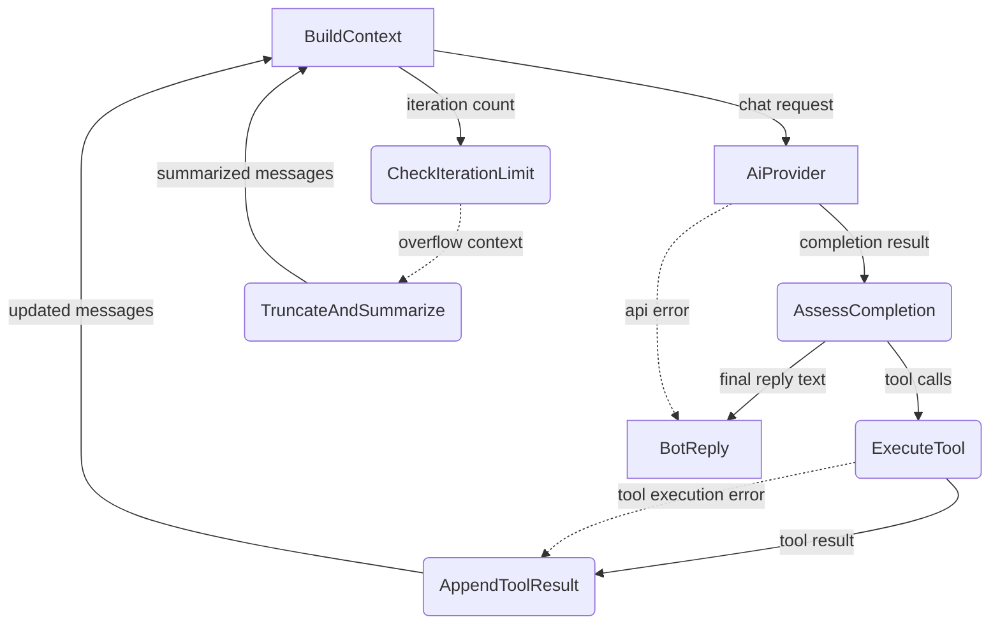
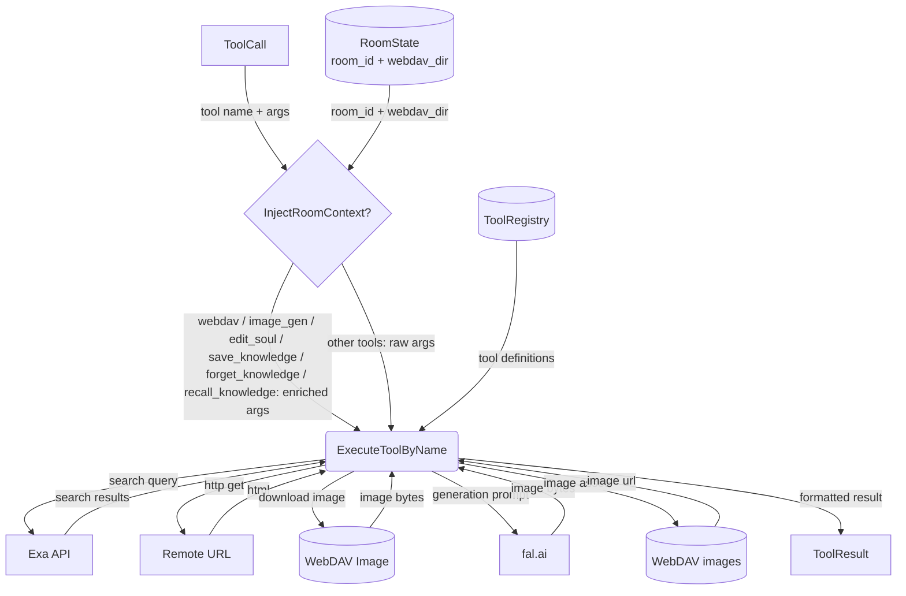
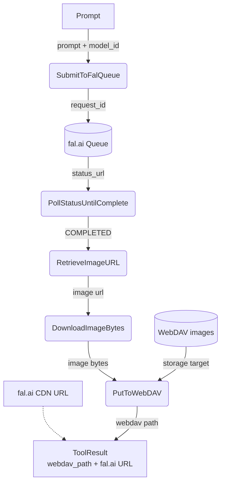
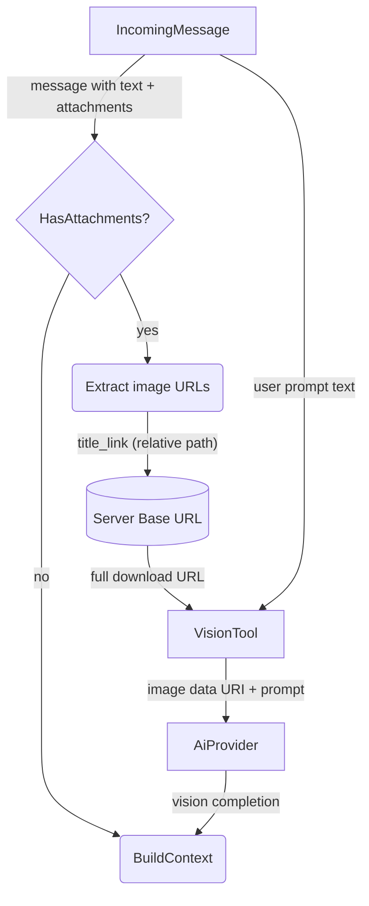
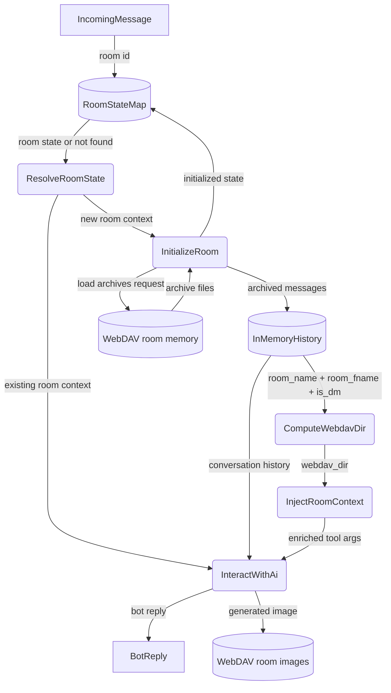

# Agent Harness

## 1. Purpose

The operational environment that wraps the agent loop — the invariant core
cycle of `LLM → tools → LLM → ...`. The harness layers Tools, Knowledge, and
Context around this loop without modifying it.

### 1a. Micro Harness Scope

rockbot implements a **micro harness**: a minimal harness with only the
mechanisms needed for a single-agent, single-channel chatbot. Three of the six
standard harness mechanisms are present:

| Mechanism   | Coverage | Details |
|-------------|----------|---------|
| **Tools**   | Full     | `web_search`, `web_fetch`, `vision`, `webdav`, `image_gen` (fal.ai), `calendar` (CalDAV), `datetime` — each tool has its own DFD |
| **Context** | Full     | Per-room conversation history buffer, summarization, archive loading — see [Memory Management](base/memory.md); plus iteration limits, room state routing, system prompt assembly |
| **Knowledge** | Full     | `save_knowledge`, `forget_knowledge`, `recall_knowledge` — see [Knowledge Management](base/knowledge.md) |

Intentionally absent — not needed for rockbot's scope:

| Mechanism       | Reason |
|-----------------|--------|
| **Permissions** | Single-user bot — no sandbox or approval flows |
| **Extensions**  | No plugin/hook system — tools are statically registered |
| **Coordination**| Single agent — no subagents, teams, or worktrees |

- Upstream: [Agent Loop](agent-loop.md) feeds `IncomingMessage`
  into the loop and consumes `BotReply`
- Downstream: [AI Provider](base/ai-provider.md) receives `ChatRequest` and returns
  `CompletionResult` with tool calls or final text
- Downstream: [Memory Management](base/memory.md) provides `ConversationHistory` per
  room and receives new messages for archival
- Downstream: [Knowledge Management](base/knowledge.md) extracts and persists
  domain facts, loads entries into agent context on room init
- Downstream: [WebDAV Tool](tools/webdav.md) persists generated image assets
  and provides file storage via `WebDavTool`
- Downstream: [Calendar Tool](tools/calendar.md) provides CalDAV event access
  via `CalendarTool` (conditionally registered)

## 2. Diagram

### 2a. Agent Loop (Main Success Path)

After every response (including errors and fallbacks), the room is marked dirty for
snapshot persistence. The periodic maintenance timer (every `persist_interval_secs`)
flushes all dirty snapshots to WebDAV. The snapshot contains all three persistence
layers: chat history, daily summaries, and soul memory.

### 2b. Error Handling & Fallbacks

### 2c. Agent Loop Deep Dive

Level 2 decomposition of the invariant agent loop (`while True: LLM → tools →
LLM`): queries the AI provider, executes any tool calls, feeds results back, and
loops until a final text reply is produced.

### 2d. Tool Execution Deep Dive

Room context (`room_id` UUID + `webdav_dir` path key) is injected into
`webdav`, `image_gen`, `edit_soul`, `save_knowledge`, `forget_knowledge`, and
`recall_knowledge` tool calls. Stateless tools (`web_search`,
`web_fetch`, `vision`, `datetime`, `calendar`) receive no room context.

### 2e. Image Generation Pipeline

The `image_gen` tool uses the fal.ai queue API (async submit + poll for result):
a prompt is submitted to `https://queue.fal.run/{model_id}`, the status is polled
via `https://queue.fal.run/{model_id}/requests/{request_id}/status` until
COMPLETED, then the result is fetched from
`https://queue.fal.run/{model_id}/requests/{request_id}`. The generated image URL
is downloaded and uploaded to WebDAV. The tool result includes **both** the
WebDAV path and the original fal.ai CDN URL — the LLM should include the
fal.ai URL in its response to the user so they can view/share the image
directly.

> **fal.ai API docs:** https://fal.ai/docs — see Model APIs section for
> queue/submit/poll/result endpoints.

### 2g. Auto-Attachment Vision Pipeline

When an incoming message contains image attachments (`IncomingMessage.attachments`
is non-empty), the harness automatically constructs a prompt describing the
attached images and passes the original file URL to the vision tool. This allows
the agent to "see" images without the user needing to explicitly invoke the
vision tool.

**Image selection**: uses `attachments[0].title_link` (original file) over
`image_url` (thumbnail). The server base URL is prepended to construct the full
download URL: `{server_config.host()}{title_link}`.

**Prompt construction**: if the user included text with the image (e.g. "B78"),
that text becomes the prompt to the vision tool. If no text is present, a default
prompt ("Describe this image in detail.") is used.

### 2f. Per-Room State Routing

Each room maintains independent state — conversation history, agent context, and
WebDAV archive path. The agent routes incoming messages to the correct room's
pipeline. Room context (`room_id` UUID + `webdav_dir` path key) is computed from
`room_name`, `room_fname`, and `is_dm` and injected into all WebDAV-backed tool
calls (`webdav`, `image_gen`, `edit_soul`, `save_knowledge`, `forget_knowledge`,
`recall_knowledge`).

## 3. Data Structures

- **AgentContext** — does not exist as a struct. The harness constructs these values on the fly: `system_prompt` is built by `build_system_prompt()`, `history` by `build_context()`, `tools` by `ToolRegistry::definitions()`, `room_id` is a method parameter, `webdav_dir` is computed by `compute_webdav_dir()`.

#### `ToolResult`

| Field      | Type     | Notes                                      |
| ---------- | -------- | ------------------------------------------ |
| `call_id`  | `String` | Matches `ToolCall.id`                      |
| `name`     | `String` | Tool name                                  |
| `content`  | `String` | Result text (returned to LLM as tool msg)  |
| `is_error` | `bool`   | True if tool execution failed              |

#### `ToolRegistry`

| Field      | Type                    | Notes                          |
| ---------- | ----------------------- | ------------------------------ |
| `tools`    | `HashMap<String, Box<dyn Tool>>` | Name → implementation |

#### `ToolDef`

| Field        | Type            | Notes                                   |
| ------------ | --------------- | --------------------------------------- |
| `name`       | `String`        | Function name                           |
| `description`| `Option<String>`| Human-readable description for the LLM  |
| `parameters` | `Option<Value>` | JSON Schema for arguments               |
| `tool_type`  | `String`        | Always `"function"`                     |
| `strict`     | `Option<bool>`  | Whether to enforce strict schema        |

#### Registered Tools

| Tool Name     | Description                                      | Arguments                          |
| ------------- | ------------------------------------------------ | ---------------------------------- |
| `web_search`  | Search the web using Exa                         | `query: string`                    |
| `web_fetch`   | Fetch a URL, optionally as markdown              | `url: string, markdown: bool`      |
| `vision`      | Download an image, encode as base64, and send to the AI provider for multimodal vision analysis; auto-invoked by the harness when an incoming message has image attachments _(requires an AI provider with vision support)_ | `url: string, prompt: string`      |
| `webdav`      | Read, write, edit, list, mkdir, delete, and check existence in the room's WebDAV directory | `action: string, path: string, content?: string, oldString?: string, newString?: string` |
| `image_gen`   | Generate an image using fal.ai models; returns both the WebDAV path and the original fal.ai CDN URL — prefer the fal.ai URL in responses _(requires `fal` provider in config)_ | `prompt: string, model_id: string` |
| `calendar`    | Manage calendar events via CalDAV _(requires WebDAV + calendar_name)_ | `action: string, uid?: string, summary?: string, ...` |
| `datetime`    | Get current date/time in various formats           | `timezone: string, format: string` |
| `edit_soul`   | Edit the bot's permanent core memory per room (Layer 3) | `action: string, section_header: string, content: string` |
| `save_knowledge` | Persist a knowledge entry (.md + index.json) on WebDAV | `category: string, topic: string, content: string, when_useful: string, tags: string` |
| `forget_knowledge` | Remove a knowledge entry and its index record | `topic: string` |
| `recall_knowledge` | Search the knowledge index and return matching entries | `query: string` |
| `infograph`   | _(planned)_ Generate an infographic image         | `prompt: string`                   |
| `anime`       | _(planned)_ Generate a Japanese anime-style image | `prompt: string`                   |
