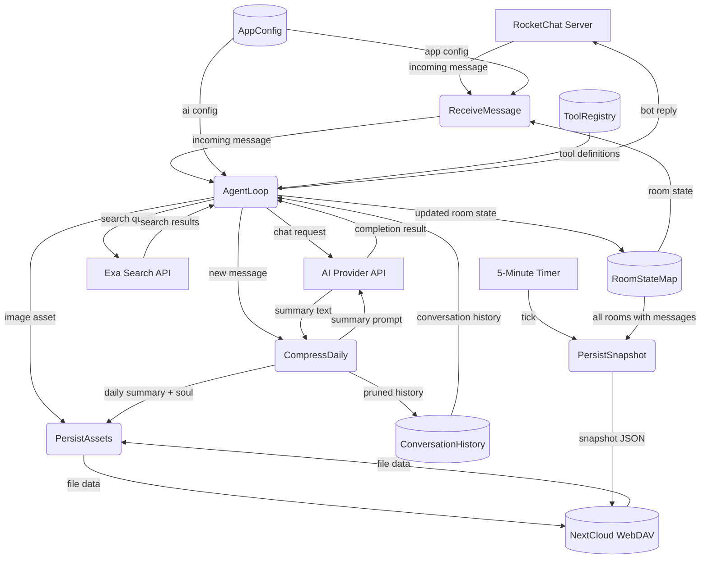
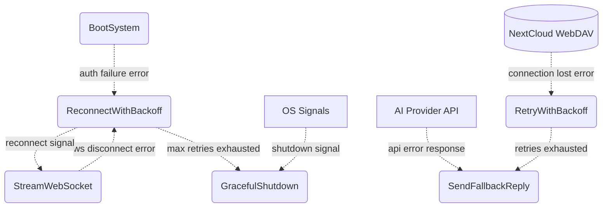
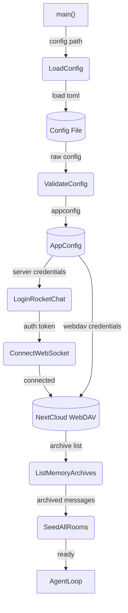

# Agent Loop

## 1. Purpose

Shows how all subsystems — RocketChat client, AI provider, tools, memory,
WebDAV, config — are wired together to run the agent harness. This is the
top-level process decomposition of RockBot: a single event loop that connects to
RocketChat, routes incoming messages to the agent harness, executes tool calls,
manages per-room memory, and persists everything to WebDAV.

- Upstream: [Configuration Management](base/config.md) provides `AppConfig`
- Downstream: [Agent Harness](agent-harness.md) receives `IncomingMessage` and
  returns `BotReply` (see agent-harness.md for loop internals and tool execution)
- Downstream: [RocketChat Connection](base/rocketchat.md) handles auth, WebSocket
  streaming, and message filtering
- Downstream: [AI Provider](base/ai-provider.md) handles chat completion requests
- Downstream: [Memory Management](base/memory.md) manages per-room conversation history,
  archive (threshold-based daily compress), and snapshot persist (timer-based)
- Downstream: [WebDAV Tool](tools/webdav.md) persists image assets

## 2. Diagram

### 2a. Happy Flow (Main Success Path)

### 2b. Error Handling & Fallbacks

### 2c. Startup Sequence

## 3. Data Structures

#### `HarnessState`

| Field    | Type                       | Notes                                       |
| -------- | -------------------------- | ------------------------------------------- |
| `config` | `Arc<AppConfig>`           | Immutable configuration shared across subsystems |
| `rooms`  | `HashMap<String, RoomState>` | Per-room state map (room_id → state)     |
| `client` | `rocketchat::Client`       | RocketChat connection handle                |
| `memory` | `MemoryManager`            | Per-room conversation history               |
| `webdav` | `WebDavClient`             | WebDAV handle for persistent storage        |

#### `RoomState`

| Field        | Type                | Notes                                      |
| ------------ | ------------------- | ------------------------------------------ |
| `room_id`    | `String`            | RocketChat room UUID (in-memory lookup key, not a path segment) |
| `is_dm`      | `bool`              | True if direct message room                |
| `history`    | `ConversationHistory`| In-memory message buffer for this room     |
| `webdav_dir` | `String`            | Type-prefixed WebDAV path key (`r-`/`d-`), computed from `room_name`/`room_fname`/`is_dm` |

#### `LifecycleSignal`

| Variant     | Fields             | Notes                                      |
| ----------- | ------------------ | ------------------------------------------ |
| `Startup`   | —                  | Bot is initializing                        |
| `Running`   | —                  | Main event loop active                     |
| `Shutdown`  | `exit_code: i32`   | Graceful shutdown triggered                |
| `Reconnect` | `attempt: u32`     | WebSocket reconnection in progress         |
