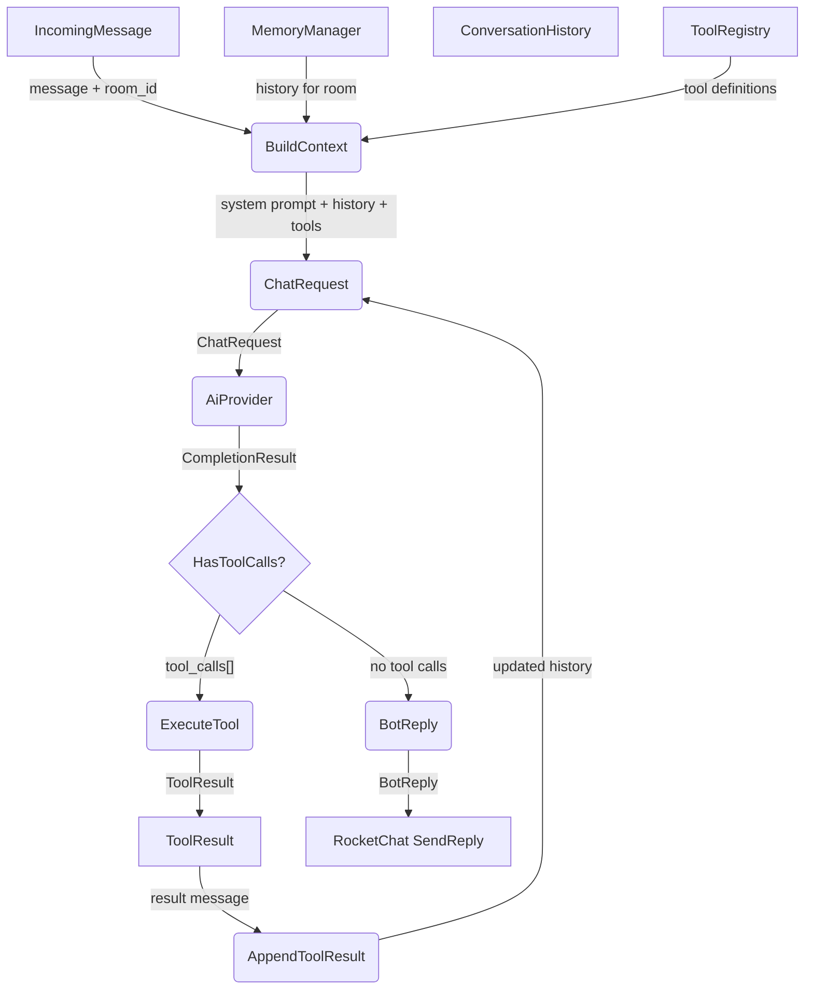
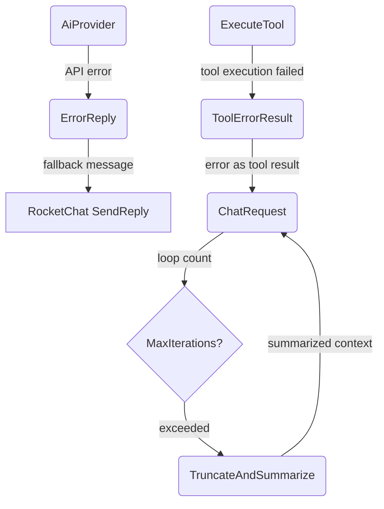
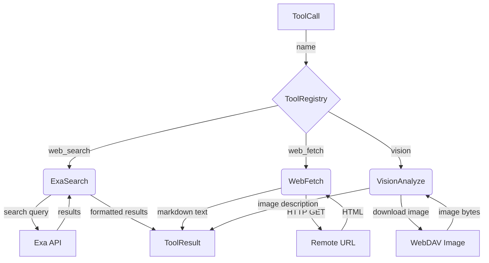

# Agent Orchestration

## 1. Purpose

Core agentic loop that receives an `IncomingMessage`, assembles context (system
prompt + conversation history + tool definitions), queries the AI provider,
executes any tool calls, feeds results back, and loops until a final text reply
is produced. Each room/DM has its own conversation context.

- Upstream: [RocketChat Connection](rocketchat.md) provides `IncomingMessage`
- Upstream: [Memory Management](memory.md) provides conversation history
- Downstream: [AI Provider](ai-provider.md) receives `ChatRequest` and returns
  `CompletionResult`
- Downstream: [Tools](#2c-tool-execution-deep-dive) execute and return results

## 2. Diagram

### 2a. Happy Flow (Main Success Path)

### 2b. Error Handling & Fallbacks

### 2c. Tool Execution Deep Dive

### 2d. Tool Definitions

| Tool Name     | Description                           | Arguments                    |
| ------------- | ------------------------------------- | ---------------------------- |
| `web_search`  | Search the web using Exa              | `query: string`              |
| `web_fetch`   | Fetch a URL, optionally as markdown   | `url: string, markdown: bool`|
| `vision`      | Describe or analyze an image          | `url: string, prompt: string`|

## 3. Data Structures

#### `AgentContext`

| Field           | Type                  | Notes                              |
| --------------- | --------------------- | ---------------------------------- |
| `system_prompt` | `String`              | Bot personality and instructions   |
| `history`       | `Vec<ChatMessage>`    | Conversation history for room      |
| `tools`         | `Vec<ToolDef>`        | Registered tool definitions        |
| `room_id`       | `String`              | Source room/DM identifier          |

#### `ToolResult`

| Field      | Type     | Notes                                      |
| ---------- | -------- | ------------------------------------------ |
| `call_id`  | `String` | Matches `ToolCall.id`                      |
| `name`     | `String` | Tool name                                  |
| `content`  | `String` | Result text (returned to LLM as tool msg)  |
| `is_error` | `bool`   | True if tool execution failed              |

#### `ToolRegistry`

| Field      | Type                    | Notes                          |
| ---------- | ----------------------- | ------------------------------ |
| `tools`    | `HashMap<String, Box<dyn Tool>>` | Name → implementation |
