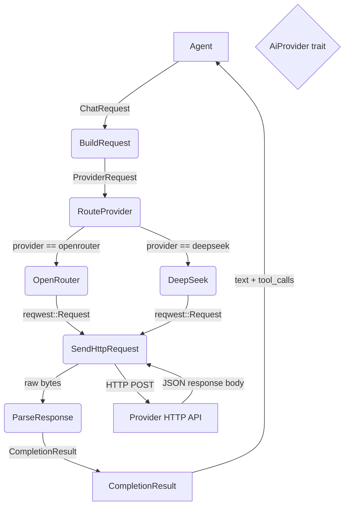
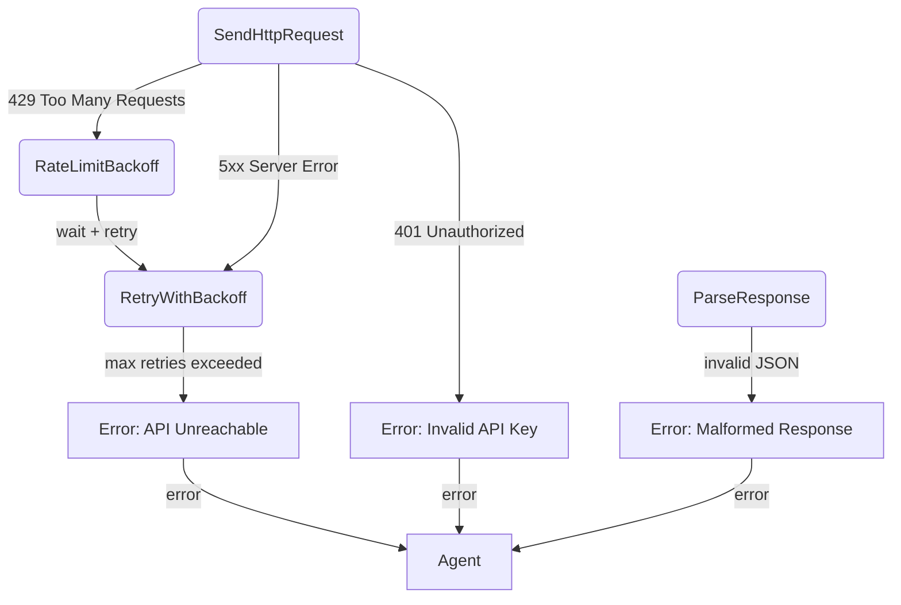
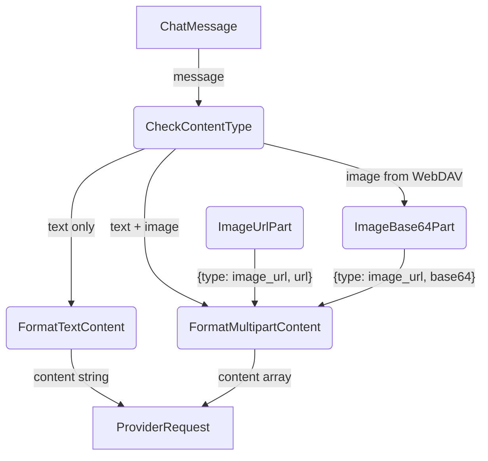

# AI Provider

## 1. Purpose

Configurable `AiProvider` trait abstracting over OpenAI-compatible chat
completion APIs. Concrete implementations for OpenRouter and DeepSeek handle
provider-specific headers, model naming, and vision payload formatting. Supports
streaming responses and tool/function calling.

- Upstream: [Configuration Management](config.md) provides `AiConfig`
- Upstream: [Agent Harness](agent-harness.md) selects the provider via
  `AppConfig` on startup
- Downstream: [Agent Orchestration](agent.md) calls `complete()` with message
  history and tool definitions

## 2. Diagram

### 2a. Happy Flow (Main Success Path)

### 2b. Error Handling & Fallbacks

### 2c. Vision Payload Deep Dive

## 3. Data Structures

#### `ChatRequest`

| Field      | Type              | Notes                                    |
| ---------- | ----------------- | ---------------------------------------- |
| `messages` | `Vec<ChatMessage>`| Conversation history                     |
| `tools`    | `Vec<ToolDef>`    | Available tool/function definitions      |
| `stream`   | `bool`            | Enable streaming response                |

#### `ChatMessage`

| Field     | Type               | Notes                                    |
| --------- | ------------------ | ---------------------------------------- |
| `role`    | `Role`             | `System`, `User`, `Assistant`, `Tool`    |
| `content` | `MessageContent`   | Text or multipart (text + images)        |
| `name`    | `Option<String>`   | Tool result name                         |
| `tool_calls` | `Option<Vec<ToolCall>>` | Assistant tool call requests      |

#### `MessageContent`

| Variant     | Fields                        | Notes                          |
| ----------- | ----------------------------- | ------------------------------ |
| `Text`      | `String`                      | Plain text content             |
| `Multipart` | `Vec<ContentPart>`            | Mixed text and images          |

#### `ContentPart`

| Variant    | Fields                          | Notes                         |
| ---------- | ------------------------------- | ----------------------------- |
| `Text`     | `String`                        | Text segment                  |
| `ImageUrl` | `{ url: String, detail: String }` | Remote or `data:` base64 URL |

#### `CompletionResult`

| Field        | Type                  | Notes                                |
| ------------ | --------------------- | ------------------------------------ |
| `text`       | `Option<String>`      | Assistant text response              |
| `tool_calls` | `Vec<ToolCall>`       | Tool/function calls requested by LLM |
| `finish`     | `FinishReason`        | `Stop`, `ToolUse`, `Length`, `Error` |

#### `ToolCall`

| Field      | Type     | Notes                                      |
| ---------- | -------- | ------------------------------------------ |
| `id`       | `String` | Provider-assigned call ID                  |
| `name`     | `String` | Tool/function name                         |
| `arguments`| `String` | JSON-encoded arguments                     |

#### `ToolDef`

| Field        | Type     | Notes                                   |
| ------------ | -------- | --------------------------------------- |
| `name`       | `String` | Function name                           |
| `description`| `String` | Human-readable description for the LLM  |
| `parameters` | `Value`  | JSON Schema for arguments               |
