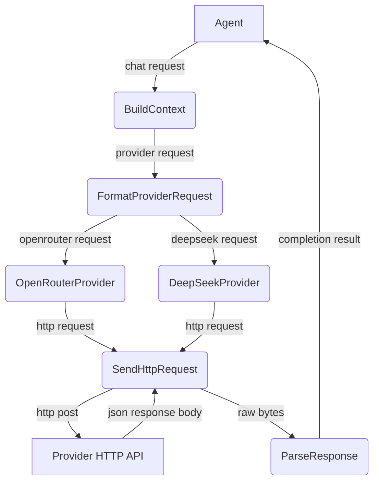
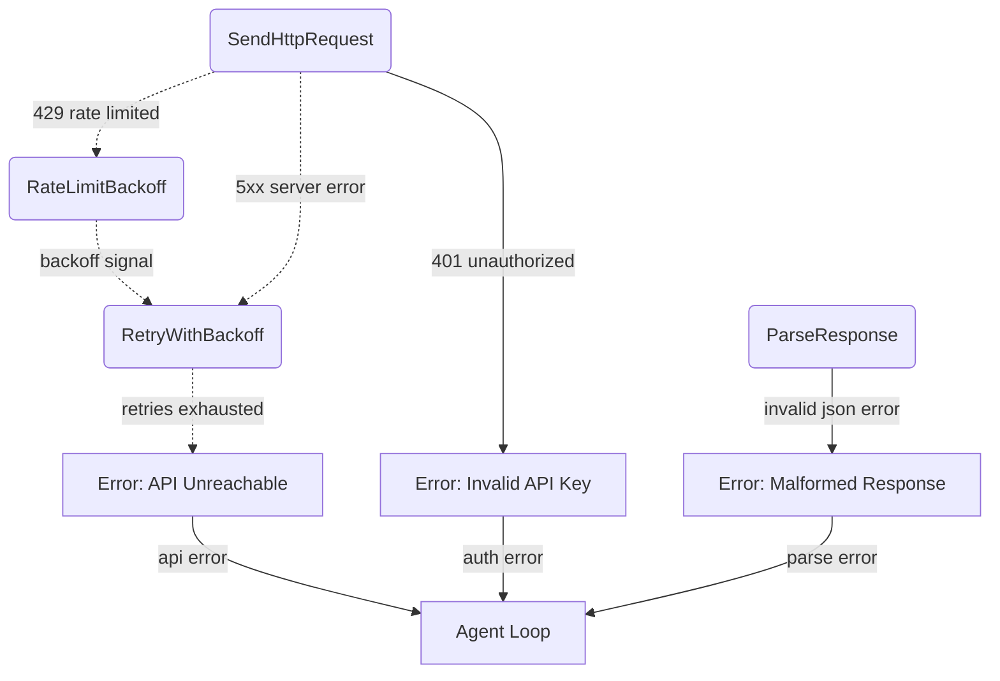
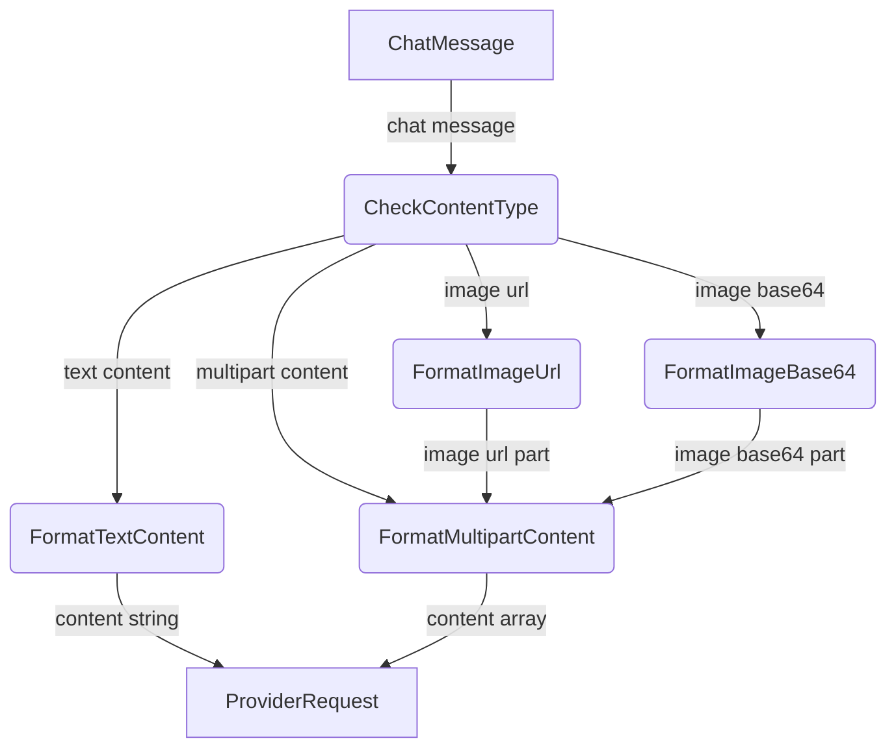

# AI Provider

## 1. Purpose

Configurable `AiProvider` trait abstracting over OpenAI-compatible chat
completion APIs. Concrete implementations for OpenRouter and DeepSeek handle
provider-specific headers, model naming, and vision payload formatting _(planned — types exist but no production code constructs image content parts)_. Supports
The `stream` field is sent in request bodies but SSE response parsing is not implemented — all responses are consumed as full JSON.

- Upstream: [Configuration Management](config.md) provides `AiConfig`
- Downstream: [Agent Harness](../agent-harness.md) calls `complete()` with `ChatRequest`
  (message history + tool definitions) and returns `CompletionResult`

## 2. Diagram

### 2a. Happy Flow (Main Success Path)

### 2b. Error Handling & Fallbacks

### 2c. Vision Payload Deep Dive

## 3. Data Structures

#### `ChatRequest`

| Field              | Type                    | Notes                              |
| ------------------ | ----------------------- | ---------------------------------- |
| `messages`         | `Vec<ChatMessage>`      | Conversation history               |
| `tools`            | `Vec<ToolDef>`          | Available tool/function definitions|
| `stream`           | `bool`                  | Enable streaming response          |
| `model`            | `String`                | Model identifier                   |
| `temperature`      | `Option<f32>`           | Sampling temperature               |
| `max_tokens`       | `Option<u32>`           | Maximum output tokens              |
| `thinking`         | `Option<ThinkingConfig>`| Thinking mode config               |
| `reasoning_effort` | `Option<String>`        | Reasoning effort level             |
| `tool_choice`      | `Option<Value>`         | Tool choice override               |

#### `ChatMessage`

| Field               | Type                       | Notes                             |
| ------------------- | -------------------------- | --------------------------------- |
| `role`              | `Role`                     | `System`, `User`, `Assistant`, `Tool` |
| `content`           | `MessageContent`           | Text or multipart (text + images) |
| `name`              | `Option<String>`           | Tool result name                  |
| `tool_calls`        | `Option<Vec<ToolCall>>`    | Assistant tool call requests      |
| `tool_call_id`      | `Option<String>`           | Required for tool result messages |
| `reasoning_content` | `Option<String>`           | DeepSeek reasoning/chain-of-thought|

#### `MessageContent`

| Variant     | Fields                        | Notes                          |
| ----------- | ----------------------------- | ------------------------------ |
| `Text`      | `String`                      | Plain text content             |
| `Multipart` | `Vec<ContentPart>`            | Mixed text and images          |

#### `ContentPart`

| Variant    | Fields                          | Notes                         |
| ---------- | ------------------------------- | ----------------------------- |
| `Text`     | `String`                        | Text segment                  |
| `ImageUrl` | `{ url: String, detail: Option<String> }` | Remote or `data:` base64 URL |

#### `CompletionResult`

| Field               | Type                  | Notes                                |
| ------------------- | --------------------- | ------------------------------------ |
| `text`              | `Option<String>`      | Assistant text response              |
| `tool_calls`        | `Vec<ToolCall>`       | Tool/function calls requested by LLM |
| `finish`            | `FinishReason`        | `Stop`, `ToolUse`, `Length`, `Error` |
| `reasoning_content` | `Option<String>`      | DeepSeek-style chain-of-thought text |
| `usage`             | `Option<UsageInfo>`   | Token usage statistics               |

#### `ToolCall`

| Field       | Type           | Notes                             |
| ----------- | -------------- | --------------------------------- |
| `id`        | `String`       | Provider-assigned call ID         |
| `call_type` | `String`       | Always `"function"`               |
| `function`  | `FunctionCall` | Nested function details           |

#### `FunctionCall`

| Field       | Type     | Notes                 |
| ----------- | -------- | --------------------- |
| `name`      | `String` | Tool/function name    |
| `arguments` | `String` | JSON-encoded arguments|

#### `ToolDef`

| Field       | Type         | Notes                             |
| ----------- | ------------ | --------------------------------- |
| `tool_type` | `String`     | Always `"function"`               |
| `function`  | `FunctionDef`| Wrapped function definition       |

#### `FunctionDef`

| Field         | Type              | Notes                           |
| ------------- | ----------------- | ------------------------------- |
| `name`        | `String`          | Function name                   |
| `description` | `Option<String>`  | Human-readable description      |
| `parameters`  | `Option<Value>`   | JSON Schema for arguments       |
| `strict`      | `Option<bool>`    | Strict schema enforcement       |
