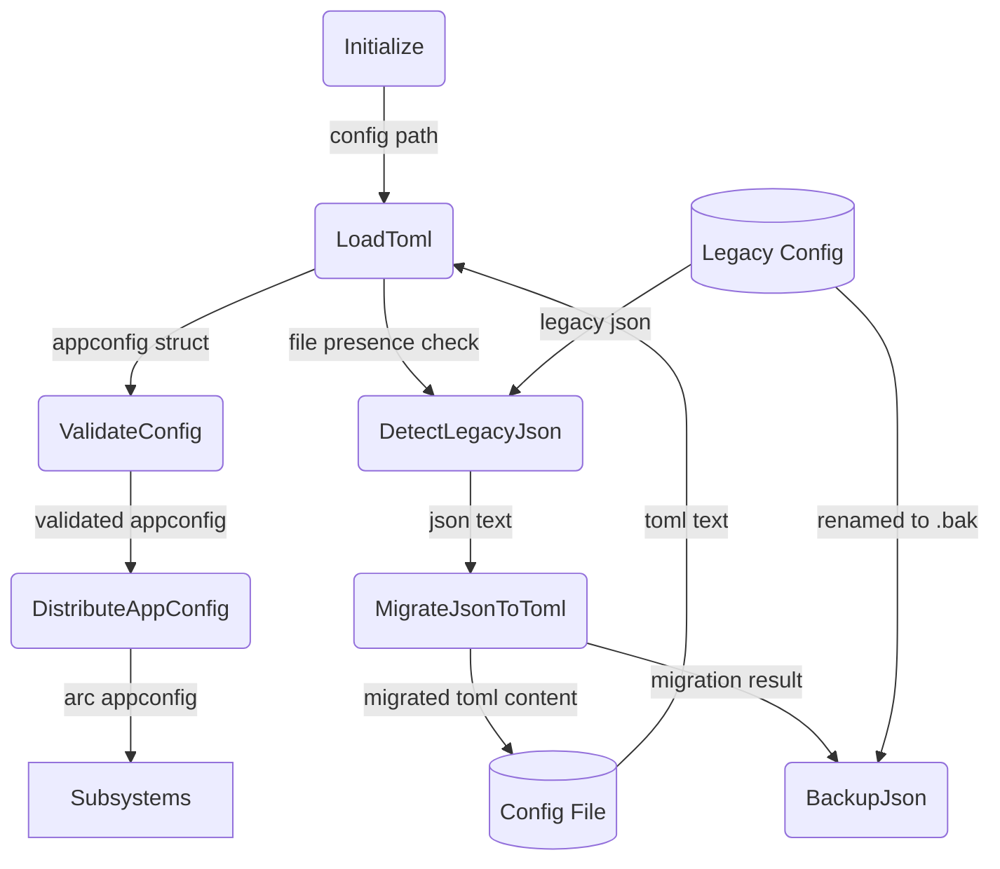
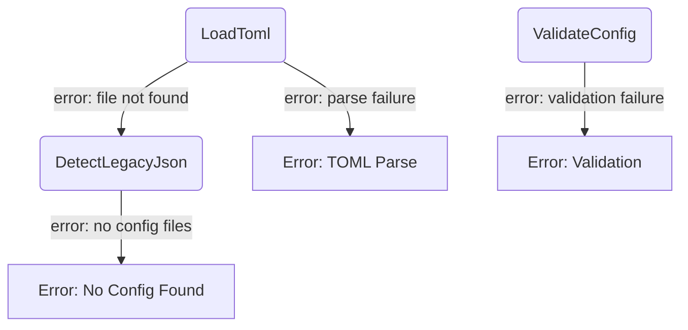
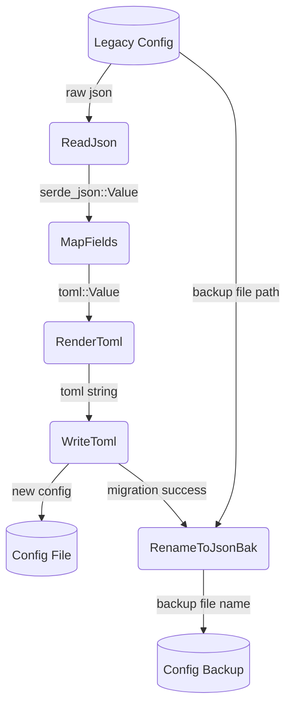

# Configuration Management

## 1. Purpose

Loads `config.toml` at startup with typed deserialization; detects a legacy
`config.json` and auto-migrates it to TOML, then backs up the old file. The
validated `AppConfig` struct is shared read-only across all subsystems.

- Upstream: [WebDAV Storage](webdav.md) consumes `WebDavConfig` for remote file
  access
- Downstream: [RocketChat Connection](rocketchat.md), [AI Provider](ai-provider.md),
  [Memory Management](memory.md) all consume their respective config slices

## 2. Diagram

### 2a. Happy Flow (Main Success Path)

### 2b. Error Handling & Fallbacks

### 2c. Config Migration Deep Dive

## 3. Data Structures

#### `AppConfig`

| Field        | Type             | Notes                                     |
| ------------ | ---------------- | ----------------------------------------- |
| `server`     | `ServerConfig`   | RocketChat connection details             |
| `ai`         | `AiConfig`       | Provider selection and model settings     |
| `webdav`     | `WebDavConfig`   | NextCloud WebDAV endpoint and credentials |
| `memory`     | `MemoryConfig`   | Character threshold, archive schedule     |
| `tools`      | `ToolsConfig`    | Tool-specific API keys and toggles        |

#### `ServerConfig`

| Field      | Type     | Notes                            |
| ---------- | -------- | -------------------------------- |
| `url`      | `String` | RocketChat base URL              |
| `username` | `String` | Bot login username               |
| `password` | `String` | Bot login password               |
| `use_tls`  | `bool`   | Use `wss://` instead of `ws://`  |

#### `AiConfig`

| Field      | Type     | Notes                                      |
| ---------- | -------- | ------------------------------------------ |
| `provider` | `String` | `"openrouter"` or `"deepseek"`             |
| `api_key`  | `String` | Provider API key                           |
| `model`    | `String` | Model identifier string                    |
| `base_url` | `String` | Override endpoint (optional)               |

#### `WebDavConfig`

| Field      | Type     | Notes                                   |
| ---------- | -------- | --------------------------------------- |
| `url`      | `String` | NextCloud WebDAV endpoint URL           |
| `username` | `String` | NextCloud username                      |
| `password` | `String` | NextCloud app password                  |
| `root`     | `String` | Base directory for bot data             |

#### `MemoryConfig`

| Field              | Type   | Notes                                      |
| ------------------ | ------ | ------------------------------------------ |
| `max_chars`        | `usize`| Character count threshold before archive   |
| `archive_interval` | `u64`  | Seconds between periodic archive checks   |

#### `ToolsConfig`

| Field              | Type              | Notes                               |
| ------------------ | ----------------- | ----------------------------------- |
| `exa_api_key`      | `Option<String>`  | Exa search API key                  |
| `web_fetch`        | `bool`            | Enable web fetch tool               |
| `vision`           | `bool`            | Enable vision tool                  |
| `image_gen`        | `bool`            | Enable image generation tools       |
| `image_gen_api_key`| `Option<String>`  | Image generation API key            |
| `image_gen_url`    | `Option<String>`  | Image generation endpoint override  |

#### JSON → TOML Field Mapping

| JSON path (`config.json`)    | TOML path (`config.toml`)         |
| ---------------------------- | --------------------------------- |
| `bot.server`                 | `server.url`                      |
| `bot.username`               | `server.username`                 |
| `bot.password`               | `server.password`                 |
| `openai.api_key`             | `ai.api_key`                      |
| `openai.model`               | `ai.model`                        |
| `openai.base_url`            | `ai.base_url`                     |
