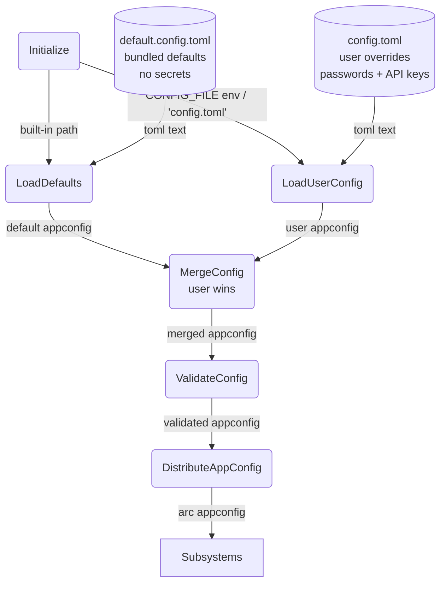
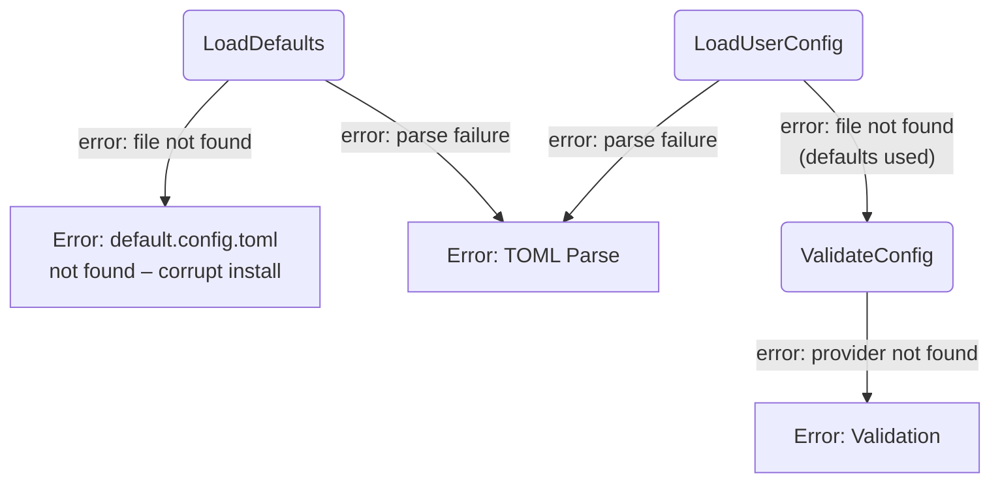

# Configuration Management

## 1. Purpose

Loads two TOML files at startup — a bundled `default.config.toml` (shipped
with the repo, no secrets) and a user `config.toml` (gitignored, holds
passwords and API keys). The two are deep-merged via Serde's merge strategy
(user values override defaults). The validated `AppConfig` struct is shared
read-only across all subsystems.

- Downstream: [WebDAV Tool](../tools/webdav.md) consumes `WebDavConfig` for remote file
  access
- Downstream: [RocketChat Connection](rocketchat.md), [AI Provider](ai-provider.md),
  [Memory Management](memory.md) and [Tools](tools/) each consume their respective
  config slices

## 2. Diagram

### 2a. Happy Flow (Main Success Path)

### 2b. Error Handling & Fallbacks

## 3. Data Structures

#### `AppConfig`

| Field        | Type                         | Notes                                          |
| ------------ | ---------------------------- | ---------------------------------------------- |
| `rocketchat` | `RocketChatSection`          | Server connection + chat model settings        |
| `chat_providers` | `Vec<ProviderConfig>`    | Chat AI provider definitions (array-of-tables) |
| `image_providers`| `Vec<ProviderConfig>`    | Image generation provider definitions          |
| `image_model`    | `ImageModelConfig` (always present via default)| Default image provider + model alias           |
| `webdav`     | `Option<WebDavConfig>`       | NextCloud WebDAV endpoint and credentials      |
| `tools`      | `HashMap<String, ToolServiceConfig>`| Tool-specific API keys (generic map)     |

#### `RocketChatSection`

| Field    | Type           | Notes                                         |
| -------- | -------------- | --------------------------------------------- |
| `server` | `ServerConfig` | RocketChat connection details                 |
| `model`  | `ModelConfig`  | Default provider, model alias, history limits |

#### `ServerConfig`

| Field      | Type     | Notes                                                               |
| ---------- | -------- | ------------------------------------------------------------------- |
| `url`      | `String` | RocketChat server host (no scheme)                                  |
| `username` | `String` | Bot login username (`""` in defaults, filled in user config)        |
| `password` | `String` | Bot login password (`""` in defaults, filled in user config)        |

#### `ModelConfig`

| Field                  | Type    | Notes                                                         |
| ---------------------- | ------- | ------------------------------------------------------------- |
| `default_provider`     | `String`| Must match a `[[chat_providers]].name`                        |
| `default_model`        | `String`| Model alias key in provider's models map                      |
| `max_history_size`     | `usize` | Max conversation turns (default 18)                           |
| `max_text_length`      | `usize` | Layer 1 overflow threshold chars (default 50000)              |
| `max_iterations`       | `u32`   | Max agent loop iterations (default 28)                         |
| `max_summary_chars`    | `usize` | Layer 2 max chars across loaded summaries (default 4000)      |
| `max_soul_chars`       | `usize` | Layer 3 max chars for soul.md content (default 2000)          |
| `summary_days`         | `u32`   | Layer 2 retention window in days (default 3)                  |
| `memory_ttl_secs`      | `u64`   | Room idle timeout — snapshot to WebDAV then evict (default 600)|
| `persist_interval_secs`| `u64`   | Snapshot persist timer interval (default 120)                |
| `max_context_bytes`    | `usize` | Max byte size for image-stripping trigger (default 30MB). Text context is governed by the model's token limit (1M for qwen3.7-plus), not by byte count. Set high to let the provider enforce the real limit. |
| `max_attachment_bytes` | `u64`   | Max size of a single attachment in bytes (default 25_000_000) |

#### `ProviderConfig`

| Field        | Type                     | Notes                                                             |
| ------------ | ------------------------ | ----------------------------------------------------------------- |
| `name`       | `String`                 | Provider identifier ("openrouter", etc.)                          |
| `api_key`    | `String`                 | Provider API key (`""` in defaults, filled in user config)        |
| `base_url`   | `String`                 | API endpoint base URL                                             |
| `basecf_url` | `Option<String>`         | Cloudflare worker proxy override; used by Fal as storage/CDN upload URL |
| `chat_path`  | `Option<String>`         | Chat completions path (Default: `/chat/completions`)             |
| `draw_path`  | `Option<String>`         | Image generation path (opt.)                                      |
| `models`     | `HashMap<String, String>`| Alias → model-id map                                              |

> **Note:** `basecf_url` is used by `FalAiProvider` as the `storage_url` for CDN uploads. Chat providers use `base_url` + `chat_path` via `ProviderConfig::chat_url()`.

#### `ToolServiceConfig`

| Field     | Type     | Notes                  |
| --------- | -------- | ---------------------- |
| `api_key` | `String` | Service-specific key   |

#### `ImageModelConfig`

| Field                   | Type     | Notes                                                     |
| ----------------------- | -------- | --------------------------------------------------------- |
| `default_provider`      | `String` | Must match an `[[image_providers]].name`                   |
| `default_text_model`    | `String` | Model alias for text-to-image generation                  |
| `default_edit_model`    | `String` | Model alias for image editing                             |
| `default_quality`       | `String` | Image quality level (default `"medium"`)                  |
| `default_output_format` | `String` | Output image format (default `"png"`)                      |
| `default_num_images`    | `u32`    | Number of images per generation (default 1)                |
| `default_image_size`    | `String` | Target image dimensions (default `"portrait_2_3"`)         |
| `default_image_size_tier` | `String` | Resolution tier `"2K"` or `"4K"` (default `"4K"`)       |

#### `WebDavConfig`

| Field      | Type     | Notes                                   |
| ---------- | -------- | --------------------------------------- |
| `url`      | `String` | NextCloud WebDAV endpoint URL           |
| `username` | `String` | NextCloud username                      |
| `password` | `String` | NextCloud app password                  |
| `root`     | `String` | Base directory for bot data             |
| `calendar_name` | `Option<String>` | CalDAV calendar name (enables calendar tool if set) |
| `dav_path`      | `String`         | WebDAV/NextCloud API path prefix (default `"/remote.php/dav"`) |

## 4. Config Files

| File                  | Git   | Secrets | Purpose                                    |
| --------------------- | ----- | ------- | ------------------------------------------ |
| `default.config.toml` | Tracked | No   | Bundled defaults (model limits, URLs, empty secrets) |
| `config.toml`         | Ignored | Yes  | User overrides (passwords, API keys)       |

- `default.config.toml` is loaded first from the workspace root (shipped with the repo).
- `config.toml` is loaded second; its path comes from the `CONFIG_FILE` env var (default `"config.toml"`).
- User-provided values deep-merge over defaults. Empty strings in user config override defaults.
- If `config.toml` is missing, the bot runs with only default values (all secrets will be empty — startup may fail validation).
