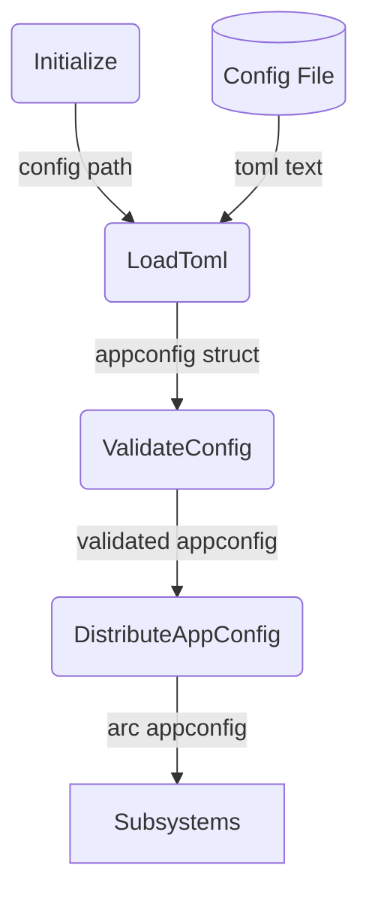
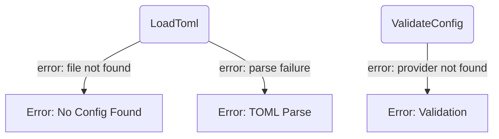

# Configuration Management

## 1. Purpose

Loads `config.toml` at startup with typed deserialization via `serde`. The
validated `AppConfig` struct is shared read-only across all subsystems.
Supports `from_file` (with validation) and `from_str` (raw parse, no
validation) entry points.

- Upstream: [WebDAV Storage](webdav.md) consumes `WebDavConfig` for remote file
  access
- Downstream: [RocketChat Connection](rocketchat.md), [AI Provider](ai-provider.md),
  [Memory Management](memory.md) and [Tools](tools/) each consume their respective
  config slices

## 2. Diagram

### 2a. Happy Flow (Main Success Path)

### 2b. Error Handling & Fallbacks

## 3. Data Structures

#### `AppConfig`

| Field        | Type                         | Notes                                          |
| ------------ | ---------------------------- | ---------------------------------------------- |
| `rocketchat` | `RocketChatSection`          | Server connection + chat model settings        |
| `providers`  | `Vec<ProviderConfig>`        | AI provider definitions (array-of-tables)      |
| `webdav`     | `Option<WebDavConfig>`       | NextCloud WebDAV endpoint and credentials      |
| `tools`      | `HashMap<String, ToolSvcCfg>`| Tool-specific API keys (generic map)           |

#### `RocketChatSection`

| Field    | Type           | Notes                                         |
| -------- | -------------- | --------------------------------------------- |
| `server` | `ServerConfig` | RocketChat connection details                 |
| `model`  | `ModelConfig`  | Default provider, model alias, history limits |

#### `ServerConfig`

| Field      | Type     | Notes                              |
| ---------- | -------- | ---------------------------------- |
| `url`      | `String` | RocketChat server host (no scheme) |
| `username` | `String` | Bot login username                 |
| `password` | `String` | Bot login password                 |
| `debug`    | `bool`   | Enable verbose DDP logging         |

#### `ModelConfig`

| Field              | Type     | Notes                                    |
| ------------------ | -------- | ---------------------------------------- |
| `default_provider` | `String` | Must match a [[providers]].name          |
| `default_model`    | `String` | Model alias key in provider's models map |
| `max_history_size` | `usize`  | Max conversation turns (default 12)      |
| `max_text_length`  | `usize`  | Max total text chars (default 50000)     |
| `max_iterations`   | `u32`    | Max agent loop iterations (default 8)    |

#### `ProviderConfig`

| Field        | Type                     | Notes                                      |
| ------------ | ------------------------ | ------------------------------------------ |
| `name`       | `String`                 | Provider identifier ("openrouter", etc.)   |
| `api_key`    | `String`                 | Provider API key                           |
| `base_url`   | `String`                 | API endpoint base URL                      |
| `basecf_url` | `Option<String>`         | Cloudflare worker proxy override (opt.)    |
| `chat_path`  | `Option<String>`         | Chat completions path (default /chat/comp.)|
| `draw_path`  | `Option<String>`         | Image generation path (opt.)               |
| `models`     | `HashMap<String, String>`| Alias → model-id map                       |

#### `ToolServiceConfig`

| Field     | Type     | Notes                  |
| --------- | -------- | ---------------------- |
| `api_key` | `String` | Service-specific key   |

#### `WebDavConfig`

| Field      | Type     | Notes                                   |
| ---------- | -------- | --------------------------------------- |
| `url`      | `String` | NextCloud WebDAV endpoint URL           |
| `username` | `String` | NextCloud username                      |
| `password` | `String` | NextCloud app password                  |
| `root`     | `String` | Base directory for bot data             |
