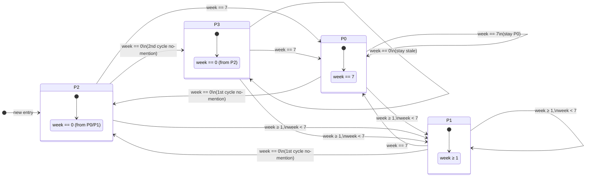
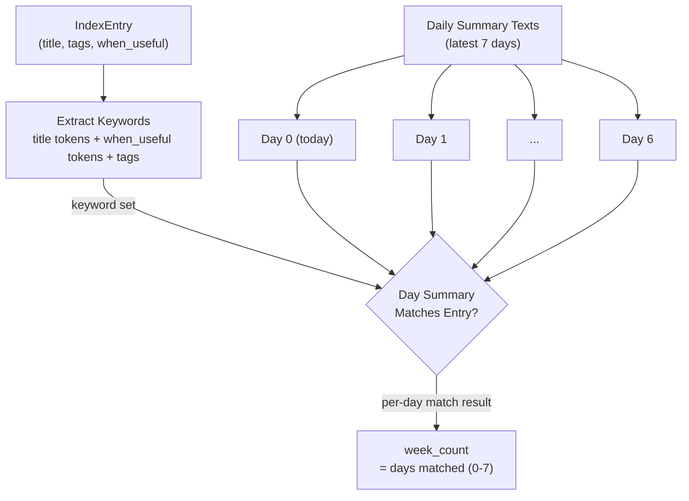
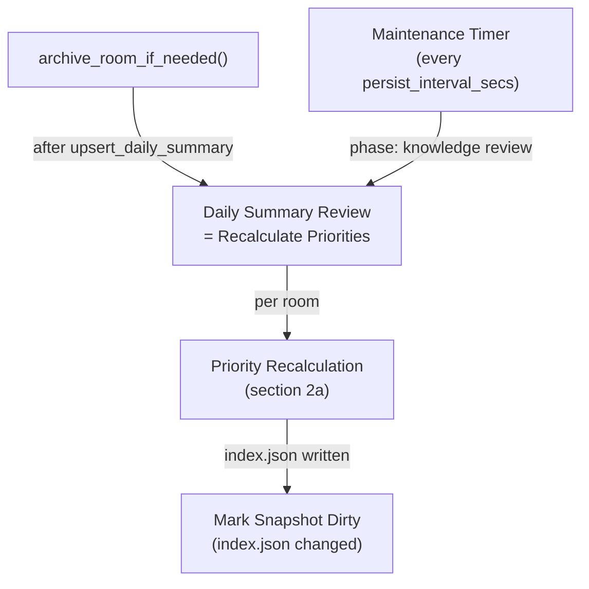

# Knowledge Priority Algorithm

## 1. Purpose

Defines the **adaptive priority recalculation** algorithm that runs during daily
summary review. Knowledge entries are re-evaluated against their mention
presence in the latest 7 daily summaries, promoting frequently-used entries
and progressively degrading stale ones. A "week" means any consecutive 7-day
sliding window — not a calendar week.

This DFD is referenced by [Knowledge Management](knowledge.md) for data
structures and by [Agent Harness](../agent-harness.md) for the daily summary
review trigger.

- Upstream: [Agent Harness](../agent-harness.md) — triggers priority
  recalculation after daily summary creation during archive review
- Upstream: [Memory Management](memory.md) — provides daily summaries
  (Layer 2) as the mention source
- Upstream: [Knowledge Management](knowledge.md) — defines `IndexEntry`,
  `KnowledgePriority` enum, and WebDAV storage for `index.json`
- Downstream: WebDAV crate — reads daily summaries, reads/writes `index.json`

## 2. Diagram

### 2a. Priority Recalculation Flow

```mermaid
flowchart TD
    START[Daily Summary Review Trigger]
    ROOM["Per-Room<br/>(webdav_dir)"]
    LOAD_SUMS["Load Latest 7-Day<br/>Daily Summaries"]
    DAV[(NextCloud WebDAV)]
    LOAD_IDX["Load knowledge/index.json"]
    EMPTY{Any knowledge<br/>entries?}
    DONE[Done]
    TICK{More entries?}
    NEXT[Next IndexEntry]
    SCAN["Scan Summaries for<br/>Entry Mentions<br/>(title + tags + when_useful keywords)"]
    COUNT["Count Days Mentioned<br/>= week_count (0-7)"]
    NEW_PRIO{"Compute New Priority<br/>(see 2b state diagram)"}
    CHANGED{Priority Changed?}
    DEGRADE{Is Degradation?<br/>(new < current)}
    RATE_CHECK{"last_degraded_at<br/>≥ 24h ago?"}
    RATE_SKIP[Skip — Rate Limited<br/>At most 1 degrade/day]
    MARK_DIRTY[Update Entry Priority<br/>+ set last_degraded_at]
    WRITE_IDX["Write Updated index.json"]
    SKIP[Skip]

    START --> ROOM
    ROOM -->|"room webdav_dir"| LOAD_SUMS
    LOAD_SUMS -->|"GET summaries/{YYYY-MM-DD}.md"| DAV
    DAV -->|"summary texts (up to 7)"| LOAD_SUMS
    LOAD_SUMS -->|"latest 7 days of summaries"| LOAD_IDX
    LOAD_IDX -->|"GET knowledge/index.json"| DAV
    DAV -->|"IndexEntry list"| EMPTY
    EMPTY -->|"no entries"| DONE
    EMPTY -->|"yes"| TICK
    TICK -->|"next entry"| NEXT
    TICK -->|"no more"| WRITE_IDX
    NEXT -->|"entry title, tags, when_useful"| SCAN
    LOAD_SUMS -->|"7 days of summary texts"| SCAN
    SCAN -->|"per-day match bool"| COUNT
    COUNT -->|"week_count + current priority"| NEW_PRIO
    NEW_PRIO --> CHANGED
    CHANGED -->|"yes"| DEGRADE
    CHANGED -->|"no"| SKIP
    DEGRADE -->|"yes — degrading"| RATE_CHECK
    DEGRADE -->|"no — promoting"| MARK_DIRTY
    RATE_CHECK -->|"yes — allowed"| MARK_DIRTY
    RATE_CHECK -->|"no — blocked"| RATE_SKIP
    MARK_DIRTY -->|"updated entry"| TICK
    RATE_SKIP --> TICK
    SKIP --> TICK
    WRITE_IDX -->|"PUT knowledge/index.json"| DAV
    WRITE_IDX --> DONE
```

### 2b. Priority State Diagram

Priority transitions depend on the **week_count** (number of days in the latest
7-day window where the entry is mentioned) and the entry's **current priority**.
New entries always start at P2.



**Transition table**:

| Current | week_count == 7 | week_count ≥ 1 (but < 7) | week_count == 0 |
| ------- | --------------- | ------------------------ | --------------- |
| **P0**  | → P0            | → P1                     | → P2            |
| **P1**  | → P0            | → P1                     | → P2            |
| **P2**  | → P0            | → P1                     | → P3            |
| **P3**  | → P0            | → P1                     | → P3            |

**Rules**:
- **P0** = used every day (7/7) — always recalled in context
- **P1** = mentioned at least once in the latest 7 days — highest priority short of daily use
- **P2** = not mentioned in the latest 7 days, OR new entry — one-cycle degradation
- **P3** = not mentioned for two consecutive cycles (from P2) — stale, but can recover if mentioned again
- Promotion is immediate: any mention ≥1 day jumps to P1; 7/7 jumps to P0
- Degradation is incremental: P0/P1 → P2 → P3, one step per review cycle with 0 mentions
- **Rate limit**: degradation is capped at **once per 24 hours** — if
  `last_degraded_at` is less than 24 hours ago, the degradation is skipped and
  the current priority is kept. Promotions are never rate-limited and reset
  `last_degraded_at`.

### 2c. Mention Matching Logic



A day is a **mention** if the daily summary text contains any entry keyword
(title tokens, `when_useful` tokens, or tag tokens — tokens > 2 characters,
case-insensitive, split on non-alphanumeric boundaries). Simple boolean
`contains()` per keyword; no fuzzy matching.

**Missing summaries**: if fewer than 7 summaries exist (young rooms, early
operation), missing days count as **not mentioned**. This naturally produces
lower priorities for rooms without a full week of history.

### 2d. Trigger — Daily Summary Review



The priority recalculation runs at two points:

1. **After archive** — immediately after `upsert_daily_summary()` writes a new
   daily summary
2. **Periodic maintenance** — during the periodic timer tick, alongside
   snapshot persistence and room eviction, to ensure stale entries degrade
   even on inactive days

## 3. Data Structures

### IndexEntry Priority Field

| Field             | Type               | Notes                                                       |
| ----------------- | ------------------ | ----------------------------------------------------------- |
| `priority`        | `KnowledgePriority` | Updated by this algorithm; **default for new entries is P2** |
| `last_degraded_at`| `String` (ISO 8601) | Timestamp of last degradation; used to enforce ≤1 degrade/day |

### KnowledgePriority

```rust
enum KnowledgePriority {
    P0, // used every day (week_count == 7) — always recalled
    P1, // used ≥ 1 in latest 7 days — strong recall boost (+5)
    P2, // not used in latest 7 days (1st cycle) OR new entry — moderate boost (+2)
    P3, // not used for 2+ consecutive cycles — baseline (+0)
}
```

**Recall behavior** (unchanged from [Knowledge Management](knowledge.md)):
P0 entries are always selected regardless of keyword overlap. P1-P3 add
progressively weaker score bonuses.

| Priority | Score bonus | Always selected? |
|----------|------------|-------------------|
| P0       | +8         | Yes               |
| P1       | +5         | No                |
| P2       | +2         | No                |
| P3       | +0         | No                |

## 4. Configuration

No dedicated config keys. The algorithm reuses:

| Key            | Source                 | Default | Used for                                  |
| -------------- | ---------------------- | ------- | ----------------------------------------- |
| `summary_days` | `[rocketchat.model]`   | 7       | Summary retention window; algorithm always reads latest 7 days |

## 5. Integration with Other Subsystems

### With Agent Harness

The harness calls `review_knowledge_priorities()` at two points:
1. **Post-archive**: after `upsert_daily_summary()` completes
2. **Periodic maintenance**: during `maintenance_tick()`, after snapshot
   persistence and before room eviction

### With Knowledge Management

- Reads `index.json` for current entry metadata and priority
- Writes updated `index.json` with recalculated priorities
- New entries default to P2

### With Memory Management

- Reads daily summaries from Layer 2 (`summaries/{date}.md`)
- Marks snapshots dirty when `index.json` is rewritten

### Error Handling

```mermaid
flowchart TD
    RECALC[Priority Recalculation]
    DAV[(NextCloud WebDAV)]
    ERR_IDX{index.json<br/>read fails?}
    ERR_SUMS{summary<br/>read fails?}
    ERR_WRITE{index.json<br/>write fails?}
    SKIP[Skip Room — Retry Next Cycle]
    WARN[Warn + Continue<br/>(missing days = not mentioned)]
    DONE[Done]

    RECALC -->|"GET index.json"| ERR_IDX
    ERR_IDX -->|"404 / parse error"| SKIP
    ERR_IDX -->|"ok"| ERR_SUMS
    ERR_SUMS -->|"summary missing"| WARN
    ERR_SUMS -->|"ok"| ERR_WRITE
    ERR_WRITE -->|"PUT failed"| WARN
    ERR_WRITE -->|"ok"| DONE
```

If summaries are missing for a room, missing days count as "not mentioned" and
degrade accordingly. If `index.json` is missing, the room is skipped (no
entries to evaluate).
