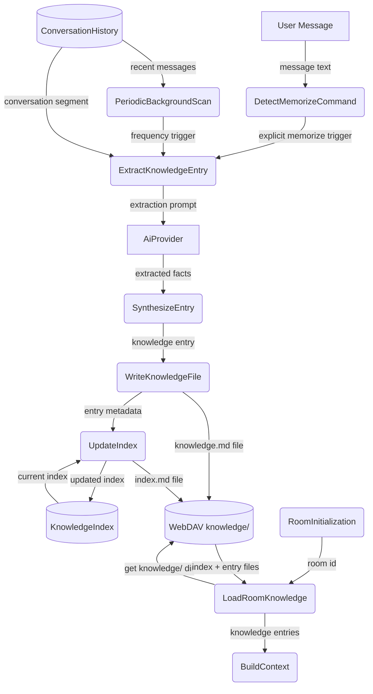
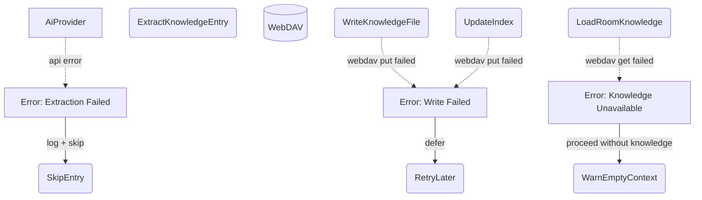
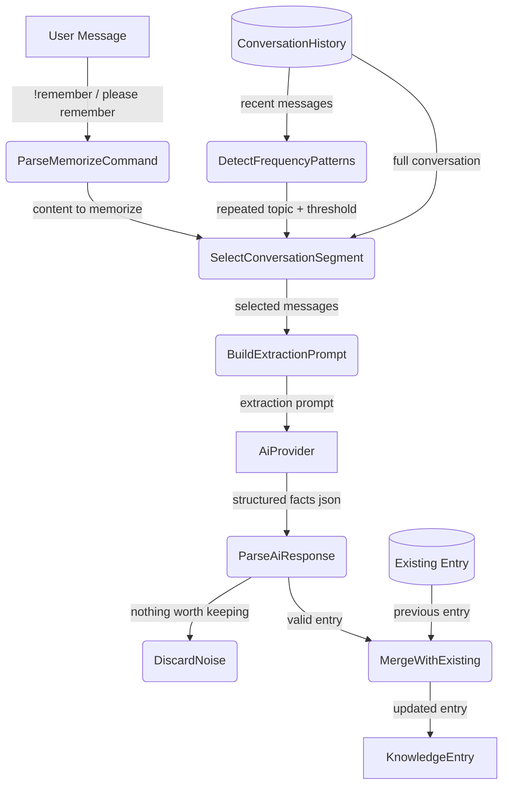
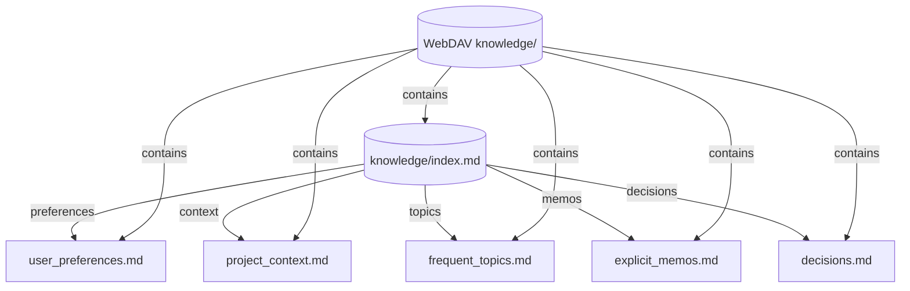

# Knowledge Management

## 1. Purpose

Extracts remembered facts about users and rooms from conversation history and
stores them as indexed `.md` files on WebDAV. Two extraction triggers: explicit
`!remember` commands and frequency-based pattern detection. On room
initialization, knowledge entries are loaded into the agent context to inform
the LLM about user preferences, project context, and past decisions.

- Upstream: [Memory Management](memory.md) provides `ConversationHistory` as
  extraction source
- Upstream: [Configuration Management](config.md) provides `KnowledgeConfig`
- Downstream: [WebDAV Tool](../tools/webdav.md) persists `.md` files and
  `index.md`
- Downstream: [AI Provider](ai-provider.md) is called for extraction
  synthesis
- Downstream: [Agent Harness](../agent-harness.md) loads knowledge entries into
  `BuildContext` on room init

## 2. Diagram

### 2a. Happy Flow (Main Success Path)



### 2b. Error Handling & Fallbacks



### 2c. Knowledge Extraction Deep Dive

Two extraction triggers — explicit user command (`!remember`) and periodic
frequency scan — feed the same synthesis pipeline.



### 2d. Knowledge Index Structure

The `index.md` file maps topics to individual knowledge `.md` files, enabling
selective loading without scanning the entire directory.



## 3. Data Structures

### `KnowledgeEntry`

Single `.md` file containing extracted facts on one topic.

| Field      | Type         | Notes                                     |
| ---------- | ------------ | ----------------------------------------- |
| `id`       | `String`     | Unique entry identifier (slug)            |
| `room_id`  | `String`     | Owning room (`"global"` for cross-room)   |
| `topic`    | `String`     | Human-readable topic title                |
| `content`  | `String`     | Markdown body with extracted facts        |
| `source`   | `SourceType` | `"explicit"` or `"frequency"`             |
| `created`  | `String`     | ISO 8601 timestamp                        |
| `updated`  | `String`     | ISO 8601 timestamp                        |

### `KnowledgeIndex`

Single `index.md` file listing all entries in a room's knowledge directory.

| Field      | Type               | Notes                         |
| ---------- | ------------------ | ----------------------------- |
| `entries`  | `Vec<IndexEntry>`  | Descriptors for every entry   |
| `updated`  | `String`           | Last modification timestamp   |

### `IndexEntry`

| Field      | Type         | Notes                                    |
| ---------- | ------------ | ---------------------------------------- |
| `id`       | `String`     | Matches `KnowledgeEntry.id`              |
| `filename` | `String`     | `{topic_slug}.md`                        |
| `topic`    | `String`     | Human-readable topic                     |
| `tags`     | `Vec<String>`| Searchable tags for context injection    |
| `source`   | `SourceType` | How the entry was created                |

### `KnowledgeConfig`

Appended to `AppConfig` in [Configuration Management](config.md).

| Field                 | Type   | Notes                                     |
| --------------------- | ------ | ----------------------------------------- |
| `knowledge_enabled`   | `bool` | Enable knowledge extraction               |
| `frequency_threshold` | `usize`| Mention count before auto-extraction      |
| `scan_interval`       | `u64`  | Seconds between periodic scans            |

### File Layout

```
{root}/{room_id}/knowledge/index.md
{root}/{room_id}/knowledge/{topic_slug}.md
```

Example:

```
rockbot/general/knowledge/index.md
rockbot/general/knowledge/user_preferences.md
rockbot/general/knowledge/project_context.md
```
