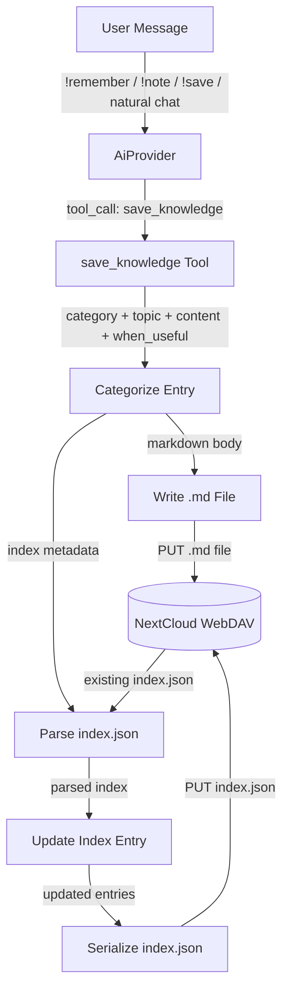
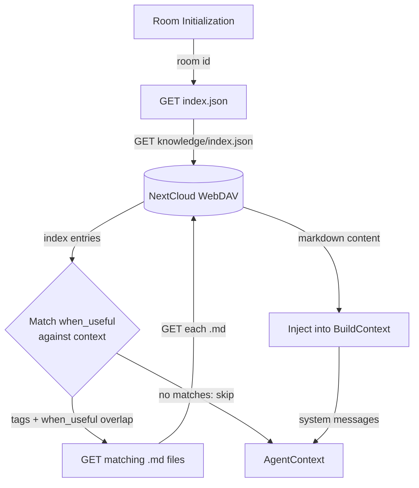
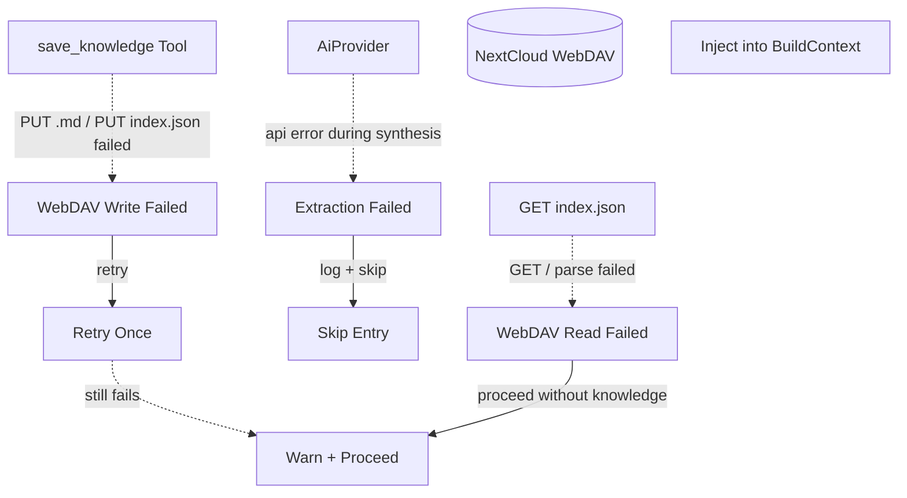
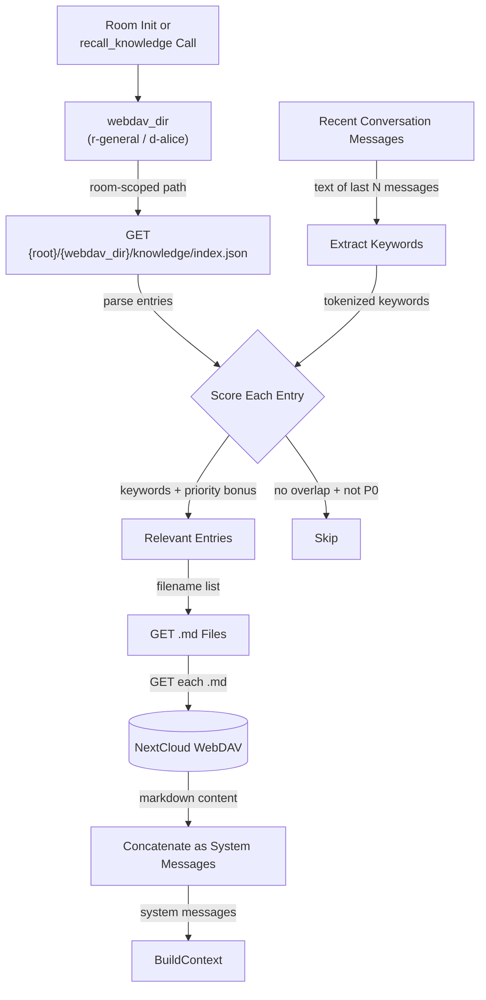

# Knowledge Management

Knowledge persistence is **always enabled** when WebDAV is configured — no
separate config toggle required. The `save_knowledge`, `forget_knowledge`, and
`recall_knowledge` tools are automatically registered alongside other
WebDAV-backed tools.

## 1. Purpose

Persistent per-room knowledge stored as `.md` files on WebDAV with a JSON
index for situational retrieval. Three categories cover everything the agent
needs to remember:

| Category | Description | Example |
|----------|-------------|---------|
| `skill`  | Procedural — how to accomplish a task | How to call the database API via `web_fetch` |
| `secret` | Credential — a sensitive value shared by the user | An API key or access token |
| `note`   | Factual — a piece of information to remember | A driver's contact number |

Each entry lives in its own `.md` file. The `index.json` file lists every
entry with a `when_useful` field — a short description of the situation that
makes this knowledge relevant. This serves as a retrieval trigger so the
agent only loads knowledge that matches the current conversation.

### Write triggers

Knowledge is saved via the `save_knowledge` tool, which the AI provider can
call in two scenarios:

1. **Explicit command** — user says `!remember <thing>`, `!note <thing>`, or `!save <thing>`;
   the AI parses the instruction and emits `save_knowledge`
2. **Agent-initiated** — during normal conversation the AI determines
   something is worth persisting and emits `save_knowledge` autonomously

Magic words recognized by the system prompt:

| Magic word | Category hint | Example |
|------------|---------------|---------|
| `!remember` | Generic — lets the AI infer category | `!remember that I prefer Python over JavaScript` |
| `!note` | Generic — lets the AI infer category | `!note the prod server IP is 10.0.0.5` |
| `!save` | Generic — lets the AI infer category | `!save that I prefer Python over JavaScript` |
| `!forget` | Maps to `forget_knowledge` tool | `!forget the old database instructions` |

No frequency-based or periodic background extraction is planned.

### Retrieval

On room initialization the harness loads `index.json` and evaluates which
entries match the current conversation context (via tags and `when_useful`
keyword overlap). Matching entries' `.md` files are downloaded and injected
into `BuildContext` as system messages. A `recall_knowledge` tool lets the
agent fetch additional entries on demand during the agent loop.

- Upstream: [Agent Harness](../agent-harness.md) detects `save_knowledge` tool
  calls and loads knowledge on room init
- Upstream: [Configuration Management](config.md) provides WebDAV access
  (knowledge is always enabled when WebDAV is configured)
- Downstream: WebDAV crate persists `.md` files and `index.json`
- Downstream: [AI Provider](ai-provider.md) synthesizes knowledge entries from
  user instructions via `save_knowledge` tool calls
- Downstream: `BuildContext` receives injected knowledge as system messages
- Downstream: [Knowledge Priority Algorithm](knowledge-priority.md) adaptively recalculates entry
  priorities based on daily summary mentions

## 2. Diagram

### 2a. Happy Flow — Write



### 2b. Happy Flow — Load



### 2c. Error Handling



### 2d. Write Deep Dive — save_knowledge Tool


### 2e. Retrieval Deep Dive — Matching When Useful

Knowledge is scoped per-room: `index.json` and `.md` files live under
`{root}/{webdav_dir}/knowledge/`. Retrieval loads the calling room's
index and scores entries against that room's recent conversation
messages.



## 3. Data Structures

### `KnowledgeEntry`

A single `.md` file stored at `{root}/{webdav_dir}/knowledge/{category}_{slug}.md`.
`webdav_dir` is the type-prefixed room key (`r-`/`d-` prefix, see [rocketchat.md](rocketchat.md)).

| Field        | Type             | Notes                                     |
| ------------ | ---------------- | ----------------------------------------- |
| `id`         | `String`         | Unique slug, e.g. `skill_db_api`          |
| `room_id`    | `String`         | WebDAV directory key (`r-general`, `d-alice`, etc.) |
| `category`   | `KnowledgeCategory` | `skill`, `secret`, or `note`           |
| `title`      | `String`         | Human-readable title                      |
| `content`    | `String`         | Full markdown body                        |
| `when_useful`| `String`         | Situation description for retrieval       |
| `tags`       | `Vec<String>`    | Searchable keywords                       |
| `created_at` | `String`         | ISO 8601 timestamp                        |
| `updated_at` | `String`         | ISO 8601 timestamp                        |

### `KnowledgeIndex`

Machine-readable JSON file at `{root}/{webdav_dir}/knowledge/index.json`.

| Field     | Type              | Notes                         |
| --------- | ----------------- | ----------------------------- |
| `version` | `String`          | `"rockbot-knowledge/1"`       |
| `room_id` | `String`          | WebDAV directory key          |
| `entries` | `Vec<IndexEntry>` | One descriptor per `.md` file |
| `updated` | `String`          | ISO 8601 last modification    |

### `IndexEntry`

| Field         | Type               | Notes                                          |
| ------------- | ------------------ | ---------------------------------------------- |
| `id`          | `String`           | Matches `KnowledgeEntry.id` (slug)             |
| `filename`    | `String`           | `{category}_{slug}.md`                         |
| `category`    | `KnowledgeCategory` | `skill`, `secret`, or `note`                 |
| `title`       | `String`           | Human-readable title                           |
| `when_useful` | `String`           | Situation description for retrieval matching   |
| `tags`        | `Vec<String>`      | Searchable keywords                            |
| `priority`    | `KnowledgePriority` | P0 (highest), P1, P2 (default for new entries), P3 (stale); managed by [Knowledge Priority Algorithm](knowledge-priority.md) |
| `last_degraded_at` | `String` (ISO 8601) | Timestamp of last degradation; enforces ≤1 degrade/day |
| `created_at`  | `String`           | ISO 8601                                       |
| `updated_at`  | `String`           | ISO 8601                                       |

### `KnowledgePriority`

```rust
enum KnowledgePriority {
    P0, // used every day in latest 7-day window — always loaded
    P1, // used ≥ 1 in latest 7-day window — strong boost (+5)
    P2, // not used in latest 7 days (1st cycle) OR new entry — moderate boost (+2)
    P3, // not used for 2+ consecutive cycles — baseline (+0)
}
```

**Priority effect on recall**: During `match_relevant`, priority adds a flat
score bonus on top of keyword matching. P0 entries are always selected
regardless of keyword overlap. Higher priority means the entry is recalled
more frequently and surfaced earlier in the injected knowledge list.

Priorities are adaptively recalculated by the [Knowledge Priority
Algorithm](knowledge-priority.md) during daily summary review, using a single
7-day sliding window against Layer 2 daily summaries. Degradation is
incremental (P0/P1→P2→P3); promotion is immediate (≥1 mention→P1, 7/7→P0).

| Priority | Score bonus | Always selected? |
|----------|------------|-------------------|
| P0       | +8         | Yes               |
| P1       | +5         | No                |
| P2       | +2         | No                |
| P3       | +0         | No                |

### `KnowledgeCategory`

```rust
enum KnowledgeCategory {
    Skill,   // procedural: how to do something
    Secret,  // credential: api key, token, password
    Note,    // factual: contact info, preference, reminder
}
```

### Markdown Entry Format

Each `.md` file uses a simple structure with optional frontmatter:

```markdown
# {title}

**Category:** {category}
**Priority:** {P0 | P1 | P2 | P3}
**When Useful:** {when_useful}
**Tags:** {tag1}, {tag2}
**Created:** {created_at}
**Updated:** {updated_at}

{content — free-form markdown body}
```

### File Layout

```
{root}/{webdav_dir}/knowledge/
├── index.json
├── skill_db_api.md
├── secret_openai_key.md
├── note_driver_contact.md
└── ...
```

Examples:

```
rockbot/r-general/knowledge/index.json
rockbot/r-general/knowledge/skill_db_api.md
rockbot/d-alice/knowledge/secret_github_token.md
rockbot/r-project-x/knowledge/note_build_commands.md
```

## 4. Integration with Agent Harness

### Tool: `save_knowledge`

Registered in `ToolRegistry`. Parameters:

| Parameter     | Type     | Required | Description                                      |
| ------------- | -------- | -------- | ------------------------------------------------ |
| `category`    | `string` | Yes      | `"skill"`, `"secret"`, or `"note"`               |
| `topic`       | `string` | Yes      | Short title for the entry                        |
| `content`     | `string` | Yes      | Markdown body                                    |
| `when_useful` | `string` | Yes      | Situation description (retrieval trigger)        |
| `tags`        | `string` | No       | Comma-separated keywords                         |
| `priority`    | `string` | No       | `"P0"`, `"P1"`, `"P2"`, or `"P3"` (default: P2) |

### Tool: `forget_knowledge`

Removes a knowledge entry and its index record. Parameters:

| Parameter | Type     | Description                              |
| --------- | -------- | ---------------------------------------- |
| `topic`   | `string` | Title or slug of the entry to delete     |

Deletes the `.md` file, removes the entry from `index.json`, and PUTs the
updated index back to WebDAV. If the file doesn't exist the index entry is
still removed (idempotent).

### Tool: `recall_knowledge`

Registered in `ToolRegistry`. Parameters:

| Parameter | Type     | Description                              |
| --------- | -------- | ---------------------------------------- |
| `query`   | `string` | Topic or keyword to search in the index  |

Returns the matching `.md` content (or all entries if no query).

### Context Injection

During `BuildContext` assembly (`MemoryManager::build_context`):
1. If WebDAV is configured, load `index.json`
2. Score each `IndexEntry` against recent conversation messages
3. For entries scoring above threshold, `GET` the `.md` file
4. Prepend each loaded entry as a system message:
   ```
   [Knowledge: {category}/{title}] {content}
   ```
5. The `when_useful` field is included as a leading line:
   ```
   Use when: {when_useful}
   ```
