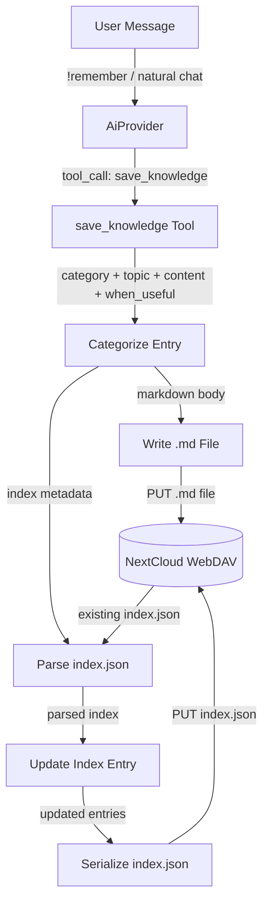
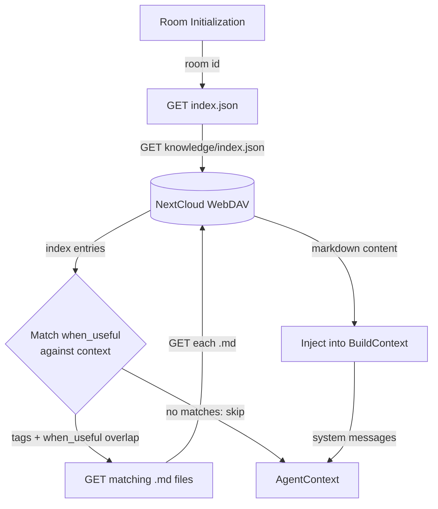
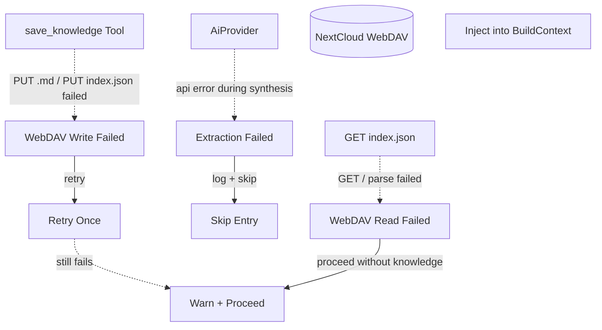
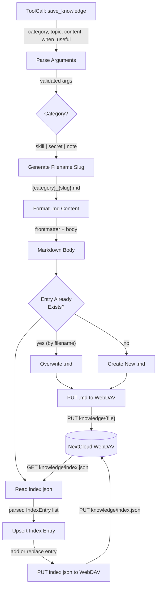
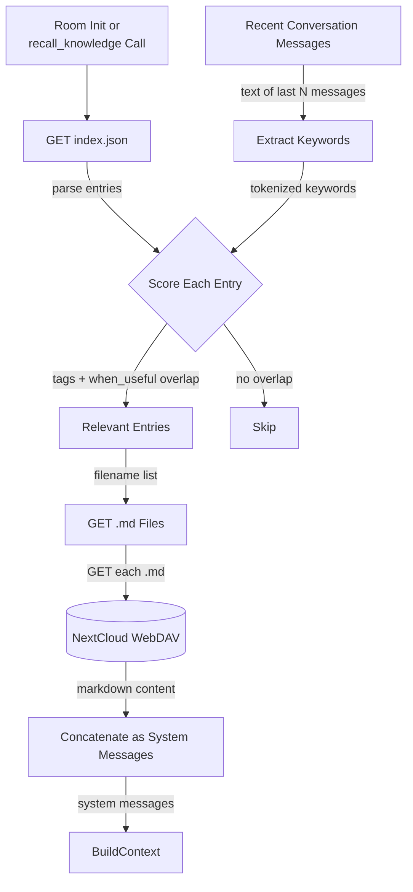

# Knowledge Management

> **Status: Planned — Not Implemented.** No Rust code exists for knowledge
> extraction, storage, or retrieval. Structures like `KnowledgeEntry`,
> `KnowledgeIndex`, and `KnowledgeConfig` are defined in this DFD only.
> The agent loop runs without knowledge injection.

## 1. Purpose

Persistent per-room knowledge stored as `.md` files on WebDAV with a JSON
index for situational retrieval. Three categories cover everything the agent
needs to remember:

| Category | Description | Example |
|----------|-------------|---------|
| `skill`  | Procedural — how to accomplish a task | How to call the database API via `web_fetch` |
| `secret` | Credential — a sensitive value shared by the user | An API key or access token |
| `note`   | Factual — a piece of information to remember | A driver's contact number |

Each entry lives in its own `.md` file. The `index.json` file lists every
entry with a `when_useful` field — a short description of the situation that
makes this knowledge relevant. This serves as a retrieval trigger so the
agent only loads knowledge that matches the current conversation.

### Write triggers

Knowledge is saved via the `save_knowledge` tool, which the AI provider can
call in two scenarios:

1. **Explicit command** — user says `!remember <thing>` or `!learn <thing>`;
   the AI parses the instruction and emits `save_knowledge`
2. **Agent-initiated** — during normal conversation the AI determines
   something is worth persisting and emits `save_knowledge` autonomously

No frequency-based or periodic background extraction is planned.

### Retrieval

On room initialization the harness loads `index.json` and evaluates which
entries match the current conversation context (via tags and `when_useful`
keyword overlap). Matching entries' `.md` files are downloaded and injected
into `BuildContext` as system messages. A `recall_knowledge` tool lets the
agent fetch additional entries on demand during the agent loop.

- Upstream: [Agent Harness](../agent-harness.md) detects `save_knowledge` tool
  calls and loads knowledge on room init
- Upstream: [Configuration Management](config.md) provides `KnowledgeConfig`
- Downstream: WebDAV crate persists `.md` files and `index.json`
- Downstream: [AI Provider](ai-provider.md) synthesizes knowledge entries from
  user instructions via `save_knowledge` tool calls
- Downstream: `BuildContext` receives injected knowledge as system messages

## 2. Diagram

### 2a. Happy Flow — Write



### 2b. Happy Flow — Load



### 2c. Error Handling



### 2d. Write Deep Dive — save_knowledge Tool



### 2e. Retrieval Deep Dive — Matching When Useful



## 3. Data Structures

### `KnowledgeEntry`

A single `.md` file stored at `{root}/{room_id}/knowledge/{category}_{slug}.md`.

| Field        | Type             | Notes                                     |
| ------------ | ---------------- | ----------------------------------------- |
| `id`         | `String`         | Unique slug, e.g. `skill_db_api`          |
| `room_id`    | `String`         | Owning room                               |
| `category`   | `KnowledgeCategory` | `skill`, `secret`, or `note`           |
| `title`      | `String`         | Human-readable title                      |
| `content`    | `String`         | Full markdown body                        |
| `created_at` | `String`         | ISO 8601 timestamp                        |
| `updated_at` | `String`         | ISO 8601 timestamp                        |

### `KnowledgeIndex`

Machine-readable JSON file at `{root}/{room_id}/knowledge/index.json`.

| Field     | Type              | Notes                         |
| --------- | ----------------- | ----------------------------- |
| `version` | `String`          | `"rockbot-knowledge/1"`       |
| `room_id` | `String`          | Owning room                   |
| `entries` | `Vec<IndexEntry>` | One descriptor per `.md` file |
| `updated` | `String`          | ISO 8601 last modification    |

### `IndexEntry`

| Field         | Type             | Notes                                          |
| ------------- | ---------------- | ---------------------------------------------- |
| `id`          | `String`         | Matches `KnowledgeEntry.id` (slug)             |
| `filename`    | `String`         | `{category}_{slug}.md`                         |
| `category`    | `KnowledgeCategory` | `skill`, `secret`, or `note`                |
| `title`       | `String`         | Human-readable title                           |
| `when_useful` | `String`         | Situation description for retrieval matching   |
| `tags`        | `Vec<String>`    | Searchable keywords                            |
| `created_at`  | `String`         | ISO 8601                                       |
| `updated_at`  | `String`         | ISO 8601                                       |

### `KnowledgeCategory`

```rust
enum KnowledgeCategory {
    Skill,   // procedural: how to do something
    Secret,  // credential: api key, token, password
    Note,    // factual: contact info, preference, reminder
}
```

### `KnowledgeConfig`

Added to `AppConfig` in [Configuration Management](config.md).

| Field              | Type   | Notes                                       |
| ------------------ | ------ | ------------------------------------------- |
| `knowledge_enabled`| `bool` | Enable knowledge persistence and retrieval   |

### Markdown Entry Format

Each `.md` file uses a simple structure with optional frontmatter:

```markdown
# {title}

**Category:** {category}
**When Useful:** {when_useful}
**Tags:** {tag1}, {tag2}
**Created:** {created_at}
**Updated:** {updated_at}

{content — free-form markdown body}
```

### File Layout

```
{root}/{room_id}/knowledge/
├── index.json
├── skill_db_api.md
├── secret_openai_key.md
├── note_driver_contact.md
└── ...
```

Examples:

```
rockbot/general/knowledge/index.json
rockbot/general/knowledge/skill_db_api.md
rockbot/dm-alice/knowledge/secret_github_token.md
rockbot/project-x/knowledge/note_build_commands.md
```

## 4. Integration with Agent Harness

### Tool: `save_knowledge`

Registered in `ToolRegistry`. Parameters:

| Parameter     | Type     | Description                                      |
| ------------- | -------- | ------------------------------------------------ |
| `category`    | `string` | `"skill"`, `"secret"`, or `"note"`               |
| `topic`       | `string` | Short title for the entry                        |
| `content`     | `string` | Markdown body                                    |
| `when_useful` | `string` | Situation description (retrieval trigger)        |
| `tags`        | `string` | Comma-separated keywords                         |

### Tool: `forget_knowledge`

Removes a knowledge entry and its index record. Parameters:

| Parameter | Type     | Description                              |
| --------- | -------- | ---------------------------------------- |
| `topic`   | `string` | Title or slug of the entry to delete     |

Deletes the `.md` file, removes the entry from `index.json`, and PUTs the
updated index back to WebDAV. If the file doesn't exist the index entry is
still removed (idempotent).

### Tool: `recall_knowledge`

Registered in `ToolRegistry`. Parameters:

| Parameter | Type     | Description                              |
| --------- | -------- | ---------------------------------------- |
| `query`   | `string` | Topic or keyword to search in the index  |

Returns the matching `.md` content (or all entries if no query).

### Context Injection

During `BuildContext` assembly (`MemoryManager::build_context`):
1. If `knowledge_enabled` and WebDAV is configured, load `index.json`
2. Score each `IndexEntry` against recent conversation messages
3. For entries scoring above threshold, `GET` the `.md` file
4. Prepend each loaded entry as a system message:
   ```
   [Knowledge: {category}/{title}] {content}
   ```
5. The `when_useful` field is included as a leading line:
   ```
   Use when: {when_useful}
   ```
