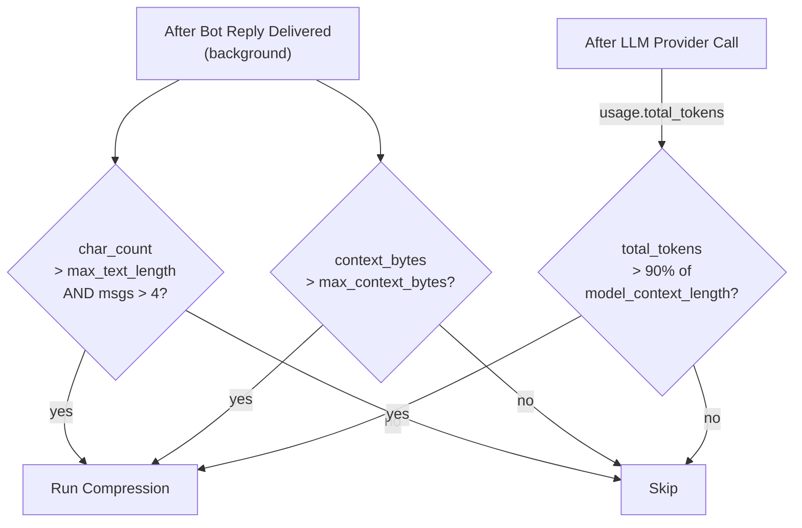
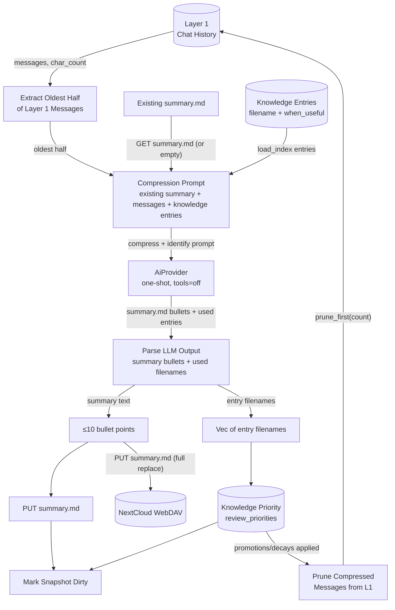
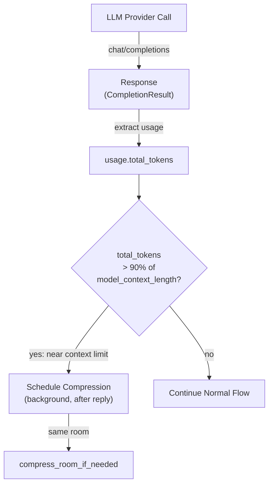
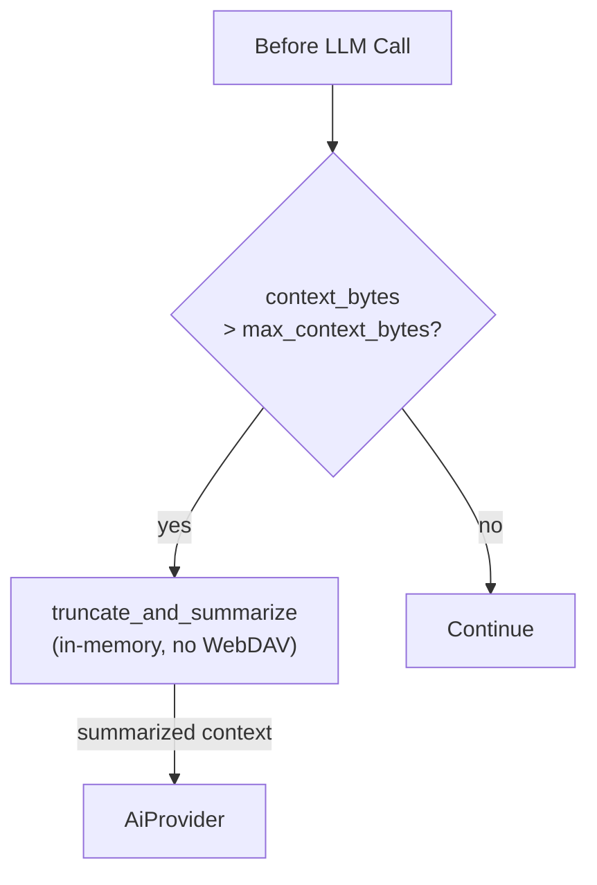
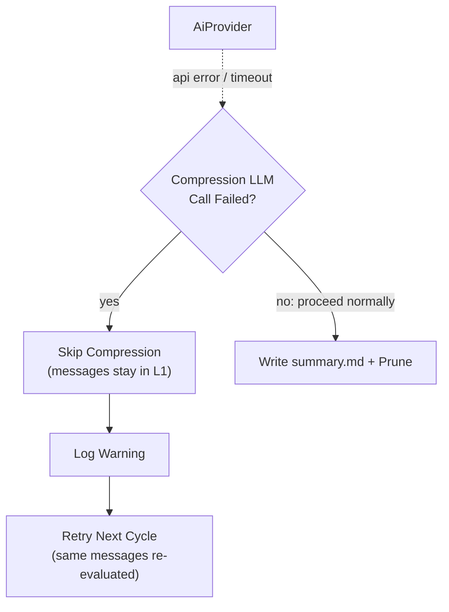

# Memory Compression

## 1. Purpose

Single dedicated DFD for the Layer 1 → Layer 2 compression pipeline: when
conversation history grows beyond limits, the oldest half is compressed into a
replacement `summary.md` (≤10 bullet points) by the LLM. The same LLM call
identifies which knowledge entries were relevant, feeding the
[Knowledge Priority Algorithm](knowledge-priority.md).

Compression runs in the background **after the bot reply is delivered**, so
there is zero delay between user request and bot response.

- Upstream: [Memory Management](memory.md) — provides `ConversationHistory`
  (Layer 1) and stores `summary.md` (Layer 2)
- Upstream: [AI Provider](ai-provider.md) — executes the compression prompt
  and returns token usage counts for the post-call token trigger
- Upstream: [Knowledge Management](knowledge.md) — provides knowledge entry
  list for the LLM to evaluate relevance
- Upstream: [Configuration Management](config.md) — provides trigger
  thresholds (`max_text_length`, `max_context_bytes`,
  `model_context_length`)
- Downstream: WebDAV crate — persists `summary.md`
- Downstream: [Knowledge Priority Algorithm](knowledge-priority.md) —
  consumes LLM-identified used entry filenames

## 2. Diagram

### 2a. Three-Trigger Compression Decision

Compression fires when **any** of these thresholds is crossed. The decision
is evaluated after each bot reply is delivered. The token trigger is evaluated
after each LLM provider call, using the response's actual `usage.total_tokens`.



**Trigger priority**: all three triggers independently call the same compression
function. The token trigger is unique in that it is evaluated *after* the LLM
response, using actual token counts from the provider — not estimates.

### 2b. Compression Deep Dive

When triggered, the oldest half of Layer 1 messages is extracted, combined with
the existing `summary.md` (if any) and the list of knowledge entries, then sent
to the LLM. The LLM produces a replacement `summary.md` and a list of used
knowledge entry filenames.



Compression is a **replace** operation: the LLM receives the existing
`summary.md` plus the overflowed messages, and produces a fresh `summary.md`
that merges old and new into at most 10 bullet points. No per-date files, no
accumulation.

### 2c. Token-Based Trigger (Post-LLM Call)

The token trigger is the most reliable mechanism because it uses the provider's
actual token count, not byte or character estimates. After each LLM call, the
harness inspects `response.usage.total_tokens`. If it exceeds 90% of the
configured `model_context_length`, compression is scheduled for the current
room.



**Token counting**: the provider response includes `usage.total_tokens` which
is the total tokens consumed by the request (prompt + completion). This is
compared against `model_context_length * 0.9`. The 90% threshold provides
safety margin — by the time the next request is built, additional system
messages (soul, knowledge, summary) will push it closer to the limit.

**Provider support**: all major providers (OpenRouter, DeepSeek, OpenAI)
return `usage` in responses. If `usage` is absent or `total_tokens` is 0,
the token trigger is skipped (graceful degradation).

### 2d. Inline Context Overflow — truncate_and_summarize

Before each LLM call, the harness also checks if serialized context bytes
exceed `max_context_bytes`. This is a separate in-memory-only mechanism
(no WebDAV write) that summarises older messages inline for the current
call. See [Agent Harness](../agent-harness.md §2i) for the full diagram.

If the inline truncation was substantial (many messages summarised), it
may also flag the room for background compression after the reply.



### 2e. Fallback — Compression Failure

If the compression LLM call fails (API error, timeout), compression is
skipped for this cycle. Messages remain in Layer 1 — they will be re-evaluated
next cycle. No data is lost.



## 3. Data Structures

### `CompressedMemory` (Layer 2)

A single file stored at `{root}/{webdav_dir}/memory/summary.md`. Defined in
[Memory Management](memory.md §3).

```rust
struct CompressedMemory {
    room_id: NonEmptyString,
    content: String,        // Markdown bullet list, ≤10 items
    archive_seq: u64,       // Compression sequence number
    updated_at: String,     // ISO 8601
}
```

### Compression Prompt Payload

The LLM receives a structured prompt containing:

| Component | Source | Notes |
|-----------|--------|-------|
| Existing summary | `GET summary.md` from WebDAV | Empty string if none exists |
| Overflowed messages | Oldest half of Layer 1 | Up to 20 user+assistant messages, each trimmed to 300 chars |
| Knowledge entries | `load_index(webdav_dir)` | `filename` + `when_useful`, up to 30 entries |

### Compression Output

The LLM response is parsed via `parse_compression_output()`:

| Output | Format | Example |
|--------|--------|---------|
| Summary bullets | Lines starting with `- ` after `# Memory Summary` header | `- User prefers short answers` |
| Used entries | Lines under `## Used Knowledge` header, each ending with `.md` | `- note_build.md` |

## 4. Configuration

Fields from `ModelConfig` in [Configuration Management](config.md):

| Field                  | Type    | Default | Notes |
| ---------------------- | ------- | ------- | ----- |
| `max_text_length`      | `usize` | 50000   | char_count overflow trigger (post-reply) |
| `max_context_bytes`    | `usize` | 4_000_000 | byte-size overflow trigger (pre-LLM inline, flag for background compression) |
| `model_context_length` | `u32`   | 131072  | Model's max context tokens. 90% threshold (`* 0.9`) triggers post-LLM compression. Default 128K (typical for GPT-4o / Claude / Qwen). |

The `model_context_length` is a per-model default — different models have
different context windows (e.g., 8K, 32K, 128K, 200K). The value should be
set to match the configured `default_model`'s context window.

## 5. Trigger Summary

| Trigger | Evaluation Point | Condition | Action |
|---------|-----------------|-----------|--------|
| **Char overflow** | After reply delivery | `char_count > max_text_length` AND `msgs > 4` | Full background compression |
| **Byte overflow** | Before each LLM call | `context_bytes > max_context_bytes` | Inline `truncate_and_summarize`; flag for background compression if substantial |
| **Token near-limit** | After each LLM response | `usage.total_tokens > model_context_length * 0.9` | Schedule background compression for this room |

## 6. Integration

### With Agent Harness

| Method | When | Action |
|--------|------|--------|
| `compress_room_if_needed()` | After reply delivery (background) | Full compression cycle (char or token triggered) |
| `truncate_and_summarize()` | Before each LLM call | Inline context reduction (byte triggered) |
| `check_token_pressure()` | After each LLM response | Inspects `usage.total_tokens`, schedules compression if near limit |

### With Memory Manager

| Method | Purpose |
|--------|---------|
| `check_and_archive()` | Returns oldest half of L1 if overflowed |
| `prune_archived()` | Removes compressed messages from L1 buffer |
| `summary_path()` | Returns WebDAV path for `summary.md` |
| `set_summary()` | Updates in-memory summary cache |
| `get_summary()` | Returns current summary for existing-content block |

### With Knowledge Manager

| Method | Purpose |
|--------|---------|
| `load_index()` | Provides `Vec<IndexEntry>` for LLM relevance identification |
| `review_priorities()` | Promotes/decays entries based on used filenames |
