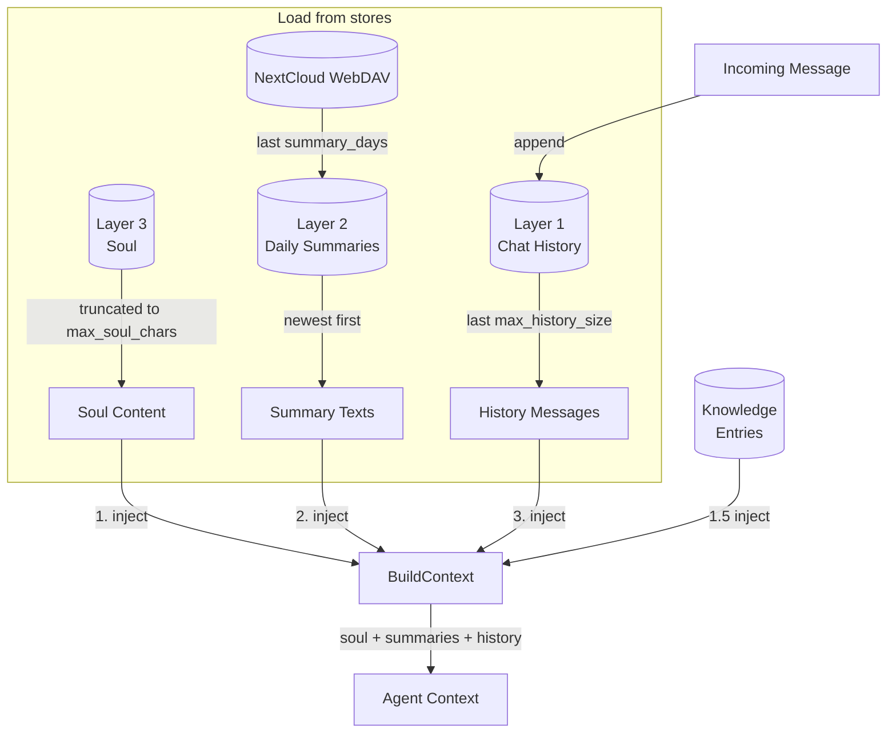
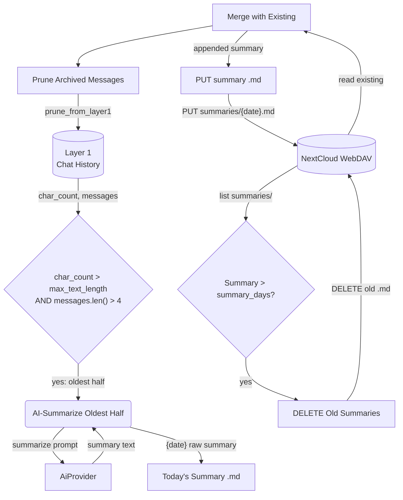
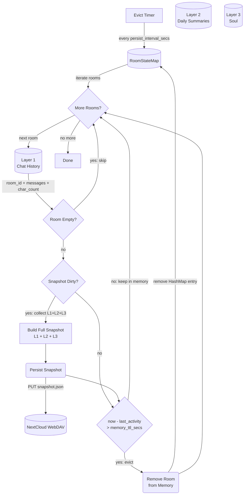
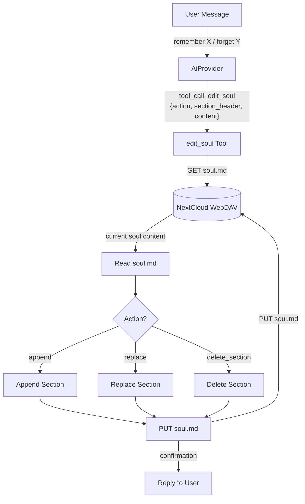
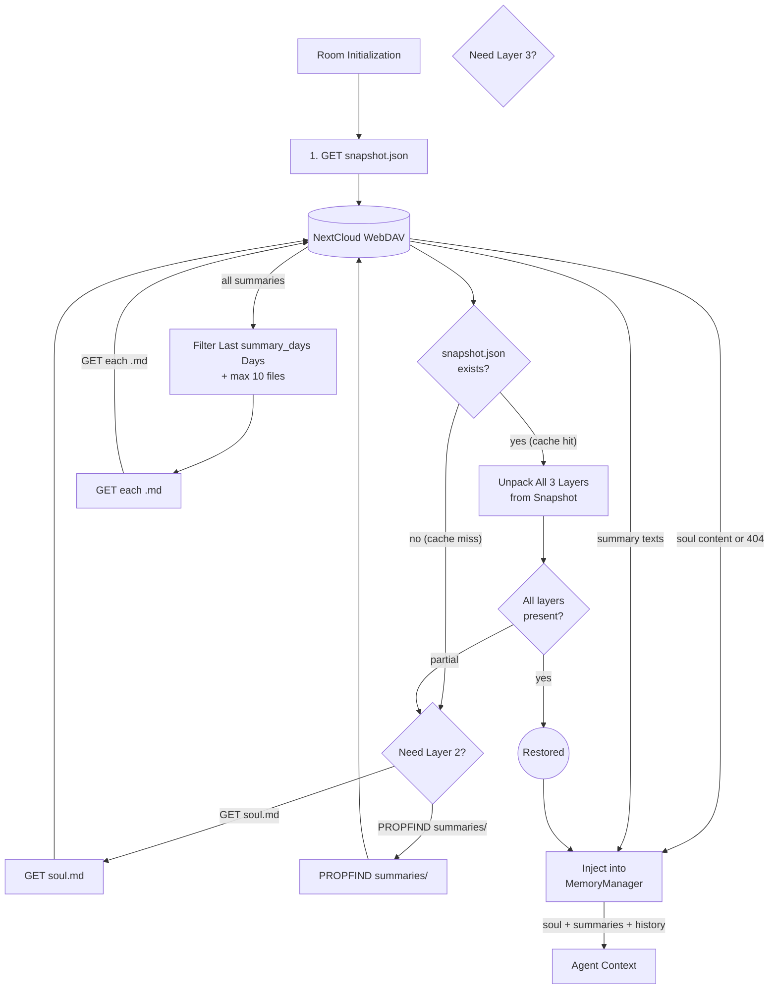
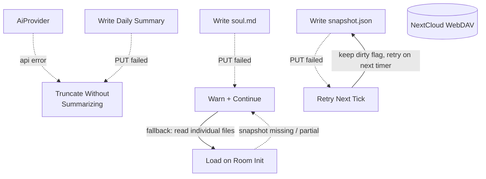
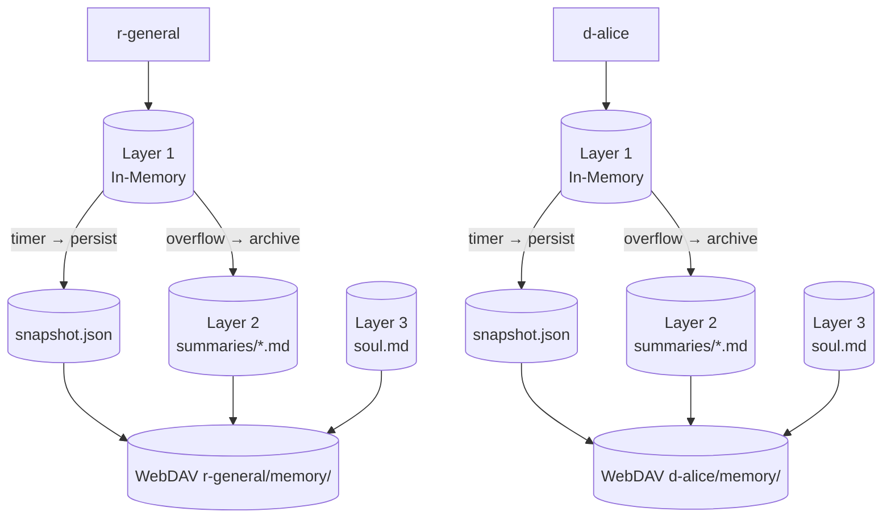

# Memory Management

## 1. Purpose

Three-layer per-room conversation memory, each layer progressively condensed
from the one before. Rooms stay in memory while actively communicating and are
evicted after a configurable idle TTL — the snapshot is persisted to WebDAV
before eviction, then restored on next interaction.

All layers are loaded on room init and injected into the agent context as
system messages. On restore, a single cached `snapshot.json` is read first
(containing all three layers). Individual files (`soul.md`, `summaries/*.md`)
serve as the source of truth — the snapshot is a performance cache, rebuilt
incrementally whenever any layer changes. If the snapshot is missing or stale,
the system falls back to reading individual files.

| Layer | Name | Storage | Limit | Contents |
|-------|------|---------|-------|----------|
| 1 | **Chat History** | In-memory only | `max_text_length` chars, `max_history_messages` msgs | Raw `Vec<ChatMessage>` — the current working window |
| 2 | **Daily Summaries** | WebDAV `.md` files | `max_summary_chars` total, 7-day rolling window | AI-summarized daily digests of overflowed Layer 1 messages |
| 3 | **Soul** | WebDAV `soul.md` file | `max_soul_chars` chars | Persistent core memory editable by user via chat |

Archive is a single flow: messages accumulate in Layer 1. When Layer 1 exceeds
`max_text_length` chars, the oldest half is AI-summarized into today's Layer 2
daily summary. Summaries older than `summary_days` (default 7 days) are
deleted. The archived messages are pruned from Layer 1. The raw conversation
state is also periodically saved to WebDAV as a crash-recovery checkpoint.

Layer 3 (soul) is permanent — the user can add, revise, or remove entries
through normal conversation (e.g. "remember I prefer short answers"). The agent
edits soul via the `edit_soul` tool.

- Upstream: [Configuration Management](config.md) provides `ModelConfig`
  (`max_text_length`, `max_history_size`, `max_summary_chars`, `max_soul_chars`,
  `summary_days`)
- Upstream: [Agent Harness](../agent-harness.md) triggers
  `archive_room_if_needed` after each message, `persist_room_snapshots` on a
  periodic timer, `restore_history` on room init, and handles `edit_soul` tool
  calls
- Downstream: WebDAV crate (`WebDavClient`, `WebDavPath`) persists daily
  summaries, snapshots, and `soul.md`
- Downstream: [AI Provider](ai-provider.md) generates daily summaries from
  overflowed chat history
- Downstream: [Knowledge Management](knowledge.md) is a separate system for
  categorized skill/secret/note entries (not part of the three-layer memory)

## 2. Diagram

### 2a. Happy Flow — Retrieve from Three Layers

On each interaction, data from all three layers is retrieved (with
configurable limits) and injected into the agent context. Write flows
(archive, persist, soul edit) are shown in separate sub-diagrams.



Layer 1 is populated by incoming messages. Layer 2 is populated by the
[Archive Flow](#2b-archive-flow--layer-1--layer-2-threshold). Layer 3 is
populated by the [Soul Editing](#2d-happy-flow--soul-editing) tool. The
[Persist & Evict Flow](#2c-persist--evict-flow--timer) provides crash recovery
for Layer 1 and TTL-based room eviction.

### 2b. Archive Flow — Layer 1 → Layer 2 (Threshold)



### 2c. Persist & Evict Flow — Timer

A single periodic timer handles both crash-recovery snapshot persistence and
TTL-based eviction. The snapshot caches all three layers (chat history, daily
summaries, soul) for single-read restore. After persisting, rooms idle longer
than `memory_ttl_secs` are saved and removed from the in-memory map.

When any layer changes (soul edit, summary write, archive), the snapshot is
marked dirty and rebuilt on the next timer tick — writes are coalesced to
avoid thrashing WebDAV.



### 2d. Happy Flow — Soul Editing



### 2e. Restore Flow — Cache-First (Room Init)

Snapshot is read first as a single WebDAV call. If present and fresh, all three
layers are restored from it. If the snapshot is missing (never written, deleted,
or from an older schema version), the system falls back to reading individual
files.



Knowledge entries are also restored during room init — see [Knowledge Management](knowledge.md).

Key properties:
- **Single read on cache hit**: one `GET snapshot.json` replaces 3+ WebDAV round trips
- **Graceful degradation**: if snapshot is missing or partial, falls back to individual file reads
- **No snapshot blocking**: if snapshot write fails, the system continues operating — next timer tick retries

### 2f. Error Handling



### 2g. Memory Partitioning

Each room gets isolated three-layer memory under its own WebDAV directory.



## 3. Data Structures

All structs live in `crate-rockbot/src/memory.rs` unless noted.

### `PersistSnapshot` (WebDAV checkpoint / cache)

A single JSON file stored at `{root}/{webdav_dir}/memory/snapshot.json`.
One file per room. Caches all three layers for single-read restore.

| Field              | Type                    | Notes                                                  |
| ------------------ | ----------------------- | ------------------------------------------------------ |
| `schema`           | `String`                | `"rockbot-snapshot/1"` version marker                  |
| `room_id`          | `String`                | RocketChat room UUID                                   |
| `messages`         | `Vec<ChatMessage>`      | Raw Layer 1 messages (in-memory buffer)                |
| `char_count`       | `usize`                 | Running Layer 1 character count                        |
| `archive_seq`      | `u64`                   | Next archive sequence number                           |
| `soul`             | `Option<String>`        | Layer 3: full soul.md content (None if no soul)       |
| `daily_summaries`  | `Vec<DailySummary>`     | Layer 2: cached daily summaries                       |
| `updated_at`       | `String`                | ISO 8601 timestamp of last write                       |

Rebuilt whenever any layer is modified (soul edit, summary write, archive).
Written on the periodic persist timer (coalesced — not on every individual
change). Source of truth for each layer remains its dedicated file
(`soul.md`, `summaries/*.md`).

### `MemoryManager`

| Field                  | Type                         | Notes                                    |
| ---------------------- | ---------------------------- | ---------------------------------------- |
| `rooms`                | `HashMap<String, RoomState>` | Per-room state map                       |
| `max_chars`            | `usize`                      | Archive threshold (max_text_length)      |
| `max_history_messages` | `usize`                      | Layer 1 message count limit for context  |
| `max_summary_chars`    | `usize`                      | Layer 2 total chars across loaded summaries |
| `summary_days`         | `u32`                        | Layer 2 retention window (default 7)     |
| `max_soul_chars`       | `usize`                      | Layer 3 max chars for soul.md content    |
| `daily_summaries`      | `HashMap<String, Vec<DailySummary>>` | Layer 2 in-memory cache           |
| `souls`                | `HashMap<String, SoulMemory>`| Layer 3 in-memory cache                  |
| `dirty_snapshots`      | `HashSet<String>`            | Room IDs needing snapshot rebuild        |
| `persist_interval_secs`| `u64`                        | Timer interval for writing snapshots (default 60) |
| `max_context_bytes`    | `usize`                      | Max total JSON bytes sent to LLM (default 30MB). Drops oldest `ImageUrl` parts first when exceeded, preserving the latest user message images. |

### `RoomState`

| Field           | Type                  | Notes                                         |
| --------------- | --------------------- | --------------------------------------------- |
| `room_id`       | `String`              | RocketChat room UUID                          |
| `room_name`     | `String`              | URL slug (ASCII)                              |
| `room_fname`    | `String`              | Friendly display name (Unicode); used for WebDAV directory naming when non-empty |
| `is_dm`         | `bool`                | Direct message flag                           |
| `history`       | `ConversationHistory` | Layer 1: in-memory buffer                     |
| `last_activity` | `u64`                 | Unix timestamp of last interaction; checked against `memory_ttl_secs` for eviction |

### `ConversationHistory` (Layer 1)

| Field              | Type               | Notes                                |
| ------------------ | ------------------ | ------------------------------------ |
| `room_id`          | `String`           | Owning room identifier               |
| `messages`         | `Vec<ChatMessage>` | In-memory message buffer             |
| `char_count`       | `usize`            | Running character count              |
| `archive_seq`      | `u64`              | Next archive sequence number         |

### `DailySummary` (Layer 2)

A single `.md` file stored at `{root}/{webdav_dir}/memory/summaries/{YYYY-MM-DD}.md`.

| Field      | Type     | Notes                                  |
| ---------- | -------- | -------------------------------------- |
| `date`     | `String` | `"YYYY-MM-DD"` — file key             |
| `summary`  | `String` | AI-generated digest of that day's chat |
| `msg_count`| `usize`  | Number of messages summarized          |
| `char_count`| `usize` | Chars of the summary text             |

### `SoulMemory` (Layer 3)

A single file stored at `{root}/{webdav_dir}/memory/soul.md`.

```rust
struct SoulMemory {
    room_id: String,
    content: String,      // Full markdown content of soul.md
    updated_at: String,   // ISO 8601
}
```

The `content` is plain markdown with optional section headers (`## Preferences`,
`## Identity`, `## Facts`). Sections are separated by `## ` headers for
targeted editing via the `edit_soul` tool.

### File Layout

Memory is stored per-room under the prefixed `webdav_dir` key (see
[rocketchat.md](rocketchat.md) for naming conventions — `r-` for channels,
`d-` for DMs, preferring `room_fname` over `room_name`).

```
{root}/{webdav_dir}/memory/
├── snapshot.json               # Timer-based crash-recovery checkpoint
├── soul.md                     # Layer 3: permanent core memory
├── summaries/                  # Layer 2: daily AI summaries
│   ├── 2026-06-08.md
│   ├── 2026-06-09.md
│   └── 2026-06-10.md
```

## 4. Configuration

Fields from `ModelConfig` in [Configuration Management](config.md):

| Field                  | Type    | Default | Notes                                              |
| ---------------------- | ------- | ------- | -------------------------------------------------- |
| `max_text_length`      | `usize` | 50000   | Archive threshold — triggers Layer 1 → Layer 2     |
| `max_history_size`     | `usize` | 12      | Layer 1 max messages in context                    |
| `max_summary_chars`    | `usize` | 8000    | Layer 2 total chars across loaded summaries         |
| `max_soul_chars`       | `usize` | 2000    | Layer 3 max chars for soul.md content              |
| `summary_days`         | `u32`   | 7       | Layer 2 retention window (days)                    |
| `memory_ttl_secs`      | `u64`   | 300     | Room idle timeout — evict from memory (after snapshot persisted) |
| `persist_interval_secs`| `u64`   | 60      | How often the timer writes dirty snapshots to WebDAV |

Note: `set_daily_summaries()` (memory.rs:287) applies a hard cap of `.take(10)` summary files regardless of `max_summary_chars`.

## 5. Integration with Agent Harness

### Triggers

| Trigger             | Method                        | Frequency                      | Condition                                                    | Action                                        |
| ------------------- | ----------------------------- | ------------------------------ | ------------------------------------------------------------ | --------------------------------------------- |
| **Timer persist**   | `maintenance_tick()` (Phase 1) | Every `persist_interval_secs`  | `dirty_snapshots` is non-empty                               | Build full snapshot (L1+L2+L3), PUT `snapshot.json`, clear dirty flag |
| **Timer evict**     | `maintenance_tick()` (Phase 2) | Every `persist_interval_secs`  | Room has ≥ 1 message AND `now - last_activity > memory_ttl_secs` | Persist snapshot if dirty, then remove room from `HashMap` |
| **Archive**         | `archive_room_if_needed()`    | After every message response   | `char_count > max_text_length` AND `messages.len() > 4`      | AI-summarize oldest half → daily `.md`, prune L1, mark snapshot dirty |
| **Room init**       | `restore_history()`           | Once per room, on first message| Room not in memory (fresh or evicted)                        | Load snapshot (cache-first), fall back to individual files |
| **Soul edit**       | `edit_soul()` tool            | On user request                | LLM invokes `edit_soul` tool                                 | Write `soul.md`, update in-memory soul, mark snapshot dirty |
| **Touch activity**  | `process_message()`           | On every incoming message      | Room exists in memory                                        | Update `last_activity` timestamp to prevent eviction |

### Tool: `edit_soul`

| Parameter       | Type     | Description                                    |
| --------------- | -------- | ---------------------------------------------- |
| `action`        | `string` | `"append"`, `"replace"`, or `"delete_section"` |
| `section_header`| `string` | Target `## Section` header                     |
| `content`       | `string` | New content (for append/replace)               |

### Context Injection Order

On room init, data is retrieved from WebDAV and injected into the agent
context in this order:

```
1. soul.md content      (Layer 3 — truncated to max_soul_chars)
2. daily summaries      (Layer 2 — last summary_days, newest first)
3. chat history         (Layer 1 — last max_history_size messages)
```

Knowledge entries are injected between soul and summaries (see
[Knowledge Management](knowledge.md)).

### Archival Lifecycle (harness.rs)

| Step               | Harness method                     | Notes                                              |
| ------------------ | ---------------------------------- | -------------------------------------------------- |
| Timer persist      | `maintenance_tick()` (Phase 1)     | Called every `persist_interval_secs`; writes dirty snapshot.json |
| Timer evict        | `maintenance_tick()` (Phase 2)     | Called every `persist_interval_secs`; persists snapshot then removes stale rooms |
| Archive check      | `memory.check_and_archive()`       | Returns oldest half if Layer 1 overflowed           |
| AI summarize       | `summarize_for_archive()`          | Calls AI provider with oldest messages              |
| Merge daily        | `upsert_daily_summary()`           | Reads today's `.md`, appends, writes back; marks snapshot dirty |
| Prune Layer 1      | `memory.prune_archived()`          | Removes archived messages from buffer               |
| Age out summaries  | `delete_old_summaries()`           | Deletes `.md` older than `summary_days`             |
| Room init          | `restore_history()`                | Cache-first: reads snapshot.json, falls back to individual files |
| Soul edit          | `edit_soul()` tool                 | Writes soul.md, updates in-memory, marks snapshot dirty |
| Touch activity     | `process_message()`                | Updates `last_activity` on every incoming message   |
| Context injection  | `MemoryManager::build_context()`   | Prepend soul + summaries before history             |
