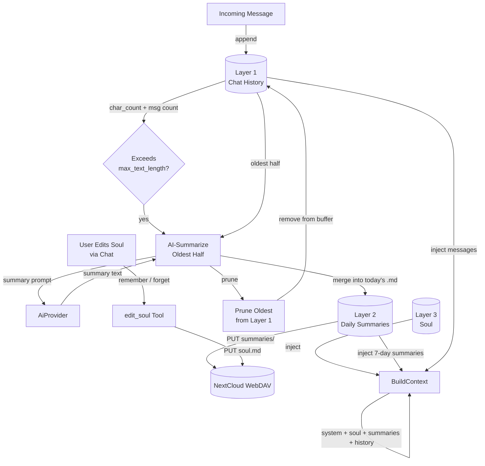
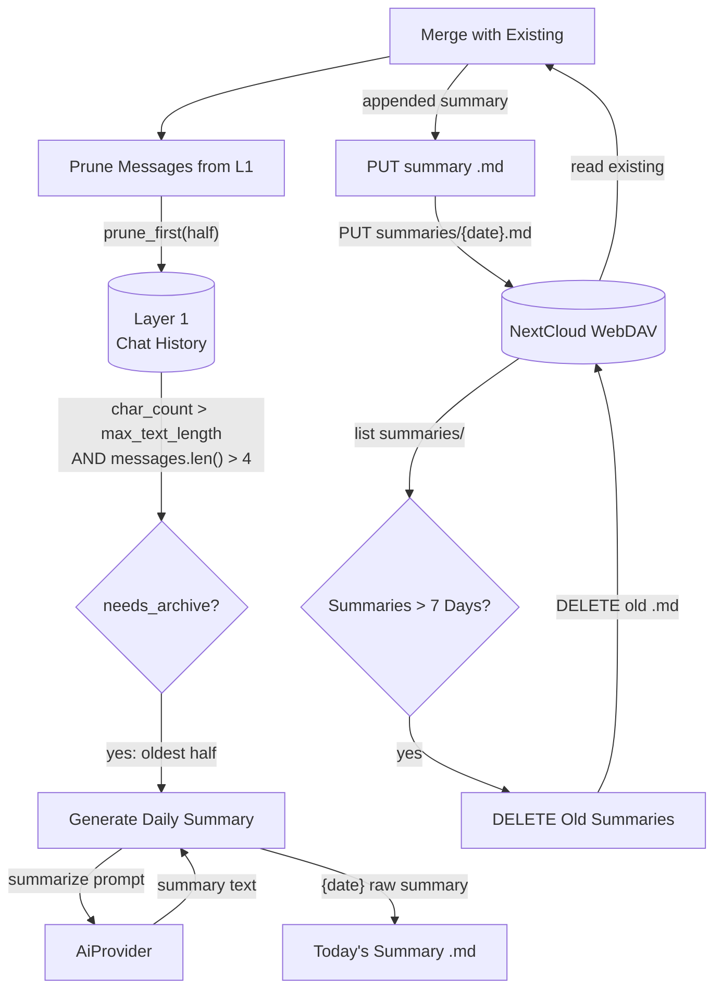
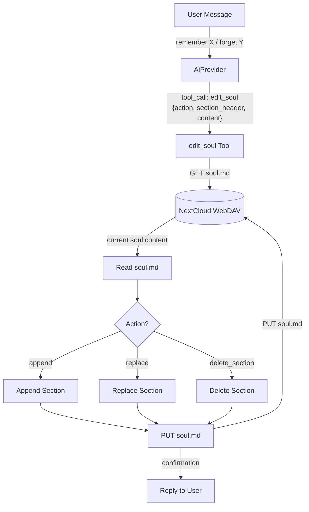
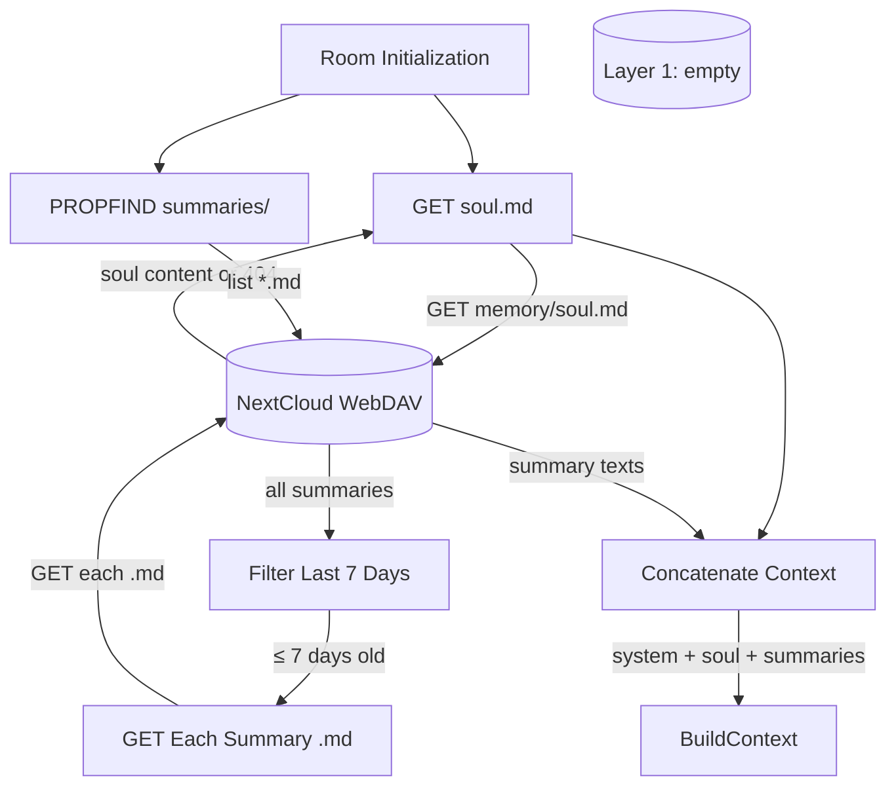
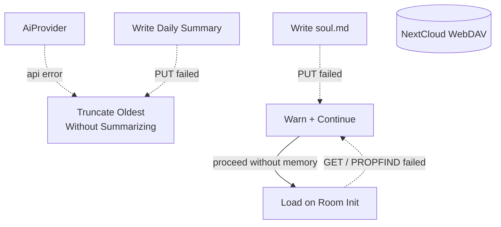
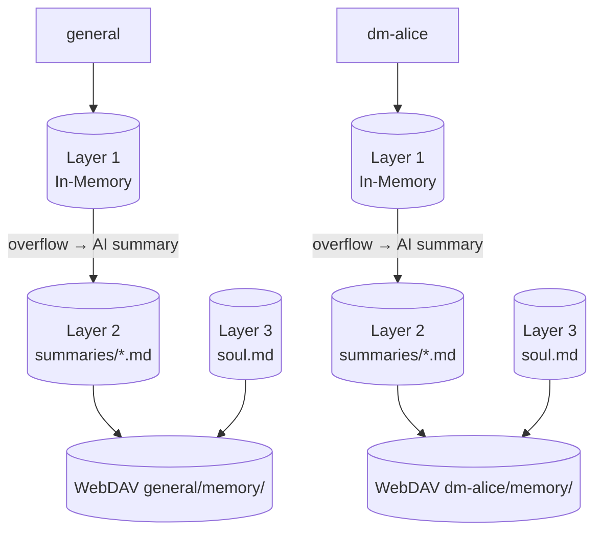

# Memory Management

## 1. Purpose

Three-layer per-room conversation memory, each layer progressively condensed
from the one before. All layers are loaded on room init and injected into the
agent context as system messages.

| Layer | Name | Storage | Limit | Contents |
|-------|------|---------|-------|----------|
| 1 | **Chat History** | In-memory only | `max_text_length` chars, `max_history_messages` msgs | Raw `Vec<ChatMessage>` — the current working window |
| 2 | **Daily Summaries** | WebDAV `.md` files | `max_summary_chars` total, 7-day rolling window | AI-summarized daily digests of overflowed Layer 1 messages |
| 3 | **Soul** | WebDAV `soul.md` file | Unbounded | Persistent core memory editable by user via chat |

**Flow:** Messages accumulate in Layer 1. When Layer 1 exceeds limits, the
oldest half is AI-summarized into today's Layer 2 daily summary. Summaries
older than 7 days are deleted. Layer 3 (soul) is permanent — the user can
add, revise, or remove entries through normal conversation (e.g. "remember
I prefer short answers"). The agent edits soul via the `edit_soul` tool.

- Upstream: [Configuration Management](config.md) provides `ModelConfig`
  (`max_text_length`, `max_history_size`, `max_summary_chars`, `summary_days`)
- Upstream: [Agent Harness](../agent-harness.md) triggers
  `archive_room_if_needed` after each message, `restore_history` on room init,
  and handles `edit_soul` tool calls
- Downstream: WebDAV crate (`WebDavClient`, `WebDavPath`) persists daily
  summaries and `soul.md`
- Downstream: [AI Provider](ai-provider.md) generates daily summaries from
  overflowed chat history
- Downstream: [Knowledge Management](knowledge.md) is a separate system for
  categorized skill/secret/note entries (not part of the three-layer memory)

## 2. Diagram

### 2a. Three-Layer Overview



### 2b. Happy Flow — Layer 1 → Layer 2 Archival



### 2c. Happy Flow — Soul Editing



### 2d. Happy Flow — Restore (Room Init)



### 2e. Error Handling



### 2f. Memory Partitioning

Each room gets isolated three-layer memory under its own WebDAV directory.



## 3. Data Structures

All structs live in `crate-rockbot/src/memory.rs` unless noted.

### `MemoryManager`

| Field                  | Type                         | Notes                                    |
| ---------------------- | ---------------------------- | ---------------------------------------- |
| `rooms`                | `HashMap<String, RoomState>` | Per-room state map                       |
| `max_chars`            | `usize`                      | Layer 1 overflow threshold               |
| `max_history_messages` | `usize`                      | Layer 1 message count limit for context  |
| `max_summary_chars`    | `usize`                      | Layer 2 total chars across loaded summaries |
| `summary_days`         | `u32`                        | Layer 2 retention window (default 7)     |

### `RoomState`

| Field       | Type                  | Notes                      |
| ----------- | --------------------- | -------------------------- |
| `room_id`   | `String`              | RocketChat room/channel id |
| `room_name` | `String`              | Display name               |
| `is_dm`     | `bool`                | Direct message flag        |
| `history`   | `ConversationHistory` | Layer 1: in-memory buffer  |

### `ConversationHistory` (Layer 1)

| Field              | Type               | Notes                                |
| ------------------ | ------------------ | ------------------------------------ |
| `room_id`          | `String`           | Owning room identifier               |
| `messages`         | `Vec<ChatMessage>` | In-memory message buffer             |
| `char_count`       | `usize`            | Running character count              |
| `archive_seq`      | `u64`              | Next archive sequence number         |
| `restored_summary` | `Option<String>`   | Restored context from prior archives |

### `DailySummary` (Layer 2)

A single `.md` file stored at `{root}/{room_id}/memory/summaries/{YYYY-MM-DD}.md`.

| Field     | Type     | Notes                                  |
| --------- | -------- | -------------------------------------- |
| `date`    | `String` | `"YYYY-MM-DD"` — file key             |
| `summary` | `String` | AI-generated digest of that day's chat |
| `msg_count`| `usize` | Number of messages summarized          |
| `char_count`| `usize`| Chars of the summary text             |

### `SoulMemory` (Layer 3)

A single file stored at `{root}/{room_id}/memory/soul.md`.

```rust
struct SoulMemory {
    room_id: String,
    content: String,      // Full markdown content of soul.md
    updated_at: String,   // ISO 8601
}
```

The `content` is plain markdown with optional section headers (`## Preferences`,
`## Identity`, `## Notes`). Sections are separated by `## ` headers for
targeted editing via the `edit_soul` tool.

Example `soul.md`:
```markdown
## Preferences
- The user prefers short, direct answers
- No emojis in responses

## Identity
- The user's name is Saru
- Works on the rockbot project

## Notes
- Driver contact: 555-0123
- Deploy key expires 2026-12-31
```

### `MemoryJson` (legacy archive format)

Kept for backward compatibility with existing archives. Used only for
reading old `{seq:06}_memory.json` files; new archiving writes to Layer 2
daily summaries instead.

| Field        | Type               | Notes                                       |
| ------------ | ------------------ | ------------------------------------------- |
| `schema`     | `String`           | `"rockbot-memory/1"` version marker         |
| `seq`        | `u64`              | Sequence number                             |
| `room_id`    | `String`           | Owning room                                 |
| `summary`    | `String`           | Truncated text preview                      |
| `date_range` | `String`           | `"ISO to ISO"`                              |
| `msg_count`  | `usize`            | Number of messages archived                 |
| `messages`   | `Vec<MessageRef>`  | Message references                          |
| `created_at` | `String`           | Archive creation timestamp                  |

### File Layout

```
{root}/{room_id}/memory/
├── soul.md                    # Layer 3: permanent core memory
├── summaries/                 # Layer 2: daily AI summaries
│   ├── 2026-06-08.md
│   ├── 2026-06-09.md
│   └── 2026-06-10.md
└── 000001_memory.json         # Legacy (pre-Layer-2 archives)
```

## 4. Configuration

New fields added to `ModelConfig` in [Configuration Management](config.md):

| Field               | Type    | Default | Notes                                     |
| ------------------- | ------- | ------- | ----------------------------------------- |
| `max_text_length`   | `usize` | 50000   | Layer 1 overflow threshold (chars)        |
| `max_history_size`  | `usize` | 12      | Layer 1 max messages in context           |
| `max_summary_chars` | `usize` | 8000    | Layer 2 total chars across loaded summaries|
| `summary_days`      | `u32`   | 7       | Layer 2 retention window (days)           |

Example TOML:
```toml
[rocketchat.model]
default_provider = "openrouter"
default_model = "chat"
max_text_length = 50000
max_history_size = 12
max_summary_chars = 8000
summary_days = 7
```

## 5. Integration with Agent Harness

### Tool: `edit_soul`

Used by the AI provider to modify Layer 3 (soul.md). Registered in `ToolRegistry`.

| Parameter       | Type     | Description                                    |
| --------------- | -------- | ---------------------------------------------- |
| `action`        | `string` | `"append"`, `"replace"`, or `"delete_section"` |
| `section_header`| `string` | Target `## Section` header (e.g. `Preferences`)|
| `content`       | `string` | New content (for append/replace)               |

### Context Injection Order

`MemoryManager::build_context()` assembles messages in this order:

```
1. system_prompt        (bot personality)
2. soul.md content      (Layer 3 — permanent core memory)
3. daily summaries      (Layer 2 — last 7 days, newest first)
4. chat history         (Layer 1 — last N messages)
```

### Archival Lifecycle (harness.rs)

| Step               | Harness method                     | Notes                                      |
| ------------------ | ---------------------------------- | ------------------------------------------ |
| Trigger check      | `archive_room_if_needed()`         | Called after every incoming message        |
| Needs check        | `MemoryManager::check_and_archive()` | Returns oldest half if Layer 1 overflowed |
| AI summarize       | `summarize_for_archive()`          | Calls AI provider with oldest messages     |
| Merge daily        | `upsert_daily_summary()`           | Reads today's `.md`, appends summary, writes back |
| Prune Layer 1      | `MemoryManager::prune_archived()`  | Removes archived messages from buffer      |
| Age out summaries  | `delete_old_summaries()`           | Deletes `.md` files older than `summary_days` days |
| Restore (room init)| `restore_history()`                | Loads soul.md + last 7 days of summaries   |
| Context injection  | `MemoryManager::build_context()`   | Prepend soul + summaries before history    |
