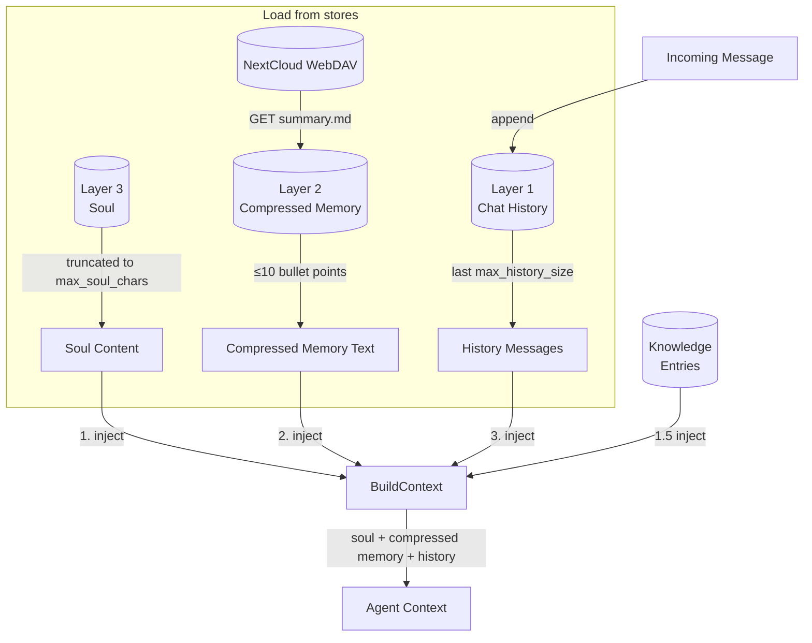
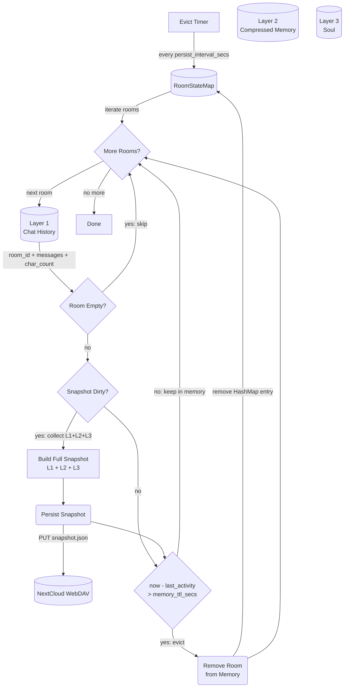
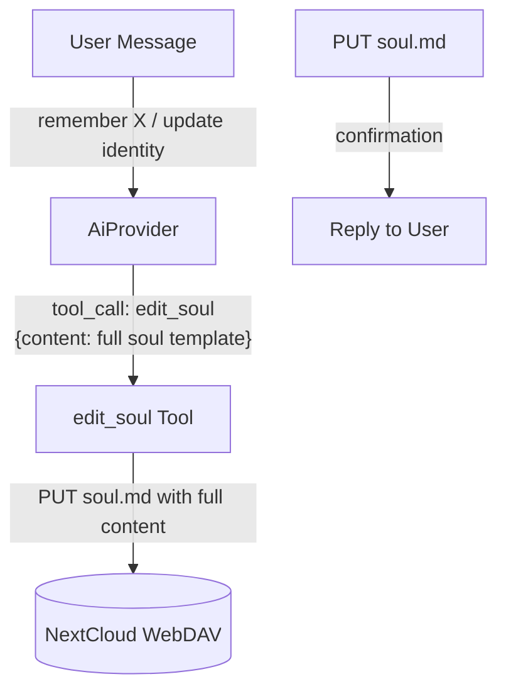
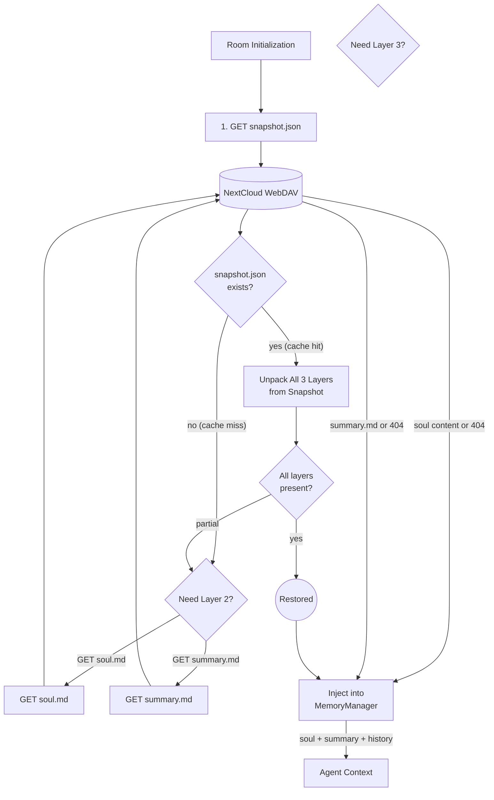
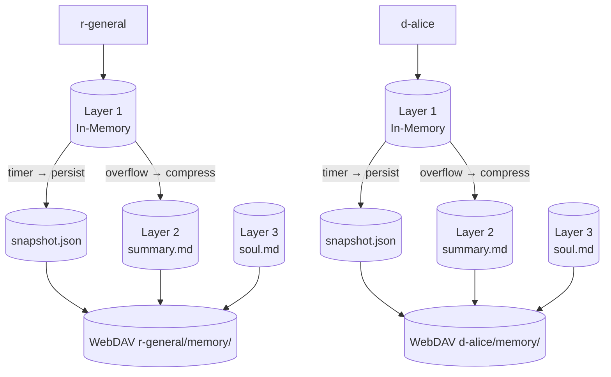

# Memory Management

## 1. Purpose

Three-layer per-room conversation memory. Rooms stay in memory while actively
communicating and are evicted after a configurable idle TTL — the snapshot is
persisted to WebDAV before eviction, then restored on next interaction.

All layers are loaded on room init and injected into the agent context as
system messages. On restore, a single cached `snapshot.json` is read first
(containing all three layers). Individual files (`soul.md`, `summary.md`)
serve as the source of truth — the snapshot is a performance cache, rebuilt
incrementally whenever any layer changes. If the snapshot is missing or stale,
the system falls back to reading individual files.

| Layer | Name | Storage | Limit | Contents |
|-------|------|---------|-------|----------|
| 1 | **Chat History** | In-memory only | `max_text_length` chars, `max_history_messages` msgs | Raw `Vec<ChatMessage>` — the current working window |
| 2 | **Compressed Memory** | WebDAV `summary.md` | ≤10 bullet points | AI-compressed key facts distilled from overflowed Layer 1 messages. See [Memory Compression](memory-compression.md) for full compression pipeline. |
| 3 | **Soul** | WebDAV `soul.md` file | `max_soul_chars` chars | Persistent core memory editable by user via chat |

Compression moves overflowed Layer 1 messages into Layer 2. The full
compression pipeline — including triggers (char count, byte limit, token
near-limit), LLM prompt structure, knowledge entry identification, and the
three-trigger decision flow — is documented in
[Memory Compression](memory-compression.md).

- Upstream: [Configuration Management](config.md) provides `ModelConfig`
  (`max_text_length`, `max_history_size`, `max_soul_chars`,
  `memory_ttl_secs`, `persist_interval_secs`, `max_context_bytes`,
  `model_context_length`)
- Upstream: [Agent Harness](../agent-harness.md) triggers
  `compress_room_if_needed` after each message, `persist_room_snapshots` on a
  periodic timer, `restore_history` on room init, and handles `edit_soul` tool
  calls
- Downstream: [Memory Compression](memory-compression.md) — full compression
  pipeline (triggers, LLM prompt, parse, write, knowledge review)
- Downstream: WebDAV crate (`WebDavClient`, `WebDavPath`) persists
  `summary.md`, snapshots, and `soul.md`
- Downstream: [AI Provider](ai-provider.md) executes compression prompts
- Downstream: [Knowledge Management](knowledge.md) — separate system for
  categorized skill/secret/note entries (not part of the three-layer memory)

## 2. Diagram

### 2a. Happy Flow — Retrieve from Three Layers

On each interaction, data from all three layers is retrieved (with
configurable limits) and injected into the agent context. Write flows
(compression, persist, soul edit) are shown in separate sub-diagrams.



Layer 1 is populated by incoming messages. Layer 2 is populated by the
[Compression Flow](#2b-compression-flow--layer-1--layer-2-overflow). Layer 3 is
populated by the [Soul Editing](#2d-happy-flow--soul-editing) tool. The
[Persist & Evict Flow](#2c-persist--evict-flow--timer) provides crash recovery
for Layer 1 and TTL-based room eviction.

### 2b. Compression Flow — Layer 1 → Layer 2 (Overflow)

Full compression pipeline (triggers, LLM prompt, parse, write, knowledge review)
is documented in [Memory Compression](memory-compression.md).

### 2c. Persist & Evict Flow — Timer

A single periodic timer handles both crash-recovery snapshot persistence and
TTL-based eviction. The snapshot caches all three layers (chat history,
compressed memory, soul) for single-read restore. After persisting, rooms idle
longer than `memory_ttl_secs` are saved and removed from the in-memory map.

When any layer changes (soul edit, summary write, compression), the snapshot is
marked dirty and rebuilt on the next timer tick — writes are coalesced to
avoid thrashing WebDAV.



### 2d. Happy Flow — Soul Editing



### 2e. Restore Flow — Cache-First (Room Init)

Snapshot is read first as a single WebDAV call. If present and fresh, all three
layers are restored from it. If the snapshot is missing (never written, deleted,
or from an older schema version), the system falls back to reading individual
files.



Knowledge entries are also restored during room init — see [Knowledge Management](knowledge.md).

Key properties:
- **Single read on cache hit**: one `GET snapshot.json` replaces 3 WebDAV round trips
- **Graceful degradation**: if snapshot is missing or partial, falls back to individual file reads
- **No snapshot blocking**: if snapshot write fails, the system continues operating — next timer tick retries

### 2f. Error Handling


### 2g. Memory Partitioning

Each room gets isolated three-layer memory under its own WebDAV directory.



## 3. Data Structures

All structs live in `crate-rockbot/src/memory.rs` unless noted.

### `PersistSnapshot` (WebDAV checkpoint / cache)

A single JSON file stored at `{root}/{webdav_dir}/memory/snapshot.json`.
One file per room. Caches all three layers for single-read restore.

| Field              | Type                    | Notes                                                  |
| ------------------ | ----------------------- | ------------------------------------------------------ |
| `schema`           | `NonEmptyString`        | `"rockbot-snapshot/1"` version marker (validated at JSON boundary) |
| `room_id`          | `NonEmptyString`        | RocketChat room UUID                                   |
| `messages`         | `Vec<ChatMessage>`      | Raw Layer 1 messages (in-memory buffer)                |
| `char_count`       | `usize`                 | Running Layer 1 character count                        |
| `archive_seq`      | `u64`                   | Compression sequence number (monotonic, for staleness checks) |
| `soul`             | `Option<String>`        | Layer 3: full soul.md content (None if no soul)       |
| `summary`          | `Option<String>`        | Layer 2: compressed summary.md content (None if no summary) |
| `updated_at`       | `String`                | ISO 8601 timestamp of last write                       |

Rebuilt whenever any layer is modified (soul edit, compression write).
Written on the periodic persist timer (coalesced — not on every individual
change). Source of truth for each layer remains its dedicated file
(`soul.md`, `summary.md`).

### `MemoryManager`

| Field                  | Type                         | Notes                                    |
| ---------------------- | ---------------------------- | ---------------------------------------- |
| `rooms`                | `HashMap<String, RoomState>` | Per-room state map                       |
| `max_chars`            | `usize`                      | Compression threshold (max_text_length)  |
| `max_history_messages` | `usize`                      | Layer 1 message count limit for context  |
| `max_soul_chars`       | `usize`                      | Layer 3 max chars for soul.md content    |
| `summaries`            | `HashMap<String, Option<String>>` | Layer 2 in-memory cache: room_id → summary.md content |
| `souls`                | `HashMap<String, SoulMemory>`| Layer 3 in-memory cache                  |
| `dirty_snapshots`      | `HashSet<String>`            | Room IDs needing snapshot rebuild        |
| `knowledge`            | `HashMap<String, String>`    | Pre-formatted knowledge system messages per room |
| `persist_interval_secs`| `u64`                        | Timer interval for writing snapshots (default 60) |
| `max_context_bytes`    | `usize`                      | Byte limit that triggers proactive compression and image-stripping (default 4MB ≈ 1M tokens). Matches typical model context limits to prevent token overflow before the provider rejects the request. |
| `summary_count`       | `HashMap<String, u32>`       | Per-room count of compression cycles (for rate-limiting) |

### `RoomState`

| Field           | Type                  | Notes                                         |
| --------------- | --------------------- | --------------------------------------------- |
| `room_id`       | `String`              | RocketChat room UUID                          |
| `room_name`     | `String`              | URL slug (ASCII)                              |
| `room_fname`    | `String`              | Friendly display name (Unicode); used for WebDAV directory naming when non-empty |
| `is_dm`         | `bool`                | Direct message flag                           |
| `history`       | `ConversationHistory` | Layer 1: in-memory buffer                     |
| `last_activity` | `u64`                 | Unix timestamp of last interaction; checked against `memory_ttl_secs` for eviction |

### `ConversationHistory` (Layer 1)

| Field              | Type               | Notes                                |
| ------------------ | ------------------ | ------------------------------------ |
| `room_id`          | `String`           | Owning room identifier               |
| `messages`         | `Vec<ChatMessage>` | In-memory message buffer             |
| `char_count`       | `usize`            | Running character count              |
| `archive_seq`      | `u64`              | Compression sequence number          |

### `CompressedMemory` (Layer 2)

A single file stored at `{root}/{webdav_dir}/memory/summary.md`.

```rust
struct CompressedMemory {
    room_id: NonEmptyString,
    content: String,        // Markdown bullet list, ≤10 items
    archive_seq: u64,       // Captures which compression cycle produced this
    updated_at: String,     // ISO 8601
}
```

The `content` is a flat bullet list — each line starts with `- `. The
first line is a header (`# Memory Summary`), followed by at most 10 bullet
points. The LLM is instructed to produce this format directly.

Example:
```markdown
# Memory Summary

- User prefers short, direct answers without explanations
- Project X uses Rust with async-tokio runtime
- Database credentials are stored in 1Password, not in code
- The deployment target is x86_64-unknown-linux-musl
- User dislikes Python type hints
```

### `SoulMemory` (Layer 3)

A single file stored at `{root}/{webdav_dir}/memory/soul.md`.

```rust
struct SoulMemory {
    room_id: NonEmptyString,
    content: String,      // Full markdown content of soul.md
    updated_at: String,   // ISO 8601
}
```

The `content` is a flat enumeration list — each line is a `-` bullet item.
The first item always starts with `My name is ...`, used for display name
extraction via regex `My name is (.+)`. The `edit_soul` tool overwrites the
entire file.

### File Layout

Memory is stored per-room under the prefixed `webdav_dir` key (see
[rocketchat.md](rocketchat.md) for naming conventions — `r-` for channels,
`d-` for DMs, preferring `room_fname` over `room_name`).

```
{root}/{webdav_dir}/memory/
├── snapshot.json               # Timer-based crash-recovery checkpoint
├── soul.md                     # Layer 3: permanent core memory
├── summary.md                  # Layer 2: AI-compressed memory (≤10 bullet points)
```

## 4. Configuration

Fields from `ModelConfig` in [Configuration Management](config.md):

| Field                  | Type    | Default | Notes                                              |
| ---------------------- | ------- | ------- | -------------------------------------------------- |
| `max_text_length`      | `usize` | 50000   | Compression threshold — triggers Layer 1 → Layer 2 when char_count exceeds this |
| `max_history_size`     | `usize` | 18      | Layer 1 max messages in context                    |
| `max_soul_chars`       | `usize` | 2000    | Layer 3 max chars for soul.md content              |
| `memory_ttl_secs`      | `u64`   | 300     | Room idle timeout — evict from memory (after snapshot persisted) |
| `persist_interval_secs`| `u64`   | 60      | How often the timer writes dirty snapshots to WebDAV |
| `max_context_bytes`    | `usize` | 4_000_000 | Max byte size for context (triggers inline summarization + flags for compression) |
| `model_context_length` | `u32`   | 1_000_000 | Model's max context tokens; 90% threshold triggers post-LLM compression |

Note: removed `max_summary_chars` and `summary_days` — no longer needed since
Layer 2 is a single `summary.md` capped at 10 bullet points by LLM instruction.

## 5. Integration with Agent Harness

### Triggers

| Trigger             | Method                        | Frequency                      | Condition                                                    | Action                                        |
| ------------------- | ----------------------------- | ------------------------------ | ------------------------------------------------------------ | --------------------------------------------- |
| **Timer persist**   | `maintenance_tick()` (Phase 1) | Every `persist_interval_secs`  | `dirty_snapshots` is non-empty                               | Build full snapshot (L1+L2+L3), PUT `snapshot.json`, clear dirty flag |
| **Timer evict**     | `maintenance_tick()` (Phase 2) | Every `persist_interval_secs`  | Room has ≥ 1 message AND `last_activity > 0` AND `now - last_activity > memory_ttl_secs` | Persist snapshot if dirty, then remove room from `HashMap` |
| **Compression**     | `compress_room_if_needed()`    | After reply delivered (background)  | Checks all three flags (char overflow, token pressure, byte pressure) | See [Memory Compression](memory-compression.md) |
| **Safety net**      | `trim_context()`               | Before each LLM call           | `context_bytes > max_context_bytes`                              | Inline trim only; sets byte_pressure_flag. See [Memory Compression](memory-compression.md §2d) |
| **Room init**       | `restore_history()`            | Once per room, on first message| Room not in memory (fresh or evicted)                        | Load snapshot (cache-first), fall back to individual files |
| **Soul edit**       | `edit_soul()` tool             | On user request                | LLM invokes `edit_soul` tool                                 | Write `soul.md`, update in-memory soul, mark snapshot dirty |
| **Touch activity**  | `process_message()`            | On every incoming message      | Room exists in memory                                        | Update `last_activity` timestamp to prevent eviction |

### Tool: `edit_soul`

| Parameter       | Type     | Description                                    |
| --------------- | -------- | ---------------------------------------------- |
| `content`       | `string` | Full soul.md content using the standard template (`# Soul Memory\n\n- My name is Name ✨\n- ...\n- ...`) |

### Context Injection Order

On room init, data is retrieved from WebDAV and injected into the agent
context in this order:

```
1. soul.md content      (Layer 3 — truncated to max_soul_chars)
2. summary.md content   (Layer 2 — ≤10 bullet points)
3. chat history         (Layer 1 — last max_history_size messages)
```

Knowledge entries are injected between soul and summary (see
[Knowledge Management](knowledge.md)).

### Compression Lifecycle

See [Memory Compression](memory-compression.md) for the full compression
pipeline — triggers, LLM prompt structure, knowledge entry identification,
and the three-trigger decision flow (char overflow, byte overflow, token
near-limit).

| Step               | Harness method                     | Notes                                              |
| ------------------ | ---------------------------------- | -------------------------------------------------- |
| Timer persist      | `maintenance_tick()` (Phase 1)     | Called every `persist_interval_secs`; writes dirty snapshot.json |
| Timer evict        | `maintenance_tick()` (Phase 2)     | Called every `persist_interval_secs`; persists snapshot then removes stale rooms |
| Room init          | `restore_history()`                | Cache-first: reads snapshot.json, falls back to individual files |
| Soul edit          | `edit_soul()` tool                 | Writes soul.md, updates in-memory, marks snapshot dirty |
| Touch activity     | `process_message()`                | Updates `last_activity` on every incoming message   |
| Context injection  | `MemoryManager::build_context()`   | Prepend soul + summary + history                    |
