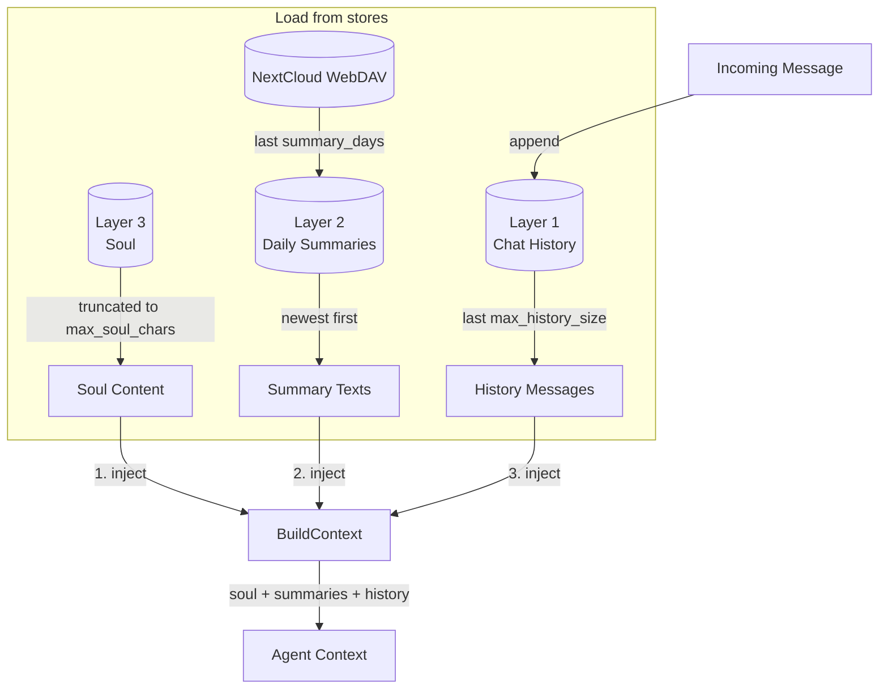
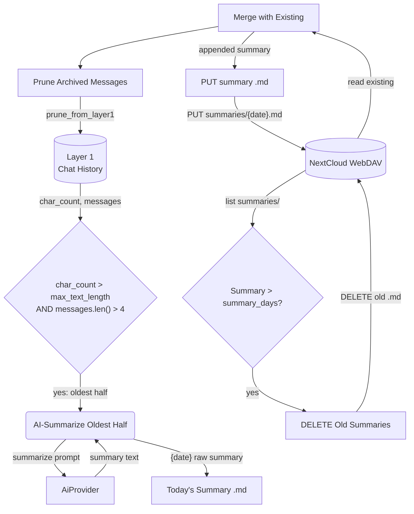
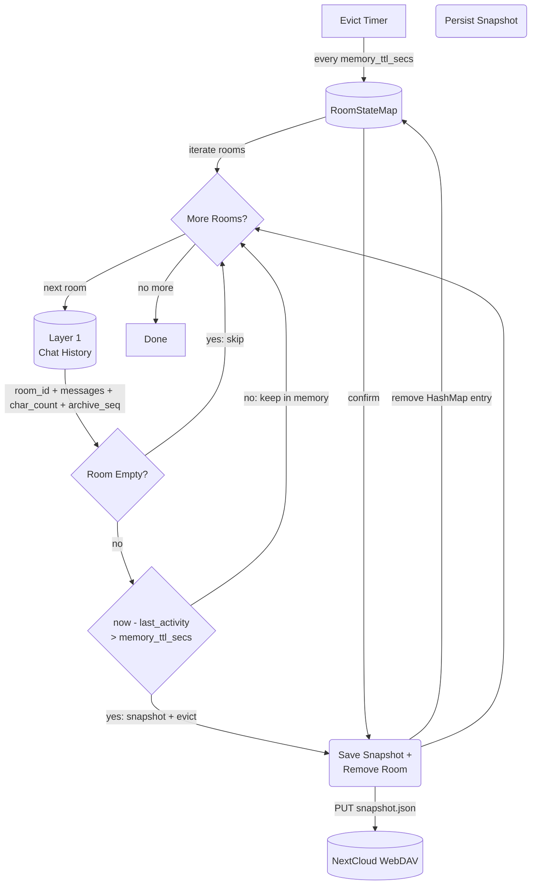
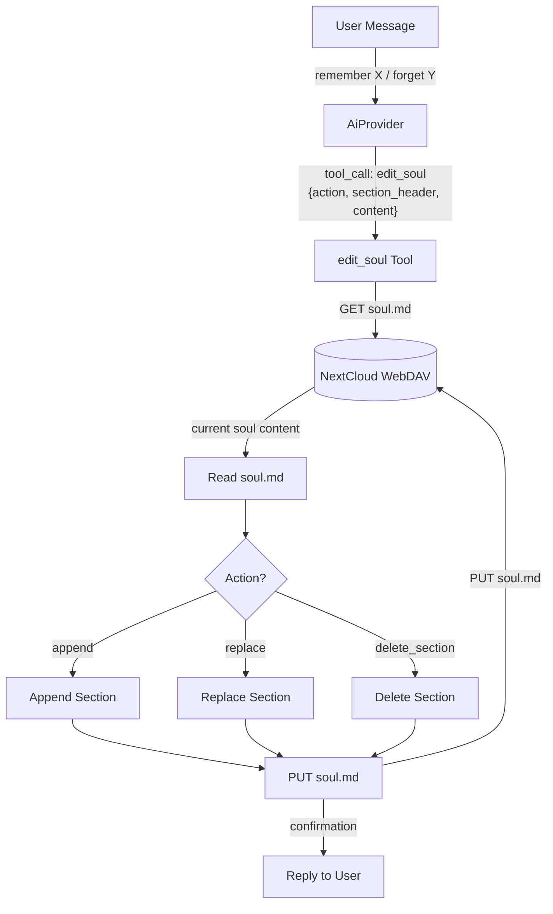
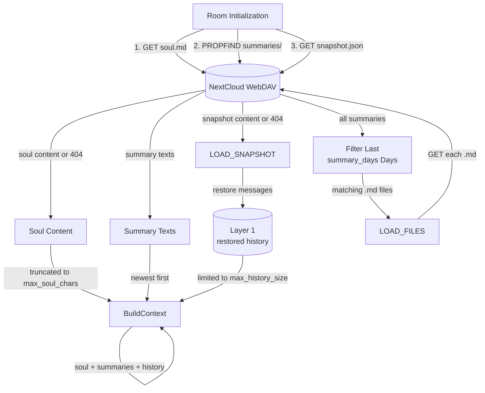
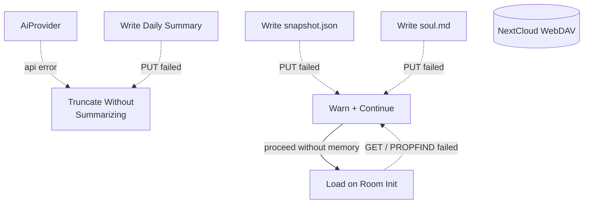
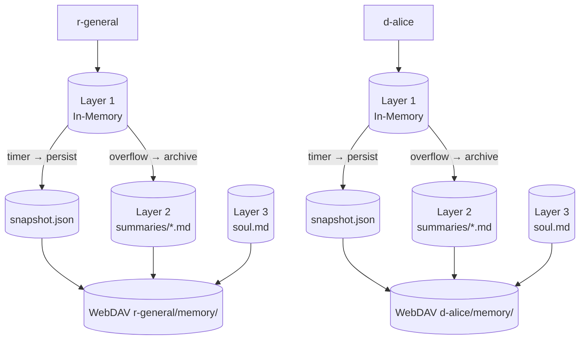

# Memory Management

## 1. Purpose

Three-layer per-room conversation memory, each layer progressively condensed
from the one before. Rooms stay in memory while actively communicating and are
evicted after a configurable idle TTL — the snapshot is persisted to WebDAV
before eviction, then restored on next interaction.

All layers are loaded on room init and injected into the agent context as
system messages.

| Layer | Name | Storage | Limit | Contents |
|-------|------|---------|-------|----------|
| 1 | **Chat History** | In-memory only | `max_text_length` chars, `max_history_messages` msgs | Raw `Vec<ChatMessage>` — the current working window |
| 2 | **Daily Summaries** | WebDAV `.md` files | `max_summary_chars` total, 7-day rolling window | AI-summarized daily digests of overflowed Layer 1 messages |
| 3 | **Soul** | WebDAV `soul.md` file | `max_soul_chars` chars | Persistent core memory editable by user via chat |

Archive is a single flow: messages accumulate in Layer 1. When Layer 1 exceeds
`max_text_length` chars, the oldest half is AI-summarized into today's Layer 2
daily summary. Summaries older than `summary_days` (default 7 days) are
deleted. The archived messages are pruned from Layer 1. The raw conversation
state is also periodically saved to WebDAV as a crash-recovery checkpoint.

Layer 3 (soul) is permanent — the user can add, revise, or remove entries
through normal conversation (e.g. "remember I prefer short answers"). The agent
edits soul via the `edit_soul` tool.

- Upstream: [Configuration Management](config.md) provides `ModelConfig`
  (`max_text_length`, `max_history_size`, `max_summary_chars`, `max_soul_chars`,
  `summary_days`)
- Upstream: [Agent Harness](../agent-harness.md) triggers
  `archive_room_if_needed` after each message, `persist_room_snapshots` on a
  periodic timer, `restore_history` on room init, and handles `edit_soul` tool
  calls
- Downstream: WebDAV crate (`WebDavClient`, `WebDavPath`) persists daily
  summaries, snapshots, and `soul.md`
- Downstream: [AI Provider](ai-provider.md) generates daily summaries from
  overflowed chat history
- Downstream: [Knowledge Management](knowledge.md) is a separate system for
  categorized skill/secret/note entries (not part of the three-layer memory)

## 2. Diagram

### 2a. Happy Flow — Retrieve from Three Layers

On each interaction, data from all three layers is retrieved (with
configurable limits) and injected into the agent context. Write flows
(archive, persist, soul edit) are shown in separate sub-diagrams.



Layer 1 is populated by incoming messages. Layer 2 is populated by the
[Archive Flow](#2b-archive-flow--layer-1--layer-2-threshold). Layer 3 is
populated by the [Soul Editing](#2d-happy-flow--soul-editing) tool. The
[Persist & Evict Flow](#2c-persist--evict-flow--timer) provides crash recovery
for Layer 1 and TTL-based room eviction.

### 2b. Archive Flow — Layer 1 → Layer 2 (Threshold)



### 2c. Persist & Evict Flow — Timer

A single periodic timer handles both crash-recovery snapshot persistence and
TTL-based eviction. After persisting, rooms idle longer than `memory_ttl_secs`
are saved and removed from the in-memory map.



### 2d. Happy Flow — Soul Editing



### 2e. Happy Flow — Restore (Room Init)

Three retrieval steps in order, each with a configurable limit:



### 2f. Error Handling



### 2g. Memory Partitioning

Each room gets isolated three-layer memory under its own WebDAV directory.



## 3. Data Structures

All structs live in `crate-rockbot/src/memory.rs` unless noted.

### `PersistSnapshot` (WebDAV checkpoint)

Saved every `persist_interval_secs` at
`{root}/{webdav_dir}/memory/snapshot.json`. One file per room.

| Field         | Type               | Notes                                      |
| ------------- | ------------------ | ------------------------------------------ |
| `room_id`     | `String`           | RocketChat room UUID                       |
| `messages`    | `Vec<ChatMessage>` | Raw Layer 1 messages                      |
| `char_count`  | `usize`            | Running character count                    |
| `archive_seq` | `u64`              | Next archive sequence number               |
| `updated_at`  | `String`           | ISO 8601 timestamp of last write           |

### `MemoryManager`

| Field                  | Type                         | Notes                                    |
| ---------------------- | ---------------------------- | ---------------------------------------- |
| `rooms`                | `HashMap<String, RoomState>` | Per-room state map                       |
| `max_chars`            | `usize`                      | Archive threshold (max_text_length)      |
| `max_history_messages` | `usize`                      | Layer 1 message count limit for context  |
| `max_summary_chars`    | `usize`                      | Layer 2 total chars across loaded summaries |
| `summary_days`         | `u32`                        | Layer 2 retention window (default 7)     |
| `memory_ttl_secs`      | `u64`                        | Idle timeout before eviction (default 300) |

### `RoomState`

| Field           | Type                  | Notes                                         |
| --------------- | --------------------- | --------------------------------------------- |
| `room_id`       | `String`              | RocketChat room UUID                          |
| `room_name`     | `String`              | URL slug (ASCII)                              |
| `room_fname`    | `String`              | Friendly display name (Unicode); used for WebDAV directory naming when non-empty |
| `is_dm`         | `bool`                | Direct message flag                           |
| `history`       | `ConversationHistory` | Layer 1: in-memory buffer                     |
| `last_activity` | `u64`                 | Unix timestamp of last interaction; checked against `memory_ttl_secs` for eviction |

### `ConversationHistory` (Layer 1)

| Field              | Type               | Notes                                |
| ------------------ | ------------------ | ------------------------------------ |
| `room_id`          | `String`           | Owning room identifier               |
| `messages`         | `Vec<ChatMessage>` | In-memory message buffer             |
| `char_count`       | `usize`            | Running character count              |
| `archive_seq`      | `u64`              | Next archive sequence number         |
| `restored_summary` | `Option<String>`   | Restored context from prior archives |

### `DailySummary` (Layer 2)

A single `.md` file stored at `{root}/{webdav_dir}/memory/summaries/{YYYY-MM-DD}.md`.

| Field      | Type     | Notes                                  |
| ---------- | -------- | -------------------------------------- |
| `date`     | `String` | `"YYYY-MM-DD"` — file key             |
| `summary`  | `String` | AI-generated digest of that day's chat |
| `msg_count`| `usize`  | Number of messages summarized          |
| `char_count`| `usize` | Chars of the summary text             |

### `SoulMemory` (Layer 3)

A single file stored at `{root}/{webdav_dir}/memory/soul.md`.

```rust
struct SoulMemory {
    room_id: String,
    content: String,      // Full markdown content of soul.md
    updated_at: String,   // ISO 8601
}
```

The `content` is plain markdown with optional section headers (`## Preferences`,
`## Identity`, `## Notes`). Sections are separated by `## ` headers for
targeted editing via the `edit_soul` tool.

### `MemoryJson` (legacy archive format)

Kept for backward compatibility. Read only — no longer written.

| Field        | Type               | Notes                                       |
| ------------ | ------------------ | ------------------------------------------- |
| `schema`     | `String`           | `"rockbot-memory/1"` version marker         |
| `seq`        | `u64`              | Sequence number                             |
| `room_id`    | `String`           | Owning room                                 |
| `summary`    | `String`           | Truncated text preview                      |
| `date_range` | `String`           | `"ISO to ISO"`                              |
| `msg_count`  | `usize`            | Number of messages archived                 |
| `messages`   | `Vec<MessageRef>`  | Message references                          |
| `created_at` | `String`           | Archive creation timestamp                  |

### File Layout

Memory is stored per-room under the prefixed `webdav_dir` key (see
[rocketchat.md](rocketchat.md) for naming conventions — `r-` for channels,
`d-` for DMs, preferring `room_fname` over `room_name`).

```
{root}/{webdav_dir}/memory/
├── snapshot.json               # Timer-based crash-recovery checkpoint
├── soul.md                     # Layer 3: permanent core memory
├── summaries/                  # Layer 2: daily AI summaries
│   ├── 2026-06-08.md
│   ├── 2026-06-09.md
│   └── 2026-06-10.md
└── 000001_memory.json          # Legacy (pre-Layer-2 archives)
```

## 4. Configuration

Fields from `ModelConfig` in [Configuration Management](config.md):

| Field                  | Type    | Default | Notes                                              |
| ---------------------- | ------- | ------- | -------------------------------------------------- |
| `max_text_length`      | `usize` | 50000   | Archive threshold — triggers Layer 1 → Layer 2     |
| `max_history_size`     | `usize` | 12      | Layer 1 max messages in context                    |
| `max_summary_chars`    | `usize` | 8000    | Layer 2 total chars across loaded summaries         |
| `max_soul_chars`       | `usize` | 2000    | Layer 3 max chars for soul.md content              |
| `summary_days`         | `u32`   | 7       | Layer 2 retention window (days)                    |
| `memory_ttl_secs`      | `u64`   | 300     | Room idle timeout — snapshot to WebDAV then evict from memory |

## 5. Integration with Agent Harness

### Triggers

| Trigger             | Method                        | Frequency                      | Condition                                                    | Action                                        |
| ------------------- | ----------------------------- | ------------------------------ | ------------------------------------------------------------ | --------------------------------------------- |
| **Timer evict**     | `evict_stale_rooms()`         | Every `memory_ttl_secs`        | Room has ≥ 1 message AND `now - last_activity > memory_ttl_secs` | Write `snapshot.json` to WebDAV, remove room from `HashMap` |
| **Archive**         | `archive_room_if_needed()`    | After every message response   | `char_count > max_text_length` AND `messages.len() > 4`      | AI-summarize oldest half → daily `.md`, prune L1 |
| **Room init**       | `restore_history()`           | Once per room, on first message| Room not in memory (fresh or evicted)                        | Load snapshot + soul + summaries             |
| **Touch activity**  | `update_last_activity()`      | On every incoming message      | Room exists in memory                                        | Update `last_activity` timestamp to prevent eviction |

### Tool: `edit_soul`

| Parameter       | Type     | Description                                    |
| --------------- | -------- | ---------------------------------------------- |
| `action`        | `string` | `"append"`, `"replace"`, or `"delete_section"` |
| `section_header`| `string` | Target `## Section` header                     |
| `content`       | `string` | New content (for append/replace)               |

### Context Injection Order

On room init, data is retrieved from WebDAV and injected into the agent
context in this order:

```
1. soul.md content      (Layer 3 — truncated to max_soul_chars)
2. daily summaries      (Layer 2 — last summary_days, newest first)
3. chat history         (Layer 1 — last max_history_size messages)
```

Knowledge entries are injected between soul and summaries (see
[Knowledge Management](knowledge.md)). Legacy `MemoryJson` context is
restored into the chat history buffer before injection.

### Archival Lifecycle (harness.rs)

| Step               | Harness method                     | Notes                                              |
| ------------------ | ---------------------------------- | -------------------------------------------------- |
| Timer evict        | `evict_stale_rooms()`              | Called every `memory_ttl_secs`; saves snapshot + removes stale rooms |
| Archive check      | `memory.check_and_archive()`       | Returns oldest half if Layer 1 overflowed           |
| AI summarize       | `summarize_for_archive()`          | Calls AI provider with oldest messages              |
| Merge daily        | `upsert_daily_summary()`           | Reads today's `.md`, appends, writes back           |
| Prune Layer 1      | `memory.prune_archived()`          | Removes archived messages from buffer               |
| Age out summaries  | `delete_old_summaries()`           | Deletes `.md` older than `summary_days`             |
| Room init          | `restore_history()`                | Loads snapshot + soul + summaries                   |
| Touch activity     | `process_message()`                | Updates `last_activity` on every incoming message   |
| Context injection  | `MemoryManager::build_context()`   | Prepend soul + summaries before history             |
