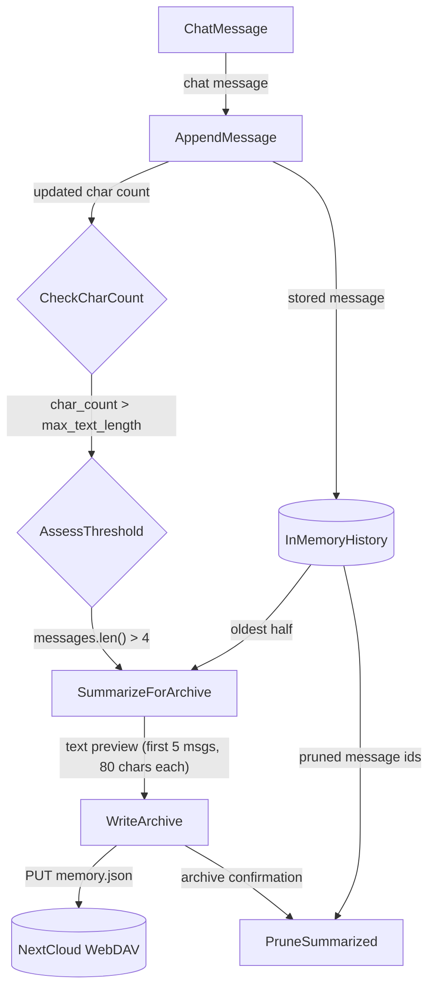
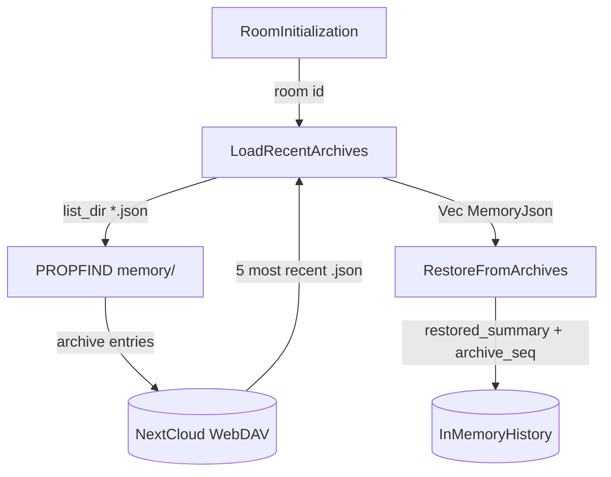
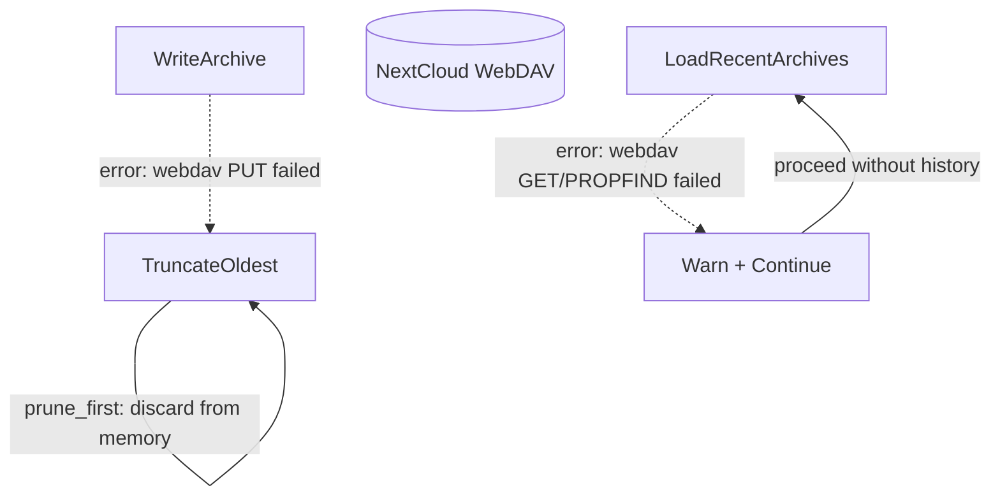
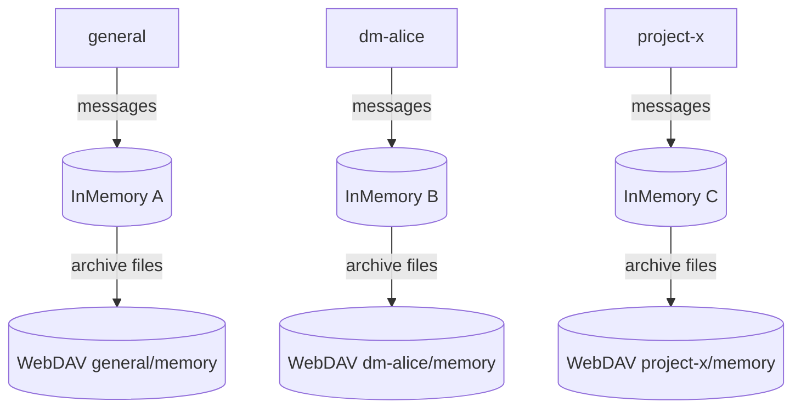

# Memory Management

## 1. Purpose

Per-room conversation memory store with character-count threshold monitoring.
When the local in-memory history exceeds `max_text_length` chars (and has more
than 4 messages), the oldest half of messages is truncated into a text
preview, serialized as a JSON archive, and PUT directly to WebDAV at
`{root}/{room_id}/memory/{seq:06}_memory.json`. On room initialization,
the 5 most recent archives are downloaded from WebDAV and a `restored_summary`
is injected into the system prompt for context continuity.

Archives are written **synchronously** to WebDAV — there is no write-back
cache layer. The harness orchestrates the full archive lifecycle: check →
summarize → serialize → PUT → prune.

- Upstream: [Configuration Management](config.md) provides `ModelConfig`
  (`max_text_length`, `max_history_size`)
- Upstream: [Agent Harness](../agent-harness.md) triggers `archive_room_if_needed`
  after each message and `restore_history` on first message in a room
- Downstream: WebDAV crate (`WebDavClient`, `WebDavPath`) provides synchronous
  PUT/GET/PROPFIND for archive persistence
- Downstream: [AI Provider](ai-provider.md) provides the `AiProvider` trait
  (used in the agent loop; *not* called for archive summarization)

## 2. Diagram

### 2a. Happy Flow — Archive



### 2b. Happy Flow — Restore



### 2c. Error Handling



### 2d. Memory Partitioning

Each room (channel or DM) gets an isolated partition with its own
in-memory history and WebDAV archive directory.



## 3. Data Structures

All structs live in `crate-rockbot/src/memory.rs` unless noted.

### `MemoryManager`

| Field                  | Type                         | Notes                              |
| ---------------------- | ---------------------------- | ---------------------------------- |
| `rooms`                | `HashMap<String, RoomState>` | Per-room state map                 |
| `max_chars`            | `usize`                      | From `ModelConfig.max_text_length` |
| `max_history_messages` | `usize`                      | From `ModelConfig.max_history_size`|

### `RoomState`

| Field       | Type                  | Notes                      |
| ----------- | --------------------- | -------------------------- |
| `room_id`   | `String`              | RocketChat room/channel id |
| `room_name` | `String`              | Display name               |
| `is_dm`     | `bool`                | Direct message flag        |
| `history`   | `ConversationHistory` | Per-room message buffer    |

### `ConversationHistory`

| Field              | Type               | Notes                                |
| ------------------ | ------------------ | ------------------------------------ |
| `room_id`          | `String`           | Owning room identifier               |
| `messages`         | `Vec<ChatMessage>` | In-memory message buffer             |
| `char_count`       | `usize`            | Running character count              |
| `archive_seq`      | `u64`              | Next archive sequence number         |
| `restored_summary` | `Option<String>`   | Restored context from prior archives |

### `ArchiveEntry`

Lightweight descriptor for listing archives without loading full content.

| Field        | Type     | Notes                  |
| ------------ | -------- | ---------------------- |
| `seq`        | `u64`    | Sequence number        |
| `summary`    | `String` | Truncated text preview |
| `date_range` | `String` | `"ISO to ISO"`         |
| `msg_count`  | `usize`  | Messages in archive    |

### `MemoryJson` (serialized archive)

On-disk format, persisted at `{root}/{room_id}/memory/{seq:06}_memory.json`.

| Field        | Type               | Notes                                       |
| ------------ | ------------------ | ------------------------------------------- |
| `schema`     | `String`           | `"rockbot-memory/1"` version marker         |
| `seq`        | `u64`              | Sequence number (zero-padded for ordering)  |
| `room_id`    | `String`           | Owning room                                 |
| `summary`    | `String`           | Truncated text preview of archived messages |
| `date_range` | `String`           | `"ISO to ISO"`                              |
| `msg_count`  | `usize`            | Number of messages archived                 |
| `messages`   | `Vec<MessageRef>`  | Message references                          |
| `created_at` | `String`           | Archive creation timestamp (`Duration::as_secs`)|

### `MessageRef`

| Field       | Type     | Notes                               |
| ----------- | -------- | ----------------------------------- |
| `id`        | `String` | Empty for current implementation    |
| `author`    | `String` | Display name from `name: text` prefix|
| `content`   | `String` | Message text content                |
| `timestamp` | `String` | Unix epoch seconds as string        |

### Archive File Naming

```
{root}/{room_id}/memory/{seq:06}_memory.json
```

Example: `rockbot/general/memory/000001_memory.json`

## 4. Archive Lifecycle (harness.rs)

The `AgentHarness` in `crate-rockbot/src/harness.rs` orchestrates the full cycle:

| Step              | Harness method                          | Memory / WebDAV interaction                 |
| ----------------- | --------------------------------------- | ------------------------------------------- |
| Trigger check     | `archive_room_if_needed()`              | Called after every incoming message         |
| Needs check       | —                                       | `MemoryManager::check_and_archive()` — returns `Option<(room_id, msgs, seq)>` |
| Summarize         | `summarize_for_archive()`               | First 5 messages, 80 chars each, joined by `\|` |
| Serialize         | `format_messages_as_json()`             | Builds `MemoryJson`, serde to string        |
| Persist           | —                                       | `WebDavClient::write_file_with_fallback()` — synchronous PUT |
| Prune             | —                                       | `MemoryManager::prune_archived()` — removes archived half, increments `archive_seq` |
| Restore           | `restore_history()` → `load_archives_for_room()` | `PROPFIND` memory dir, `GET` 5 most recent `.json` |
| Context injection | —                                       | `MemoryManager::build_context()` — prepends `restored_summary` as system message |
