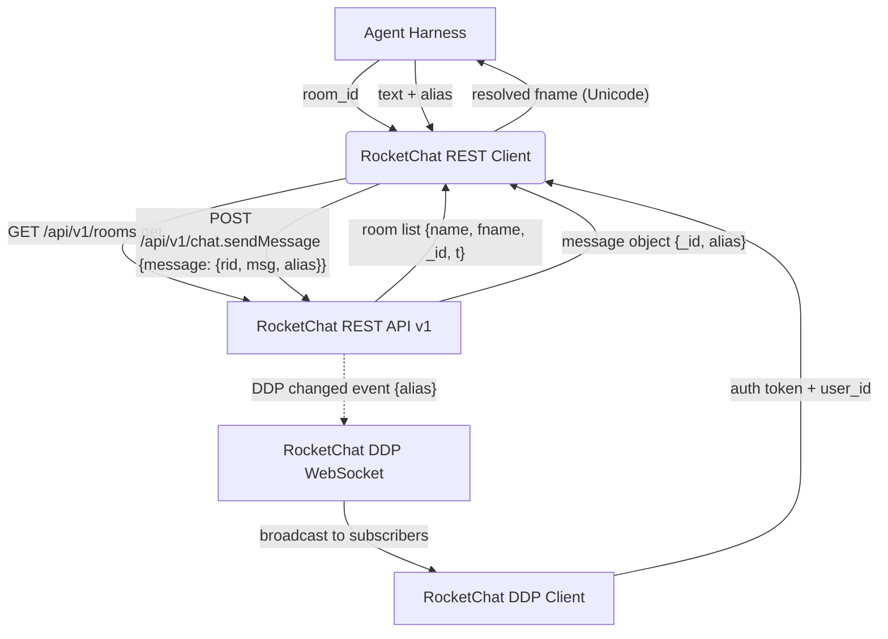
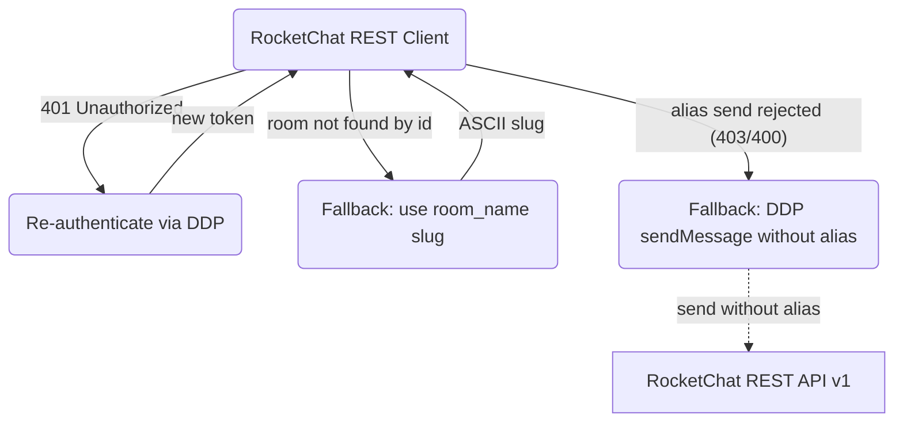
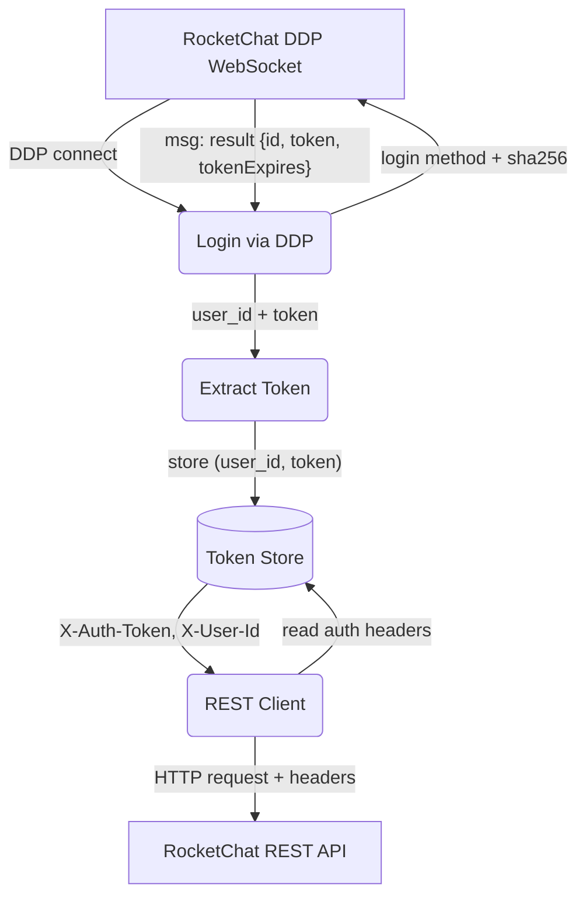
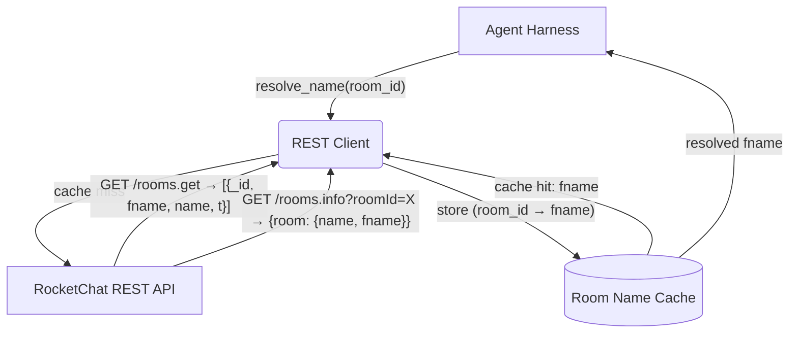
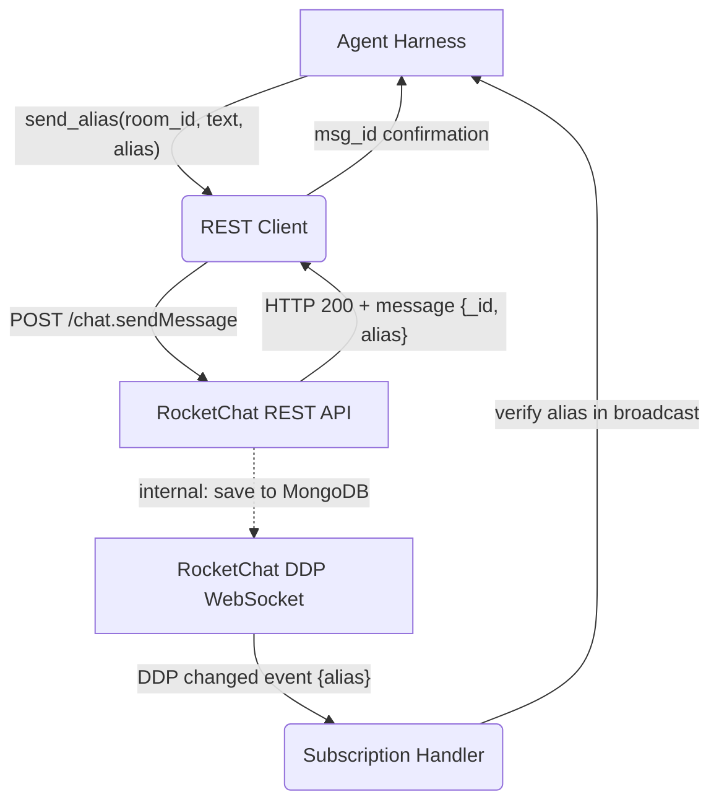

# RocketChat REST API Integration

## 1. Purpose

Extends the RockBot connection layer with **RocketChat REST API v1** calls for
two capabilities the legacy DDP `sendMessage` method cannot provide on v8.4:
**(1)** lookup of Unicode-friendly room names (`fname`) that are not available
from DDP `changed` events, and **(2)** sending messages with a per-message
`alias` field to override the sender's display name.

- Upstream: [Configuration Management](config.md) provides `host()` for URL
  construction
- Upstream: [RocketChat Connection](rocketchat.md) provides `user_id` and
  `token` from the DDP `login` response
- Downstream: [Agent Harness](../agent-harness.md) calls `resolve_room_name()`
  and `send_message_with_alias()` exposed from the REST client layer

## 2. Diagram

### 2a. Happy Flow — Room Name Resolution + Alias Send



### 2b. Error Handling & Fallbacks



### 2c. Auth Token Flow — DDP Login to REST Headers



### 2d. Room Name Resolution Deep Dive

The DDP `changed` events from a direct room subscription (`stream-room-messages`
with a specific `rid`) deliver `args` with only one element (the message), not
two. Room metadata (`roomName`, `fname`) is only available from the
`__my_messages__` subscription. The REST API fills this gap.



Room name precedence rules:
1. Cache hit by `room_id` → return cached `fname`
2. `rooms.info` by `roomId` → return `room.fname`
3. `rooms.get` scan by `_id` → return matching `fname`
4. Fallback: empty string or ASCII `room.name` slug

### 2e. Alias Message Round-Trip — REST Send → DDP Verify



## 3. Data Structures

### REST API Endpoints

#### `GET /api/v1/rooms.get`

Returns all rooms the authenticated user has joined.

**Request headers**: `X-Auth-Token`, `X-User-Id`

**Response** (`application/json`):
```json
{
    "update": [{
        "_id": "8g4gQkEAhewkGPkPL",
        "name": "shit",
        "fname": "💩💩💩SHIT屎",
        "t": "p",
        "msgs": 146779,
        "usersCount": 6
    }],
    "success": true
}
```

#### `GET /api/v1/rooms.info`

**Query params**: `roomId` (UUID) or `roomName` (ASCII slug only — Unicode
`fname` cannot be used as a query parameter).

**Response**:
```json
{
    "room": {
        "_id": "8g4gQkEAhewkGPkPL",
        "name": "shit",
        "fname": "💩💩💩SHIT屎",
        "t": "p",
        "msgs": 146779,
        "usersCount": 6
    },
    "success": true
}
```

#### `POST /api/v1/chat.sendMessage`

Sends a message. Supports `alias` (including Chinese/emoji like `"零夢✨"`).

**Request body**:
```json
{
    "message": {
        "rid": "GENERAL",
        "msg": "Hello world",
        "alias": "零夢✨"
    }
}
```

**Response**:
```json
{
    "message": {
        "_id": "Bf8dNR3WWJXaxdMyT",
        "rid": "GENERAL",
        "msg": "Hello world",
        "alias": "零夢✨",
        "u": { "_id": "wEv8J45KntNhDdkeY", "username": "rockai", "name": "香菜" },
        "ts": { "$date": 1781112548565 }
    },
    "success": true
}
```

#### `GET /api/v1/chat.getMessage`

Retrieves a single message by `_id`. Useful for verifying alias propagation.

**Response**: message object with `alias` field preserved.

### Rust Types (proposed)

#### `RestApiClient`

Wraps `reqwest::Client` and holds auth headers. Created once after DDP login.

| Field        | Type              | Purpose                           |
| ------------ | ----------------- | --------------------------------- |
| `host`       | `String`          | Server hostname (from config)     |
| `user_id`    | `String`          | `X-User-Id` header value          |
| `auth_token` | `String`          | `X-Auth-Token` header value       |
| `http`       | `reqwest::Client` | Reusable HTTP client (TLS)        |

#### `RoomInfo`

| Field   | Type     | Source                         |
| ------- | -------- | ------------------------------ |
| `_id`   | `String` | `rooms.get.update[]._id`       |
| `name`  | `String` | URL slug (ASCII)               |
| `fname` | `String` | Friendly name (Unicode/nullable)|
| `t`     | `String` | Room type: `d`, `p`, `c`       |

#### `SendMessageRequest`

| Field   | Type     | Required |
| ------- | -------- | -------- |
| `rid`   | `String` | Yes      |
| `msg`   | `String` | Yes      |
| `alias` | `Option<String>` | No |

### Implementation Map

| Component          | Source File                        |
| ------------------ | ---------------------------------- |
| `RestApiClient`    | `crate-rocketchat/src/rest.rs`     |
| REST endpoints     | `crate-rocketchat/src/rest.rs`     |
| Token capture      | `crate-rocketchat/src/client.rs`   |
| Room name cache    | `crate-rocketchat/src/rest.rs`     |
| Wire into harness  | `crate-rockbot/src/harness.rs`     |
